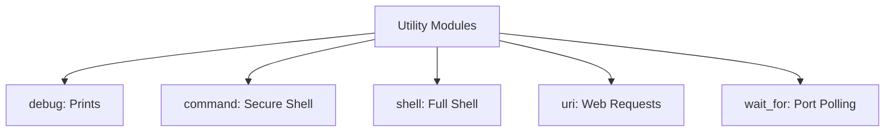

# 04. Utility Modules

Utility modules are essential for debugging, running raw commands, and interacting with external services.

## Core Modules Overview



### 1. `debug` - Information Output
Prints variables or messages to the console during execution.
```yaml
- name: Print host IP
  debug:
    var: ansible_default_ipv4.address
```

### 2. `command` - Secure Execution
Executes commands without passing them through a shell. Pipes and redirects don't work here.
```yaml
- name: Check system uptime
  command: uptime
```

### 3. `shell` - Full Shell Power
Runs commands through `/bin/sh`. Use this for pipes (`|`) or redirection (`>`).
```yaml
- name: Get error count from logs
  shell: grep -c "ERROR" /var/log/app.log
  register: error_count
```

### 4. `uri` - Web API Interaction
Interacts with HTTP/HTTPS services.
```yaml
- name: Check website status
  uri:
    url: http://example.com
    status_code: 200
```

### 5. `wait_for` - Network/File Polling
Useful for waiting for a service to become available (e.g., after a reboot).
```yaml
- name: Wait for database port
  wait_for:
    port: 5432
    state: started
```

---

## Real-Life Scenarios

### Scenario 1: "The Smoke Test"
**Problem**: Deployment was successful, but the application was internally crashing.
**Solution**: Used the `uri` module at the end of the playbook to hit the `/health` endpoint. If it didn't return 200, the deployment was marked as failed.

### Scenario 2: "The Debugger's Friend"
**Problem**: A complex variable was returning unexpected values, causing tasks to skip.
**Solution**: Inserted a `debug` task with `var: my_complex_variable` to inspect the structure and fix the logic.

### Scenario 3: "Service Readiness"
**Problem**: Playbooks failed intermittently because the database hadn't finished starting before the application tasks began.
**Solution**: Used `wait_for` to poll port 5432, ensuring the database was ready to accept connections before proceeding.

---

## ❓ Interview Questions

1. **Why is `command` preferred over `shell`?**
    - Security; `command` is not vulnerable to shell injection and is more predictable.
2. **How do you keep a secret from being logged in `debug`?**
    - Use the `no_log: true` parameter on the task.
3. **What is the `register` keyword used for?**
    - To save the output of a task into a variable for use in later tasks.

---

## 🧠 Quiz

1. **Which module identifies if a website is up?**
    - [x] `uri`
    - [ ] `http`
2. **Variable printing module:**
    - [x] `debug`
    - [ ] `log`
3. **`shell` vs `command` - which supports `| grep`?**
    - [x] `shell`
    - [ ] `command`