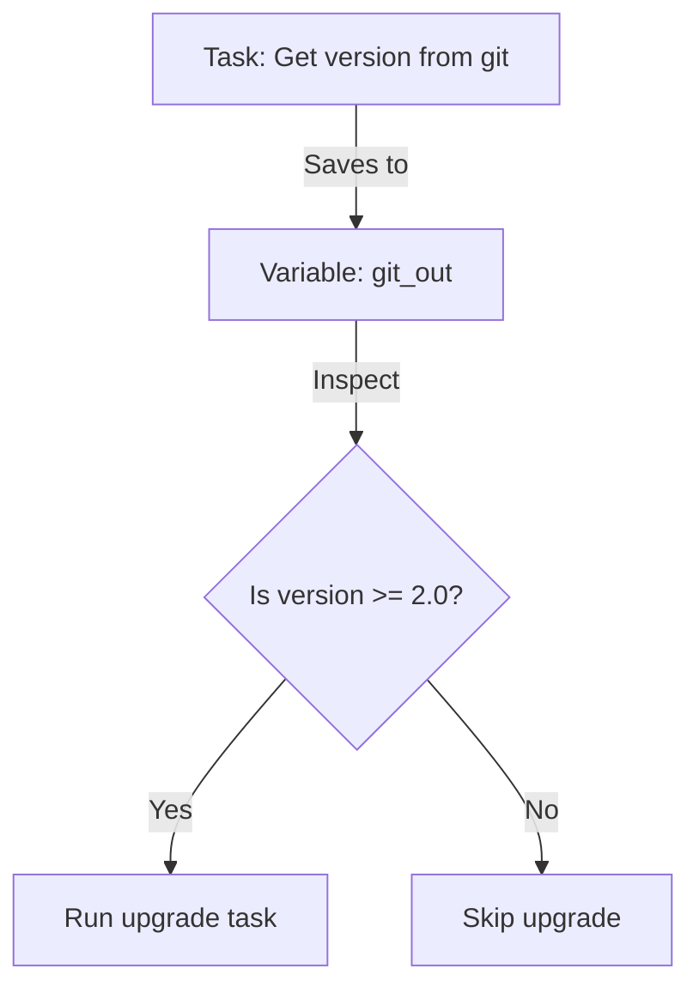

# 04. Dynamic Data Management

Variables are not always static. Often, you need to save the output of one task to use it in another, or define new variables mid-run based on logic.

## Save and Reuse (`register`)

The `register` keyword saves the entire result of a module (Status, Stdout, Stderr, etc.) into a variable.



**Example**:
```yaml
- name: Check if config exists
  stat:
    path: /etc/myapp.conf
  register: config_status

- name: Create config if missing
  template:
    src: myapp.conf.j2
    dest: /etc/myapp.conf
  when: not config_status.stat.exists
```

---

## Defining on the Fly (`set_fact`)

`set_fact` allows you to create or update a variable value during the execution of a play. It becomes a host variable that persists for the remainder of the playbook run.

```yaml
- name: Determine environment type
  set_fact:
    env_suffix: "{{ 'prod' if 'production' in group_names else 'dev' }}"

- name: Deploy app
  service:
    name: "myapp-{{ env_suffix }}"
    state: started
```

---

## Real-Life Scenarios

### Scenario 1: "The Verification Hook"
**Problem**: After a database upgrade, the application must be verified. If it fails, the whole deployment must stop.
**Solution**:
1. Run a `uri` check on the health endpoint.
2. `register` the response.
3. Use a following task with `fail: msg="App dead"` if `response.status != 200`.

### Scenario 2: "Dynamic Passwords"
**Problem**: You want to generate a random password on the fly and use it for both the Database setup AND the Application config, but you don't want to hardcode it.
**Solution**:
1. Run a `shell` command locally to generate a random string.
2. `register` it.
3. `set_fact` this value so it's easily accessible to all subsequent plays.

---

## ❓ Interview Questions

1. **What is stored in a registered variable from the `shell` module?**
    - `rc` (Return Code), `stdout`, `stderr`, `start`, `end`, and `changed` status.
2. **What is the difference between `vars` and `set_fact`?**
    - `vars` are usually defined statically at the beginning. `set_fact` is executed as a task and can use complex logic to decide the value at runtime.
3. **How do you access the standard output of a registered variable called `cmd_result`?**
    - `{{ cmd_result.stdout }}`.

---

## 🧠 Quiz

1. **Which keyword saves task output?**
    - [x] `register`
    - [ ] `save`
2. **`set_fact` variables belong to:**
    - [x] The specific Host they were set on.
    - [ ] Every host in the inventory globally.
3. **If a registered task fails, is the variable still created?**
    - [x] Yes, it will contain `failed: true` and the error message.
    - [ ] No.