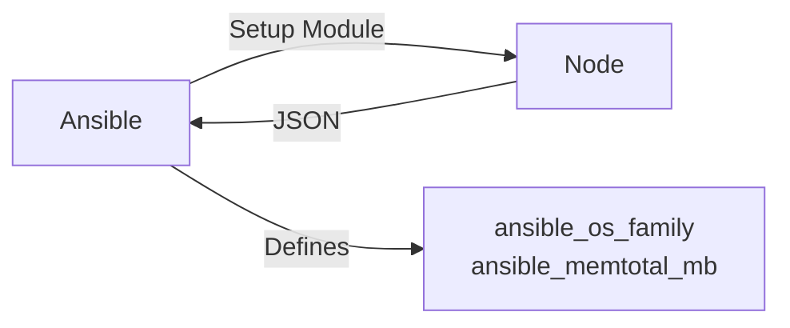

# Variables and Facts

Hardcoding values (IPs, Paths, Users) is the enemy of automation. Variables allow you to reuse code across Dev, Test, and Prod.

## 📚 Module Structure
- **[Boilerplates](README.md)**: `group_vars/all.yml`.
- **[CHALLENGES](./CHALLENGES.md)**: Fact finding, Variable Precedence.

---

## 🔑 Key Concepts

| Concept | Description |
| :--- | :--- |
| **Facts** | Information Ansible discovers about a host (IP, OS, CPU) automatically. |
| **Registers** | Variables created by capturing the output of a task. |
| **Magic Vars** | Special vars like `inventory_hostname` or `groups`. |
| **Precedence** | The order of override (Task vars > Play vars > Inventory vars). |

---

## 🏗️ Architecture: Fact Gathering

When Ansible connects, the first thing it does is `Gather Facts`.



---

## 📖 Real-World Story: The "OS Mismatch"

**Problem**: A script tried to install `apache2` via `apt` on all servers.
**Crisis**: Half the fleet was CentOS (which uses `httpd` and `yum`). The script failed.
**Solution**: Used **Facts**.
```yaml
- name: Install Apache
  package:
    name: "{{ 'apache2' if ansible_os_family == 'Debian' else 'httpd' }}"
```
**Result**: One playbook to rule them all.

---

## ❓ Interview Questions

1.  **Where should you define variables?**
    - *Answer*: `group_vars/` for general settings, `host_vars/` for exceptions, Vault for secrets. Avoid defining them inside the playbook if possible.
2.  **How do you disable fact gathering?**
    - *Answer*: `gather_facts: no` in the playbook. Used for speed or when connecting to devices without Python.
3.  **What is `hostvars['web-01']['ansible_eth0']['ipv4']['address']`?**
    - *Answer*: It accesses the facts of *another* host. Useful for configuring load balancers to know backend IPs.

---

[Next: Templates & Files](../06-Templates-and-Files/README.md)

---
## 🧭 Additional Modules
- [01 Variable Hierarchy](01-Variable-Hierarchy/README.md)
- [02 Ansible Facts](02-Ansible-Facts/README.md)
- [03 Magic Variables](03-Magic-Variables/README.md)
- [04 Dynamic Data](04-Dynamic-Data/README.md)
