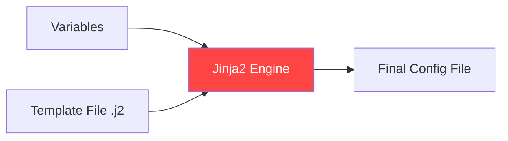

# 01. Jinja2 Basics

Jinja2 is the powerful templating engine used by Ansible to create dynamic configuration files. It allows you to inject data from variables directly into your server configurations.

## The Core Concept

Templating is the process of taking a static file with placeholders and replacing those placeholders with actual data at runtime.



### 1. Variables: `{{ ... }}`
To print the value of a variable, surround it with double curly braces.
```jinja2
# Welcome message in /etc/motd
Welcome to {{ ansible_hostname }}!
This server is managed by Ansible.
```

### 2. Filters: `|`
Filters allow you to transform the data before it is printed.
*   **Case conversion**: `{{ server_name | upper }}` or `{{ server_name | lower }}`.
*   **Default values**: `{{ http_port | default(80) }}` (Uses 80 if the variable is missing).
*   **Format conversion**: `{{ my_dict | to_yaml }}` or `{{ my_list | to_json }}`.
*   **Math**: `{{ ram_gb | int * 1024 }}`.

### 3. Comments: `{# ... #}`
Comments in Jinja2 are stripped out and will NOT appear in the final file on the server.
```jinja2
{# This is a private note for developers #}
server_name = {{ domain_name }}
```

---

## Real-Life Scenarios

### Scenario 1: "The Flexible Web Server"
**Problem**: An organization had 10 different Nginx configurations because each server had a different `server_name`.
**Solution**: Replaced all 10 files with a single `nginx.conf.j2`.
*   Template: `server_name {{ domain_name }};`
*   Variables: Definied `domain_name` in `host_vars` for each server.
*   Result: One file to maintain instead of 10.

### Scenario 2: "The Safety Net"
**Problem**: A playbook failed because a mandatory `api_key` was missing, resulting in a broken config file.
**Solution**: Used the `mandatory` filter.
*   Template: `api_key = {{ api_secret | mandatory }}`
*   Result: Ansible stops execution with a clear error message IF the variable is missing, preventing a broken config from being deployed.

### Scenario 3: "Logging Data Structures"
**Problem**: A developer needed to see the full list of tags on an EC2 instance inside a config file for debugging.
**Solution**: Used the `to_nice_json` filter.
*   Template: `instance_tags: {{ ansible_ec2_tags | to_nice_json }}`
*   Result: The raw dictionary was transformed into a readable JSON block inside the file.

---

## ❓ Interview Questions

1. **What engine does Ansible use for templating?**
    - Jinja2.
2. **How do you provide a fallback value in a template?**
    - Use the `default()` filter: `{{ var | default('fallback') }}`.
3. **Difference between `` and `{{ ... }}`?**
    - `` is for logic (loops, ifs). `{{ ... }}` is for printing values.

---

## 🧠 Quiz

1. **Symbol for a filter:**
    - [x] `|`
    - [ ] `&`
2. **Commented text in Jinja2 is visible on the remote server:**
    - [x] False
    - [ ] True
3. **To lowercase a variable `TITLE`:**
    - [x] `{{ TITLE | lower }}`
    - [ ] `{{ TITLE.lower() }}`