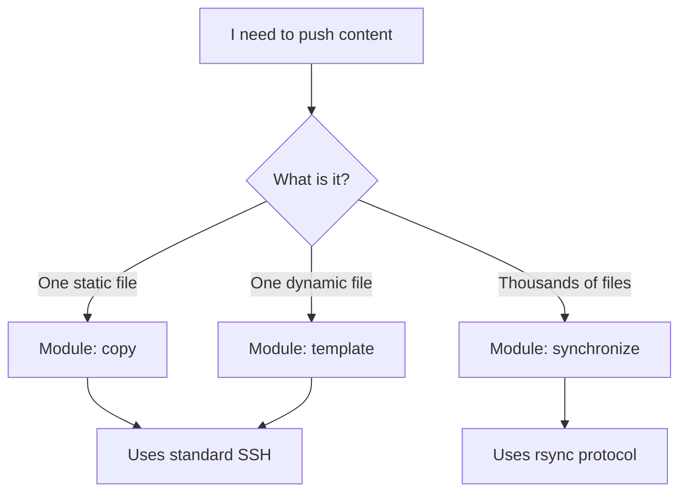

# 03. Deployment Strategies

Ansible provides three primary ways to deliver files to a remote server. Choosing the right one depends on the file's size, quantity, and whether it contains dynamic content.

## Strategy Comparison

| Feature | `copy` | `template` | `synchronize` |
| :--- | :--- | :--- | :--- |
| **Primary Use** | Static single files | Dynamic config files | Bulk directories/Large files |
| **Logic** | None (1:1) | Jinja2 (Dynamic) | rsync (Differential) |
| **Speed** | Fast (One-off) | Moderate (Overhead) | **Extremely Fast** (Bulk) |
| **Dependencies** | Python | Python | `rsync` on both nodes |

---

## 1. The `copy` Module
The most common module for configuration management. It pushes a file from your `files/` directory to the server.
*   **Best for**: SSL certs, small binary files, static config scripts.

## 2. The `template` Module
The powerhouse of Ansible. It processes files through Jinja2 before sending them.
*   **Best for**: Version-specific configs, environment-based settings.

## 3. The `synchronize` Module
A wrapper for `rsync`. It is massively faster for uploading thousands of files (like a web frontend build) because it only sends the **differences** (deltas) between files.
*   **Best for**: Static websites, node_modules, log backups.

---

## Real-Life Scenarios

### Scenario 1: "The Node.js Deploy"
**Problem**: A developer was using the `copy` module to deploy a React app. It took 15 minutes to upload `node_modules` every time.
**Solution**: Switched to `synchronize`.
*   Result: Deployment time dropped to **30 seconds**. Rsync detected that 99% of the library files hadn't changed and didn't resend them.

### Scenario 2: "The Secrets Leak"
**Problem**: A static `config.php` was being pushed via `copy`, but it contained the production database password, which was checked into Git.
**Solution**: Switched to `template`.
*   Moved the password to an encrypted Ansible Vault variable.
*   Templated the file: `password = '{{ db_password }}'`.
*   Result: Secret values are now managed securely, not hardcoded.

### Scenario 3: "Large Artifact Transfer"
**Problem**: Pushing a 500MB installer binary via `copy` often timed out or consumed excessive RAM on the control node.
**Solution**: Switched to `synchronize`.
*   Result: `rsync` handles bandwidth more efficiently and handles interruptions/resuming much better than a raw SSH file transfer.

---

## ❓ Interview Questions

1. **Why is `synchronize` faster than `copy`?**
    - It uses the rsync algorithm which only transfers the deltas (changed parts) of files, rather than the whole file every time.
2. **What is the requirement for `synchronize` to work?**
    - Both the Control Node and the Managed Node must have `rsync` installed.
3. **Can `synchronize` work from a remote server to another remote server?**
    - Yes (Pull mode), but it typically requires specific delegate-to logic or proper SSH key forwarding.

---

## 🧠 Quiz

1. **Which module uses the `rsync` command?**
    - [x] `synchronize`
    - [ ] `rsync_module`
2. **Best module for a Jinja2 template:**
    - [x] `template`
    - [ ] `copy`
3. **`synchronize` `delete: yes` will:**
    - [x] Delete files on the remote that are not in the source.
    - [ ] Delete the source files after move.