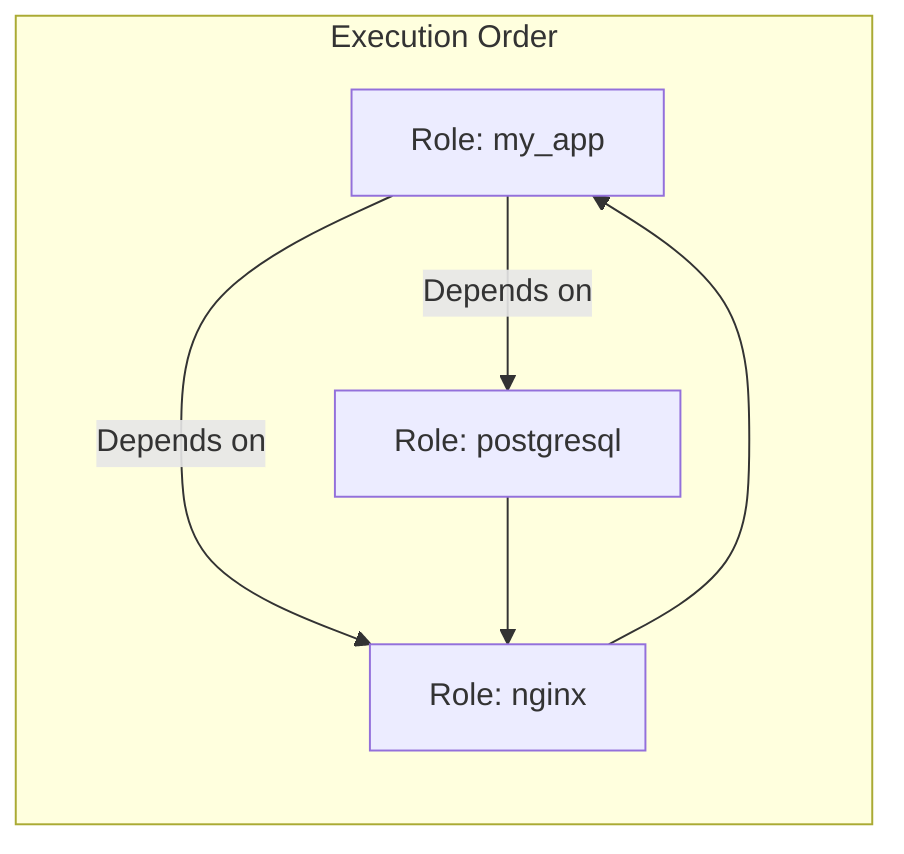

# 02. Advanced Role Usage

Once you understand the basic structure, you can leverage advanced features like dependencies, dynamic inclusions, and conditional role execution to build complex automation workflows.

## Role Dependencies

Dependencies allow you to link roles together. If Role A depends on Role B, Ansible will automatically execute Role B before starting Role A. This is defined in `meta/main.yml`.



**Example `meta/main.yml`**:
```yaml
dependencies:
  - { role: common }
  - { role: apache, port: 8080 }
```

---

## Static vs. Dynamic Inclusions

Ansible provides two ways to include roles within a playbook or another role.

### 1. `import_role` (Static)
Processed when the playbook is parsed. 
*   **Behavior**: You cannot use loops with `import_role`.
*   **Best for**: Fixed, predictable role lists.

### 2. `include_role` (Dynamic)
Processed at runtime when the task is reached.
*   **Behavior**: You *can* use loops and complex conditionals.
*   **Best for**: Deciding which role to run based on a variable or fact discovered during the run.

```yaml
- name: Include OS-specific setup
  include_role:
    name: "{{ ansible_os_family | lower }}_setup"
```

---

## Real-Life Scenarios

### Scenario 1: "The Stack Dependency"
**Problem**: An application role required a database and a load balancer to be configured first. Engineers often forgot to run the DB playbook before the App playbook.
**Solution**: Added `postgresql` and `nginx` as dependencies in the `app` role's `meta/main.yml`.
*   Result: Running the `app` role now automatically ensures the environment is ready.

### Scenario 2: "Conditional Cloud Setup"
**Problem**: A role needed to perform extra security hardening if it detected it was running in a public cloud (AWS/GCP), but skipped it on-premises.
**Solution**: Used `include_role` with a `when` clause.
```yaml
- name: Cloud specific hardening
  include_role:
    name: cloud_hardening
  when: ansible_system_vendor in ["AWS", "Google"]
```

### Scenario 3: "Parameterized Microservices"
**Problem**: A company had 10 microservices, each needing a similar systemd service file but with different ports and names.
**Solution**: Created one `generic_service` role and called it multiple times with different variables.
```yaml
roles:
  - { role: generic_service, app_name: 'auth', app_port: 8001 }
  - { role: generic_service, app_name: 'billing', app_port: 8002 }
```

---

## ❓ Interview Questions

1. **How do you pass a variable to a role?**
    - Inside the `roles:` block: `- { role: my_role, my_var: 'value' }`.
2. **What is the difference between `import_role` and `include_role`?**
    - `import_role` is static (parsed at start); `include_role` is dynamic (processed at runtime).
3. **Where is a role's dependency list defined?**
    - In `meta/main.yml`.

---

## 🧠 Quiz

1. **If Role A depends on Role B, which runs first?**
    - [x] Role B
    - [ ] Role A
2. **Can you use `when` with a role listed in the `roles:` block?**
    - [x] Yes, it applies to all tasks in the role.
    - [ ] No.
3. **Module for dynamic role inclusion:**
    - [x] `include_role`
    - [ ] `add_role`