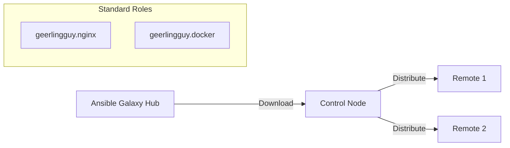

# 03. Galaxy and Collections

In the Ansible ecosystem, you don't have to write everything from scratch. **Ansible Galaxy** is the public portal for sharing roles and collections, while **Collections** are the modern method for distributing Ansible content.

## Ansible Galaxy Roles

Ansible Galaxy allows you to download community-maitained roles for common software (Nginx, Docker, PostgreSQL).



### Installation Commands:
*   **Install a role**: `ansible-galaxy install geerlingguy.nginx`.
*   **Search**: `ansible-galaxy search nginx`.

---

## The Modern Standard: Collections

Introduced in Ansible 2.10, **Collections** are a packaging format that can bundle Roles, Modules, and Plugins (like Lookup or Filter plugins) together.

### FQCN (Fully Qualified Collection Name)
To avoid name clashes, collections use a namespace. An example is `community.general.slack`, where:
*   `community`: The namespace.
*   `general`: The collection name.
*   `slack`: The module/role name.

**Example Playbook Usage**:
```yaml
- name: Send Slack Notification
  community.general.slack:
    token: "..."
    msg: "Deploy Successful!"
```

---

## Managing Dependencies (`requirements.yml`)

Instead of running individual install commands, list your dependencies in a `requirements.yml` file. This is standard practice in professional DevOps teams.

```yaml
# requirements.yml
roles:
  - name: geerlingguy.nginx
    version: 3.1.1

collections:
  - name: community.aws
    version: 1.5.0
```

**Install with**: `ansible-galaxy install -r requirements.yml`.

---

## Real-Life Scenarios

### Scenario 1: "The HAProxy Speedrun"
**Problem**: A startup needed a complex HAProxy load balancer with SSL termination immediately. Panning and writing the automation would take days.
**Solution**: Found a highly-rated "Verified" role on Galaxy.
*   Result: Within 2 hours, the cluster was up. The team relied on the community's battle-tested security settings rather than making their own amateur mistakes.

### Scenario 2: "Internal Library"
**Problem**: Different business units were writing their own "base" roles for server setup, leading to inconsistent security standards.
**Solution**: The Security Team created an internal Git repository as an Ansible Role and mandated its use via `requirements.yml`.
*   Result: Global compliance was simplified to updating one version number in a text file.

### Scenario 3: "Solving Module Gaps"
**Problem**: The core Ansible engine didn't have a module for a niche cloud provider.
**Solution**: The provider released an Ansible Collection.
*   Result: By installing the collection, the team gained 50 new modules and 5 roles specific to that cloud, without having to wait for a new Ansible release.

---

## ❓ Interview Questions

1. **What is Ansible Galaxy?**
    - The official community hub for sharing Ansible Roles and Collections.
2. **What is an FQCN?**
    - Fully Qualified Collection Name (e.g., `ansible.builtin.copy`). It ensures you are calling the exact module version from a specific namespace.
3. **How do you pin a specific version of a community role?**
    - In `requirements.yml`, specify the `version:` parameter.

---

## 🧠 Quiz

1. **Collection installation command:**
    - [x] `ansible-galaxy collection install`
    - [ ] `ansible-galaxy get`
2. **FQCN for the standard copy module:**
    - [x] `ansible.builtin.copy`
    - [ ] `core.copy`
3. **Primary file for managing multiple role downloads:**
    - [x] `requirements.yml`
    - [ ] `roles.txt`