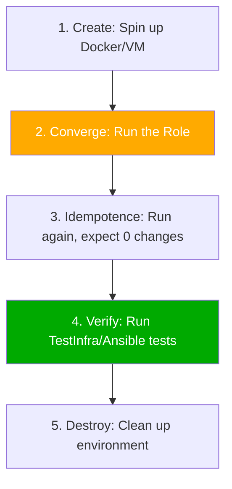

# 04. Testing with Molecule

Reliability is the difference between "scripts" and "automation". **Molecule** is the primary testing framework for Ansible roles, allowing you to develop and verify roles in isolated environments like Docker containers.

## The Molecule Workflow

Molecule automates the lifecycle of testing a role. It follows a loop: Create -> Converge -> Verify -> Destroy.



### Essential Commands
*   **`molecule test`**: Runs the full lifecycle (full sanity check).
*   **`molecule converge`**: Only spins up the environment and runs the role. Useful for development.
*   **`molecule verify`**: Runs the verification tests against the converged instance.

---

## Why Test Roles?

1.  **Catching Syntax Errors**: Ensures your YAML is valid and filters work.
2.  **Verifying Idempotency**: Ensures running the role twice doesn't cause unnecessary changes or errors.
3.  **Multi-Platform Verification**: A single command can test your role on Ubuntu, CentOS, and Fedora simultaneously using different Docker images.
4.  **CI/CD Integration**: Automatically block a Pull Request (PR) if the Role fails its Molecule tests.

---

## Real-Life Scenarios

### Scenario 1: "The OS Ninja"
**Problem**: An engineer wrote a MySQL role on their Ubuntu laptop. When it was deployed to CentOS in production, it failed because the package name was different.
**Solution**: Used Molecule with two platforms defined (Ubuntu and CentOS).
*   Result: Molecule caught the failure on CentOS during the developer's local run, allowing them to fix the logic before any code was committed to Git.

### Scenario 2: "Idempotency Proof"
**Problem**: A role was "successfully" installing a software package, but it reported "Changed" every single time it ran, triggering unnecessary service restarts.
**Solution**: Molecule's idempotency check failed the test.
*   The engineer discovered they were using a `command` module without a `creates` parameter.
*   Result: Fixed the task to be properly idempotent, saving CPU cycles and minimizing downtime in production.

### Scenario 3: "Infrastructure as Code Testing"
**Problem**: A security audit required that `/etc/shadow` must always have `0600` permissions.
**Solution**: Used Molecule's `verify.yml` (Ansible) to check the file state.
```yaml
- name: Verify shadow permissions
  stat:
    path: /etc/shadow
  register: shadow_file
  failed_when: shadow_file.stat.mode != '0600'
```
*   Result: The role is now mathematically proven to meet the security requirement on every commit.

---

## ❓ Interview Questions

1. **What is Molecule?**
    - An Ansible-native testing framework designed to aid in the development and verification of Ansible roles.
2. **Explain the 'Converge' step in Molecule.**
    - This is the step where Molecule actually runs the role's tasks against the test instance (container/VM).
3. **What is an 'Idempotency' test?**
    - A test that runs the role a second time after the initial converge. If any tasks report "changed" during the second run, the test fails.

---

## 🧠 Quiz

1. **Which command runs the entire testing lifecycle?**
    - [x] `molecule test`
    - [ ] `molecule all`
2. **Default driver used to create test instances:**
    - [x] Docker
    - [ ] Vagrant
3. **If `molecule verify` fails:**
    - [x] The infrastructure state does not match your expectations.
    - [ ] The YAML syntax is broken.