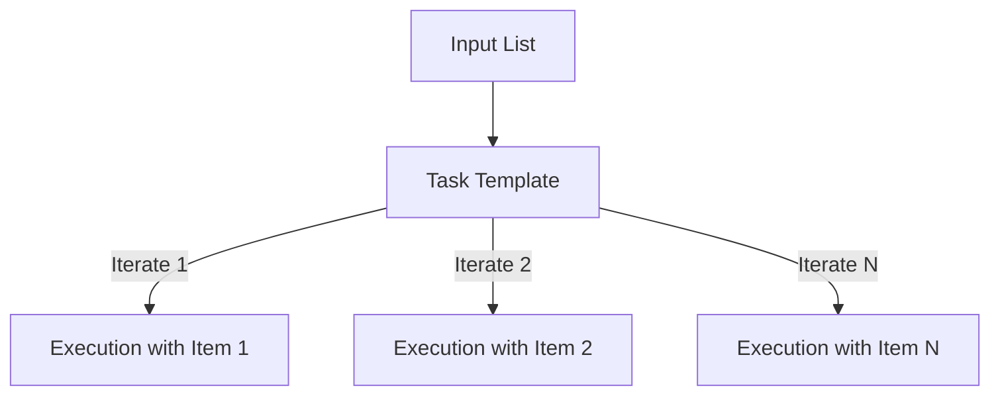

# 02. Looping Mechanics

Repetitive tasks are the enemy of efficiency. Instead of writing 10 tasks to create 10 users, Ansible allows you to loop over a single task using a list of data.

## The `loop` Keyword

The `loop` keyword is the modern standard for iteration in Ansible (replacing the older `with_items`).



### Basic List Loop
The current item is always available as the magic variable `{{ item }}`.
```yaml
- name: Install utility tools
  package:
    name: "{{ item }}"
    state: present
  loop:
    - git
    - vim
    - htop
```

### Dictionary Loop
When looping over complex data, use the key names.
```yaml
- name: Create users
  user:
    name: "{{ item.username }}"
    shell: "{{ item.shell }}"
  loop:
    - { username: 'dev1', shell: '/bin/bash' }
    - { username: 'dev2', shell: '/bin/zsh' }
```

---

## Retrying Until Success (`until`)

The `until` keyword allows a task to retry multiple times until a certain condition is met. Useful for waiting on a reboot or a service to start.

```yaml
- name: Wait for web service
  uri:
    url: "http://localhost:8080"
  register: result
  until: result.status == 200
  retries: 10
  delay: 5  # Wait 5 seconds between retries
```

---

## Real-Life Scenarios

### Scenario 1: "The User Factory"
**Problem**: An HR request came in to provision access for a new batch of 20 interns across 50 servers.
**Solution**: Used a `loop` over a YAML list of intern names.
*   Result: A 5-line task handled what would have been 1,000 lines of manual configuration.

### Scenario 2: "Dependency Polling"
**Problem**: A database takes 30 seconds to initialize, but the app deployment starts immediately and fails because the DB isn't ready.
**Solution**: Used a `uri` check with `until: result.status == 200` and `retries: 20`.
*   Result: The playbook effectively "pauses" and waits for the DB to be healthy before proceeding.

### Scenario 3: "Template Overdrive"
**Problem**: Generating 5 different configuration files from 5 different templates.
**Solution**: Looped over a dictionary of src/dest.
```yaml
- name: Deploy dynamic configs
  template:
    src: "{{ item.src }}"
    dest: "{{ item.dest }}"
  loop:
    - { src: 'nginx.j2', dest: '/etc/nginx/nginx.conf' }
    - { src: 'php.j2', dest: '/etc/php/php.ini' }
```

---

## ❓ Interview Questions

1. **What is the difference between `loop` and `with_items`?**
    - `loop` is the modern, simpler standard. `with_items` automatically flattens nested lists, while `loop` processes them exactly as they are.
2. **How do you change the name of the `item` variable?**
    - Use `loop_control`:
      ```yaml
      loop_control:
        loop_var: user_name
      ```
3. **Can you loop over an inventory group?**
    - Yes: `loop: "{{ groups['webservers'] }}"`.

---

## 🧠 Quiz

1. **Keyword to iterate over a list:**
    - [x] `loop`
    - [ ] `repeat`
2. **Variable used to access the current loop iteration:**
    - [x] `{{ item }}`
    - [ ] `{{ this }}`
3. **`retries: 5` combined with `until` will run a task at most:**
    - [x] 6 times (1st run + 5 retries)
    - [ ] 5 times