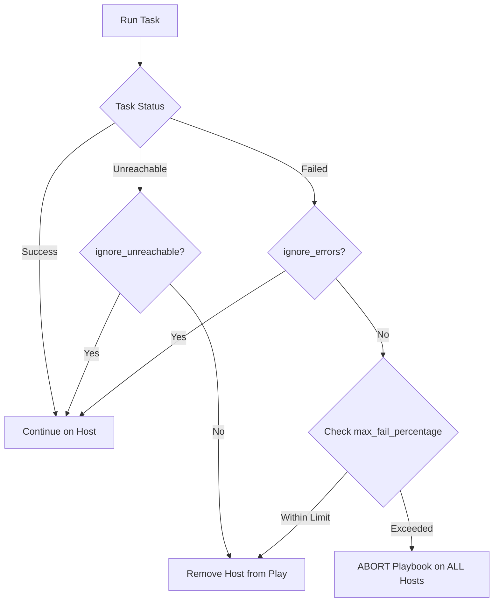

# 01. Failure Strategies

In Ansible, the default behavior is to **Fail Fast**: if a task fails on a host, that host is immediately removed from the rest of the play. This prevents further damage but can sometimes be too restrictive. You can customize this behavior using several failure strategies.

## Core Failure Strategies

### 1. Ignoring Errors (`ignore_errors`)
Use this when a task is "expected" to fail or its failure isn't critical to the rest of the playbook.

```yaml
- name: Clean up temporary files
  file:
    path: /tmp/cleanup_ready
    state: absent
  ignore_errors: yes
```

### 2. Batch Failure Tolerance (`max_fail_percentage`)
In large-scale deployments, you might want to allow a certain percentage of hosts to fail before aborting the entire run.

```yaml
- hosts: webservers
  max_fail_percentage: 30%
  serial: 10
  tasks:
    - name: Deploy update
      ...
```
*If more than 30% of the current batch (in this case, 4 out of 10) fails, Ansible stops the entire playbook on all remaining hosts.*

### 3. All or Nothing (`any_errors_fatal`)
The opposite of tolerance. If even one host fails, stop everything immediately.

```yaml
- hosts: cluster_nodes
  any_errors_fatal: true
```

### 4. Ignoring Unreachable Hosts (`ignore_unreachable`)
Useful when you want to continue a play even if some hosts are offline (e.g., in a cloud environment).

```yaml
- name: Check in with servers
  ping:
  ignore_unreachable: yes
```

---

## Host Failure Propagation



---

## Real-Life Scenarios

### Scenario 1: "The Rolling Outage Prevention"
**Problem**: A configuration error in a load balancer template could take down all 100 web nodes if pushed simultaneously.
**Solution**: Used `serial: 10` and `max_fail_percentage: 10%`.
*   Result: If the first 2 servers fail the health check, the percentage (20%) exceeds the limit (10%), and the playbook aborts before the other 90 servers are touched.

### Scenario 2: "The Optional Cleanup"
**Problem**: A playbook fails if a directory doesn't exist to be deleted, even though the goal (directory is gone) is technically met.
**Solution**: Added `ignore_errors: yes` to the deletion task.
*   Result: Playbook continues smoothly whether the folder was there or not.

### Scenario 3: "Cloud Fleet Discovery"
**Problem**: In an autoscaling group, some hosts in the inventory might have been terminated recently, leading to "Unreachable" errors that stop the whole run.
**Solution**: Used `ignore_unreachable: yes`.
*   Result: Ansible simply skips the dead nodes and finishes the work on the active ones.

---

## ❓ Interview Questions

1. **Difference between `ignore_errors` and `failed_when: false`?**
    - `ignore_errors` marks the task as **FAILED** (Red) but continues the play. `failed_when: false` marks it as **SUCCESS** (Green/Yellow).
2. **What does `any_errors_fatal` do?**
    - It causes Ansible to stop the execution on all hosts immediately if any single host fails a task.
3. **How does `max_fail_percentage` work with `serial`?**
    - The percentage is calculated against the current batch size defined by `serial`.

---

## 🧠 Quiz

1. **Keyword to skip a host if it's down:**
    - [x] `ignore_unreachable`
    - [ ] `skip_dead`
2. **If `max_fail_percentage: 10` and 1 host out of 5 fails, does the playbook stop?**
    - [x] Yes (1/5 = 20% > 10%).
    - [ ] No.
3. **By default, if a task fails on Host A, does it continue on Host B?**
    - [x] Yes, unless `any_errors_fatal` is true.
    - [ ] No.