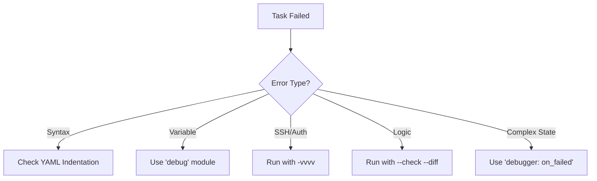

# 02. Debugging Tools

When a playbook fails, you need to understand *why*. Ansible provides several tools to inspect variables, visualize the state of the managed hosts, and even interactively debug tasks.

## 1. Visual Inspection

### The `debug` Module
The most common way to troubleshoot. Use it to print the state of any variable or a custom message.

```yaml
- name: Inspect task output
  command: /usr/bin/some_script
  register: script_result

- name: Print the result
  debug:
    var: script_result.stdout_lines
```

### Verbosity (`-v`)
Flags used with `ansible-playbook` to increase the detail of the output.

*   `-v`: Standard output.
*   `-vv`: Displays task inputs.
*   `-vvv`: Displays connection information (SSH).
*   `-vvvv`: Full connection and plugin debugging. **Essential for "Permission Denied" errors.**

---

## 2. Execution Modes

### Check Mode (`--check`)
A "Dry Run". Ansible simulates the playbook execution without making any changes to the remote hosts. Useful for seeing which tasks *would* report "Changed".

### Diff Mode (`--diff`)
Shows the exact lines that changed in a file (similar to `git diff`). Best used together with `--check`.

```bash
ansible-playbook site.yml --check --diff
```

---

## 3. The Interactive Debugger

Ansible 2.5+ includes an interactive debugger that can be triggered on failure. It allows you to inspect and modify variables and then **retry** the task immediately.

```yaml
- hosts: all
  debugger: on_failed
  tasks:
    - name: A task that might fail
      ...
```

**Debugger Commands**:
*   `p <variable>`: Print a variable.
*   `task_vars['key'] = 'new_value'`: Change a variable on the fly.
*   `r`: Redo (retry) the task.
*   `c`: Continue execution.

---

## Debugging Decision Matrix



---

## Real-Life Scenarios

### Scenario 1: "The Permission Denied Mystery"
**Problem**: An engineer was certain the SSH key was correct, but Ansible kept reporting "Permission Denied".
**Solution**: Ran with `-vvvv`.
*   Result: Revealed that the user's home directory on the remote server had `777` permissions, which caused SSH to reject the authentication for security reasons.

### Scenario 2: "Previewing Large Changes"
**Problem**: A junior admin needed to update a critical Nginx config file but was afraid of breaking it.
**Solution**: Ran the playbook with `--check --diff`.
*   Result: They saw exactly which lines were being added and noticed a wrong port number before applying the change for real.

### Scenario 3: "The Runtime Fix"
**Problem**: A complex variable generated by a custom script was slightly malformed, causing a downstream task to fail.
**Solution**: Used `debugger: on_failed`.
*   Result: When the task failed, the engineer modified the variable in the debugger, verified it worked by retrying the task, and then went back to fix the source script.

---

## ❓ Interview Questions

1. **How do you show the difference in a file change on the terminal?**
    - Use the `--diff` flag.
2. **What does `-vvvv` show that `-v` does not?**
    - It shows the full internal logs of the connection plugin (usually OpenSSH), which is required for troubleshooting authentication and network issues.
3. **Difference between `check_mode` and `ignore_errors`?**
    - `check_mode` is a global dry run (simulates execution). `ignore_errors` is a task-level setting that allows the play to continue after a real failure.

---

## 🧠 Quiz

1. **Which flag prints SSH connection details?**
    - [x] `-vvv`
    - [ ] `-v`
2. **To print a message only, the `debug` parameter is:**
    - [x] `msg`
    - [ ] `text`
3. **The debugger command to retry a task:**
    - [x] `r`
    - [ ] `retry`