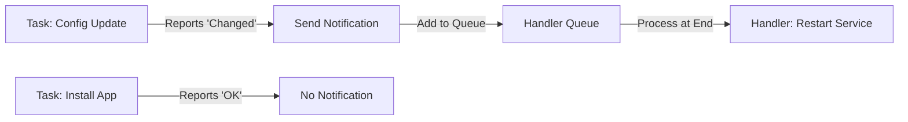

# 03. Handler Management

Handlers are a specialized form of task that run only when they receive a "notification" from another task that has successfully **changed** something. They are perfect for restarting services or clearing caches only when configuration files are modified.

## How Handlers Work



### 1. The Trigger (`notify`)
A task notifies a handler by its name.
```yaml
- name: Update Nginx Config
  template:
    src: nginx.conf.j2
    dest: /etc/nginx/nginx.conf
  notify: Restart Nginx
```

### 2. The Responder (`handlers:`)
Handlers are defined in their own section at the bottom of the play or in `handlers/main.yml` in a role.
```yaml
handlers:
  - name: Restart Nginx
    service:
      name: nginx
      state: restarted
```

---

## Advanced Handler Controls

### Force Handlers (`force_handlers: yes`)
By default, if a play fails halfway, notified handlers are **discarded** and will not run. This can leave a server with a new config but an old process running.
*   **Solution**: Set `force_handlers: yes` so notified handlers run even if the play fails later.

### Flush Handlers (`meta: flush_handlers`)
Usually, all handlers run at the very end of the play. If you need a service to restart *immediately* so a follow-up task can use it, use this.
```yaml
- name: Update Config
  template: ...
  notify: Restart DB

- meta: flush_handlers  # DB restarts NOW

- name: Connect to DB and run queries
  ...
```

### Multi-Notification (`listen`)
Instead of naming a single handler, tasks can notify a "topic". Multiple handlers can then listen to that topic.
```yaml
- name: Update global security policy
  template: ...
  notify: security_change  # Topic name

handlers:
  - name: Restart SSH
    service: name=sshd state=restarted
    listen: security_change

- name: Restart Firewall
    service: name=ufw state=restarted
    listen: security_change
```

---

## Real-Life Scenarios

### Scenario 1: "The Consistent State"
**Problem**: A playbook updated a database password in a config file, then failed later during an unrelated app-deploy task. Because the playbook failed, the "Restart DB" handler never ran.
**Solution**: Enabled `force_handlers: yes`.
*   Result: Even though the app deploy failed, the database successfully restarted with the new password, keeping the system configuration in sync.

### Scenario 2: "Immediate Availability"
**Problem**: An automation script updated an SSL certificate and then tried to run a health check against the HTTPS endpoint. The health check failed because Nginx hadn't restarted with the new cert yet.
**Solution**: Used `meta: flush_handlers` right after the cert update task.
*   Result: Nginx reloaded immediately, ensuring the health check correctly verified the active certificate.

### Scenario 3: "Cascading Restarts"
**Problem**: Changing a core library required 5 different microservices to restart. Naming all 5 in every task was messy.
**Solution**: Used the `listen` keyword.
*   Result: Tasks now simply notify `core_updated`, and all 5 services respond automatically, simplifying the code.

---

## ❓ Interview Questions

1. **What is the default trigger condition for a handler?**
    - The notifying task must return a status of `changed`.
2. **If 10 tasks notify the same "Restart Apache" handler, how many times does it run?**
    - Exactly once, at the end of the play (deduplication).
3. **What is `meta: flush_handlers`?**
    - A special task that forces all currently notified handlers to run immediately instead of waiting for the play to end.

---

## 🧠 Quiz

1. **Where are handlers typically processed?**
    - [x] At the end of the play.
    - [ ] Immediately after notification.
2. **Keyword to allow notified handlers to run if the play fails:**
    - [x] `force_handlers`
    - [ ] `always_run_handlers`
3. **Can one handler notify another?**
    - [x] Yes.
    - [ ] No.