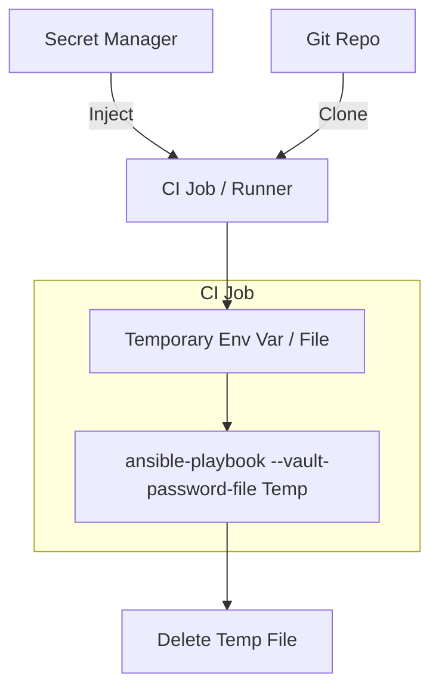

# 03. Vault in CI/CD

Integrating Ansible Vault into a CI/CD pipeline requires a secure way to provide the decryption key to the runner without exposing it in the job logs or the repository code.

## Secret Injection Flow

The modern standard is to use a dedicated secret manager (like Jenkins Credentials, GitHub Secrets, or HashiCorp Vault) to store the Ansible Vault password.



## Common Implementation Patterns

### 1. GitHub Actions
Store the vault password in a GitHub Secret named `ANSIBLE_VAULT_PASSWORD`.

```yaml
jobs:
  deploy:
    runs-on: ubuntu-latest
    steps:
      - uses: actions/checkout@v3
      - name: Run Playbook
        run: |
          echo "${{ secrets.ANSIBLE_VAULT_PASSWORD }}" > .vault_pass
          ansible-playbook site.yml --vault-password-file .vault_pass
          rm .vault_pass
```

### 2. GitLab CI
Use a File-type variable.

```yaml
deploy:
  script:
    - ansible-playbook site.yml --vault-password-file $VAULT_PASS_FILE
```
*`$VAULT_PASS_FILE` is a predefined variable path provided by GitLab.*

---

## Real-Life Scenarios

### Scenario 1: "The Jenkins Credential Gate"
**Problem**: An organization wanted to ensure only authorized Jenkins jobs could deploy to production.
**Solution**: Used the "Jenkins Credentials Binding" plugin.
*   Result: The Vault password was only available to the production pipeline and was automatically masked in the logs. If anyone tried to `echo` the password, Jenkins would replace it with `****`.

### Scenario 2: "The Ephemeral Key"
**Problem**: A security audit raised concerns that a compromised CI runner might retain the vault password in its file system.
**Solution**: Used a Python script as the password source.
```bash
ansible-playbook site.yml --vault-password-file ./fetch_key.py
```
*   Result: The key was fetched from HashiCorp Vault directly into memory and was never written to a disk file.

### Scenario 3: "Multiple Environment Secrets"
**Problem**: A single pipeline needed to deploy to Dev (password A) and Prod (password B).
**Solution**: Used Vault IDs and injected two separate secrets.
*   Result: The pipeline remained generic. It just passed both keys, and Ansible used the correct one for each environment's encrypted vars.

---

## ❓ Interview Questions

1. **How do you pass a vault password to a GitLab CI job securely?**
    - Set the password as a CI/CD Variable of type "File".
2. **Why is it important to delete the password file after the CI job finishes?**
    - To minimize the risk of a compromised runner or a subsequent job accessing the secret.
3. **What is 'Log Masking' in CI/CD?**
    - A feature where the CI tool automatically replaces sensitive strings (like vault passwords) with asterisks in the console output.

---

## 🧠 Quiz

1. **Preferred way to store Vault Passwords in GitHub Actions:**
    - [x] Secrets
    - [ ] Public Variables
2. **Does Ansible support reading the vault password from an environment variable directly?**
    - [x] Yes, via `ANSIBLE_VAULT_PASSWORD_FILE` (must point to a script or file).
    - [ ] No.
3. **`withCredentials` in Jenkins is used to:**
    - [x] Securely inject secrets into the shell environment.
    - [ ] Grant admin access to users.