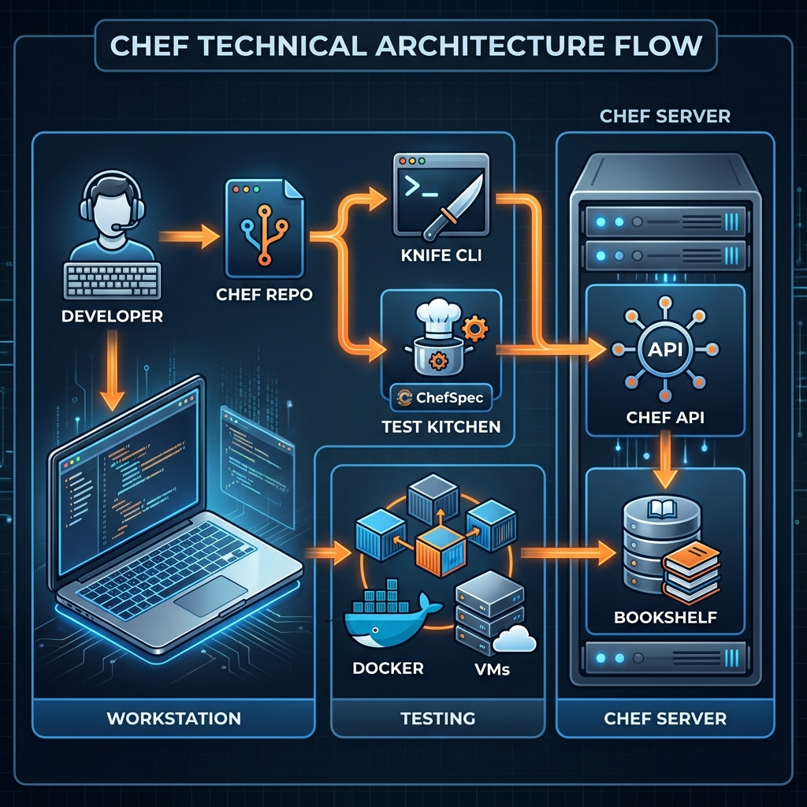

The **Workstation** is the personal computer or virtual machine where you, the infrastructure developer, author code. It is the birthplace of your infrastructure policy. Here, you write cookbooks, test them locally, and interact with the Chef Server.

## 1. Deep Dive: Components & Tools

The workstation relies on the **Chef Development Kit (Chef DK)** or the newer **Chef Workstation** package. This suite installs everything you need.

### Key Tools
*   **Chef Infra Client (local mode)**: Allows you to run Chef locally for testing purposes (`chef-client -z`).
*   **Knife**: The command-line tool that provides the interface between your workstation and the Chef Server. It's the "control tower."
    *   *Usage*: Uploading cookbooks, managing nodes, creating environments, searching data bags.
    *   *Config*: Uses `knife.rb` (usually in `.chef/`) to authenticate with the server using your RSA private key.
*   **Cookbooks**: The fundamental unit of configuration and policy distribution.
    *   Written in **Ruby DSL**.
    *   Contain *Recipes*, *Attributes*, *Templates*, *Files*, and *Metadata*.
*   **Test Kitchen**: An integration testing framework. It spins up a temporary VM (using Vagrant, Docker, EC2, etc.), runs your cookbook, tests the state, and destroys the VM.
*   **InSpec**: An auditing and testing framework for infrastructure. Used to verify "compliance as code."
*   **ChefSpec**: Unit testing for your cookbooks. It simulates a Chef run in memory without creating VMs.

### The Development Workflow
1.  **Author**: Write code in your local repo (Chef Repo).
2.  **Test**: Run `kitchen test` to spin up instances and verify logic.
3.  **Upload**: Use `knife cookbook upload` to push to the Chef Server.
4.  **Bootstrap**: Use `knife bootstrap` to install Chef Client on a target node.

## 2. Architecture Diagram


## 3. Real-Life Scenarios

### Scenario A: Dependency Conflict
**Situation**: You are writing a cookbook `my_webserver` that depends on `apache2` version `~> 5.0`. However, another team member updated the `apache2` cookbook on the server to `7.0`, which introduced breaking changes.
**Action**:
1.  Check `metadata.rb` in your cookbook.
2.  Use **Berkshelf** (part of Chef Workstation) to manage dependencies locally. `berks install` creates a `Berksfile.lock`.
3.  Pin the version in your `metadata.rb` or `Berksfile`.
4.  Use `knife cookbook upload my_webserver --include-dependencies` carefully, or rely on a CI/CD pipeline to promote artifacts.

### Scenario B: Bootstrapping a New Cloud Instance
**Situation**: You just launched an EC2 instance and need it managed.
**Action**:
1.  From your workstation:
    ```bash
    knife bootstrap 192.168.1.50 -U ubuntu -i ~/.ssh/my_key.pem -N "web-01" --sudo --run-list "recipe[my_webserver]"
    ```
2.  **Result**: Knife connects via SSH, installs Chef Client, registers the node "web-01" with the Chef Server, and runs the `my_webserver` recipe.

## 4. Interview Questions
1.  **What is the role of `knife` in Chef?**
    *   *Answer*: Knife is the CLI tool used on the workstation to communicate with the Chef Server. It manages data bags, nodes, roles, environments, and acts as the delivery mechanism for cookbooks.

2.  **Explain the difference between `Test Kitchen` and `ChefSpec`.**
    *   *Answer*: ChefSpec is for *unit testing*; it simulates a run in memory to verify that resources are defined correctly in the resource collection. Test Kitchen is for *integration testing*; it creates real infrastructure (virtual machines/containers) to verify that the code actually configures the system as expected.

3.  **Where are your credentials for the Chef Server stored on the workstation?**
    *   *Answer*: Typically in the `.chef/` directory inside your chef-repo, specifically in the `knife.rb` or `config.rb` file, alongside your user's `.pem` private key file.

4.  **What is a Chef Supermarket?**
    *   *Answer*: A community site for hosting open-source cookbooks. You can pull community cookbooks to your workstation to avoid reinventing the wheel (e.g., the official `nginx` or `docker` cookbooks).

5.  **What is the purpose of `metadata.rb`?**
    *   *Answer*: It defines the cookbook's name, version, author, and most importantly, its *dependencies* on other cookbooks.

## 5. Quiz: Test Your Knowledge
1.  **Which tool is primarily used to interact with the Chef Server from the workstation?**
    *   A) Chef Client
    *   B) Kitchen
    *   C) Knife
    *   D) Ohai

    <details><summary>Click for Answer</summary>C) Knife</details>

2.  **Where do you define cookbook dependencies?**
    *   A) `recipes/default.rb`
    *   B) `metadata.rb`
    *   C) `knife.rb`
    *   D) `attributes.rb`

    <details><summary>Click for Answer</summary>B) metadata.rb</details>

3.  **Which command generates a new cookbook skeleton?**
    *   A) `chef generate cookbook my_cookbook`
    *   B) `knife create cookbook my_cookbook`
    *   C) `chef-client new my_cookbook`
    *   D) `kitchen create my_cookbook`

    <details><summary>Click for Answer</summary>A) `chef generate cookbook my_cookbook`</details>

4.  **True or False: ChefSpec spins up a virtual machine to test your code.**
    *   A) True
    *   B) False

    <details><summary>Click for Answer</summary>B) False (ChefSpec is in-memory unit testing)</details>

5.  **What file typically contains your Chef Server URL and validation key path?**
    *   A) `client.rb`
    *   B) `Berksfile`
    *   C) `knife.rb` / `config.rb`
    *   D) `kitchen.yml`

    <details><summary>Click for Answer</summary>C) knife.rb / config.rb</details>

6.  **What is Berkshelf used for?**
    *   A) Managing cookbook dependencies
    *   B) Viewing log files
    *   C) Bootstrapping nodes
    *   D) Encrypting data bags

    <details><summary>Click for Answer</summary>A) Managing cookbook dependencies</details>

7.  **What language is used to write Chef recipes?**
    *   A) Python
    *   B) YAML
    *   C) Ruby
    *   D) Go

    <details><summary>Click for Answer</summary>C) Ruby</details>

8.  **Which tool validates your ruby code syntax?**
    *   A) RuboCop / Cookstyle
    *   B) ChefSpec
    *   C) Knife
    *   D) Ohai

    <details><summary>Click for Answer</summary>A) RuboCop / Cookstyle</details>

9.  **To upload a cookbook to the Chef Server, you use:**
    *   A) `chef push`
    *   B) `knife cookbook upload`
    *   C) `kitchen upload`
    *   D) `scp -r`

    <details><summary>Click for Answer</summary>B) knife cookbook upload</details>

10. **What is the `chef-repo`?**
    *   A) The directory on the server where data is stored.
    *   B) A local directory structure for storing cookbooks, roles, and configuration.
    *   C) The central GitHub repository for Chef Software.
    *   D) A Ruby gem.

    <details><summary>Click for Answer</summary>B) A local directory structure for storing cookbooks, roles, and configuration.</details>

11. **When running `kitchen test`, what is the first phase?**
    *   A) Converge
    *   B) Verify
    *   C) Create
    *   D) Destroy

    <details><summary>Click for Answer</summary>C) Create (if instances don't exist, it creates them first)</details>

12. **Which sub-command of knife helps in finding nodes?**
    *   A) `knife find`
    *   B) `knife search`
    *   C) `knife query`
    *   D) `knife look`

    <details><summary>Click for Answer</summary>B) knife search</details>

13. **What is a "Generator" in Chef Workstation?**
    *   A) A power source for the server.
    *   B) A set of templates used by `chef generate` to create files with a consistent structure.
    *   C) A tool to generate random passwords.
    *   D) The process that compiles the resource collection.

    <details><summary>Click for Answer</summary>B) A set of templates used by `chef generate`...</details>

14. **Where does Test Kitchen define its configuration?**
    *   A) `kitchen.yml`
    *   B) `Vagrantfile`
    *   C) `metadata.rb`
    *   D) `test.json`

    <details><summary>Click for Answer</summary>A) kitchen.yml</details>

15. **What constitutes a "Chef Policy"?**
    *   A) Only the run_list.
    *   B) A combination of cookbooks, roles, environments, and data bags that describe the desired state.
    *   C) The license agreement.
    *   D) The firewall rules.

    <details><summary>Click for Answer</summary>B) A combination of cookbooks, roles, environments...</details>

16. **What is the command `chef-apply` used for?**
    *   A) Applying a full run_list to a node.
    *   B) Running a single recipe file locally for ad-hoc tasks.
    *   C) Applying a license key.
    *   D) Uploading changes to the server.

    <details><summary>Click for Answer</summary>B) Running a single recipe file locally for ad-hoc tasks.</details>

17. **Your private key (`user.pem`) allows you to:**
    *   A) SSH into any node.
    *   B) Sign API requests sent to the Chef Server.
    *   C) Encrypt data bags.
    *   D) Decrypt SSL traffic.

    <details><summary>Click for Answer</summary>B) Sign API requests sent to the Chef Server.</details>

18. **Which folder in a cookbook contains static files like config files or scripts?**
    *   A) `templates/`
    *   B) `attributes/`
    *   C) `files/`
    *   D) `resources/`

    <details><summary>Click for Answer</summary>C) files/</details>

19. **If you need dynamic content in a config file, you should use:**
    *   A) A File in `files/`
    *   B) A Template in `templates/` (ERB)
    *   C) A Recipe
    *   D) A Data Bag

    <details><summary>Click for Answer</summary>B) A Template in `templates/` (ERB)</details>

20. **What is the default text editor for Knife if not configured?**
    *   A) VS Code
    *   B) Nano
    *   C) Vim (or system default)
    *   D) Notepad

    <details><summary>Click for Answer</summary>C) Vim (or system default)</details>
