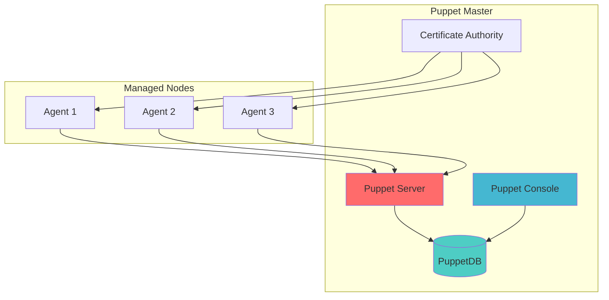

# 🎭 Puppet: Enterprise Configuration Management Platform

Puppet is a powerful, enterprise-grade configuration management tool that uses a declarative language to define system configurations and automatically enforces desired state across infrastructure.

---

## 🎯 **What is Puppet?**

Puppet is an open-source configuration management tool that helps system administrators automate the provisioning, configuration, and management of servers and applications across physical and virtual machines.

### **Key Features**
- **Declarative Language**: Describe desired state, not procedures
- **Agent-Based Architecture**: Puppet agents pull configurations from master
- **Cross-Platform**: Windows, Linux, macOS, and Unix support
- **Enterprise Scale**: Manages thousands of nodes efficiently
- **Compliance Reporting**: Built-in compliance and reporting capabilities

---

## 🏗️ **Architecture Overview**



### **Core Components**
- **Puppet Server**: Central configuration server
- **Puppet Agent**: Client software on managed nodes
- **PuppetDB**: Configuration and reporting database
- **Certificate Authority**: SSL certificate management
- **Puppet Console**: Web-based management interface

---

## 🛠️ **Learning Modules**

### **Module 1: Puppet Fundamentals**
- **Installation & Setup**: Master-agent architecture
- **Puppet Language**: Resources, classes, and modules
- **Manifests**: Writing and organizing Puppet code
- **Facter**: System fact collection and usage

### **Module 2: Resource Management**
- **Core Resources**: File, package, service, user management
- **Resource Relationships**: Dependencies and ordering
- **Resource Collectors**: Virtual and exported resources
- **Custom Resources**: Creating custom resource types

### **Module 3: Advanced Puppet**
- **Modules & Classes**: Code organization and reusability
- **Hiera**: Hierarchical data management
- **Environments**: Managing different configurations
- **Puppet Forge**: Community modules and best practices

### **Module 4: Enterprise Features**
- **Puppet Enterprise Console**: Web-based management
- **Role-Based Access Control**: User and permission management
- **Compliance Reporting**: Automated compliance checking
- **Orchestration**: Multi-node task execution

---

## 📚 **Puppet Language Basics**

### **Resource Declaration**
```puppet
# Package resource
package { 'nginx':
  ensure => installed,
}

# Service resource
service { 'nginx':
  ensure  => running,
  enable  => true,
  require => Package['nginx'],
}

# File resource
file { '/etc/nginx/nginx.conf':
  ensure  => file,
  content => template('nginx/nginx.conf.erb'),
  notify  => Service['nginx'],
}
```

### **Classes and Modules**
```puppet
# Class definition
class nginx {
  package { 'nginx':
    ensure => installed,
  }
  
  service { 'nginx':
    ensure  => running,
    enable  => true,
    require => Package['nginx'],
  }
  
  file { '/etc/nginx/nginx.conf':
    ensure  => file,
    source  => 'puppet:///modules/nginx/nginx.conf',
    notify  => Service['nginx'],
    require => Package['nginx'],
  }
}

# Class usage
include nginx
```

### **Conditional Logic**
```puppet
case $::operatingsystem {
  'RedHat', 'CentOS': {
    $package_name = 'httpd'
    $service_name = 'httpd'
  }
  'Ubuntu', 'Debian': {
    $package_name = 'apache2'
    $service_name = 'apache2'
  }
  default: {
    fail("Unsupported operating system: ${::operatingsystem}")
  }
}
```

---

## 🔧 **Practical Examples**

### **Web Server Configuration**
```puppet
class webserver {
  # Install Apache
  package { 'apache2':
    ensure => installed,
  }
  
  # Configure Apache service
  service { 'apache2':
    ensure  => running,
    enable  => true,
    require => Package['apache2'],
  }
  
  # Deploy website content
  file { '/var/www/html/index.html':
    ensure  => file,
    content => '<h1>Welcome to Puppet-managed server</h1>',
    require => Package['apache2'],
  }
  
  # Configure firewall
  firewall { '100 allow http':
    dport  => 80,
    proto  => tcp,
    action => accept,
  }
}
```

### **User Management**
```puppet
class users {
  # Create user accounts
  user { 'devops':
    ensure     => present,
    home       => '/home/devops',
    shell      => '/bin/bash',
    managehome => true,
    groups     => ['sudo', 'docker'],
  }
  
  # Deploy SSH keys
  ssh_authorized_key { 'devops@company.com':
    ensure => present,
    user   => 'devops',
    type   => 'ssh-rsa',
    key    => 'AAAAB3NzaC1yc2EAAAA...',
  }
}
```

---

## 📊 **Hiera Data Management**

### **Hiera Configuration**
```yaml
# hiera.yaml
version: 5
defaults:
  datadir: data
  data_hash: yaml_data

hierarchy:
  - name: "Per-node data"
    path: "nodes/%{trusted.certname}.yaml"
  
  - name: "Per-environment data"
    path: "environments/%{server_facts.environment}.yaml"
  
  - name: "Per-OS data"
    path: "os/%{facts.os.family}.yaml"
  
  - name: "Common data"
    path: "common.yaml"
```

### **Data Files**
```yaml
# data/common.yaml
---
nginx::version: '1.18'
nginx::worker_processes: 'auto'
nginx::worker_connections: 1024

users:
  admin:
    ensure: present
    shell: /bin/bash
    groups:
      - sudo
      - wheel
```

---

## 🔄 **Integration Patterns**

### **With Terraform**
```puppet
# Use Terraform for infrastructure, Puppet for configuration
class infrastructure {
  # Terraform provisions the infrastructure
  # Puppet configures the applications and services
  
  include ::nginx
  include ::mysql
  include ::monitoring
}
```

### **With Docker**
```puppet
class docker_host {
  # Install Docker
  class { 'docker':
    version => '20.10.0',
  }
  
  # Deploy containers
  docker::run { 'nginx':
    image   => 'nginx:latest',
    ports   => ['80:80'],
    volumes => ['/etc/nginx:/etc/nginx:ro'],
  }
}
```

---

## 🎯 **Best Practices**

### **1. Code Organization**
- Use modules for logical grouping
- Follow Puppet style guide
- Implement proper testing with rspec-puppet
- Use version control for all Puppet code

### **2. Resource Management**
- Use resource relationships (require, notify, before, subscribe)
- Implement idempotent configurations
- Handle edge cases and error conditions
- Use virtual and exported resources appropriately

### **3. Data Separation**
- Use Hiera for all configuration data
- Separate code from data
- Implement environment-specific configurations
- Use encrypted data for sensitive information

### **4. Performance Optimization**
- Optimize catalog compilation time
- Use efficient resource collectors
- Implement proper caching strategies
- Monitor agent run times and failures

---

## 🔍 **Troubleshooting Guide**

### **Common Issues**
1. **Certificate Problems**: SSL certificate mismatches or expiration
2. **Catalog Compilation Errors**: Syntax errors in manifests
3. **Resource Conflicts**: Multiple resources managing same target
4. **Performance Issues**: Slow catalog compilation or agent runs

### **Debugging Commands**
```bash
# Test Puppet syntax
puppet parser validate manifest.pp

# Dry run configuration
puppet agent --test --noop

# Debug agent run
puppet agent --test --debug

# Check certificate status
puppet cert list --all

# Validate Hiera data
puppet lookup --node nodename key_name
```

---

## 📊 **Comparison with Other Tools**

| Feature | Puppet | Ansible | Chef | SaltStack |
|---------|--------|---------|------|-----------|
| **Architecture** | Agent-based | Agentless | Agent-based | Agent-based |
| **Language** | Declarative DSL | YAML | Ruby DSL | YAML/Python |
| **Learning Curve** | Medium | Low | High | Medium |
| **Enterprise Features** | Excellent | Good | Excellent | Good |
| **Windows Support** | Excellent | Good | Good | Good |
| **Compliance** | Built-in | Add-on | Add-on | Add-on |

---

## 🏆 **Interview Questions**

### **Technical Questions**
1. **Explain the difference between Puppet resources, classes, and modules.**
2. **How does Puppet handle resource dependencies and ordering?**
3. **What is Hiera and how does it separate code from data?**
4. **Describe Puppet's catalog compilation process.**

### **Practical Scenarios**
1. **Managing configuration drift across 1000+ servers**
2. **Implementing compliance reporting for SOX requirements**
3. **Handling secrets and sensitive data in Puppet**
4. **Designing disaster recovery for Puppet infrastructure**

---

## 🚀 **Advanced Topics**

### **Custom Facts**
```ruby
# lib/facter/custom_fact.rb
Facter.add('application_version') do
  setcode do
    if File.exist?('/opt/myapp/version.txt')
      File.read('/opt/myapp/version.txt').strip
    else
      'unknown'
    end
  end
end
```

### **Custom Resource Types**
```ruby
# lib/puppet/type/myresource.rb
Puppet::Type.newtype(:myresource) do
  @doc = "Custom resource type example"
  
  newparam(:name, :namevar => true) do
    desc "The name of the resource"
  end
  
  newproperty(:ensure) do
    desc "Whether the resource should exist"
    newvalues(:present, :absent)
    defaultto :present
  end
end
```

---

## 📖 **Resources & References**

### **Official Documentation**
- [Puppet Documentation](https://puppet.com/docs/)
- [Puppet Language Reference](https://puppet.com/docs/puppet/latest/lang_summary.html)

### **Community Resources**
- [Puppet Forge](https://forge.puppet.com/)
- [Puppet Community](https://puppet.com/community/)

### **Training & Certification**
- [Puppet Certification Program](https://puppet.com/learning-training/certification/)
- [Learning Puppet](https://learn.puppet.com/)

---

**Next Steps**: Master Puppet fundamentals, explore enterprise features, and integrate with existing infrastructure automation workflows.

*"Infrastructure as code with enterprise-grade reliability and compliance."*

---
## 🧭 Additional Modules
- [02 Manifests and Classes](02-Manifests-and-Classes/README.md)
