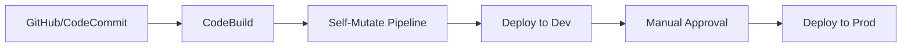

# 🏆 AWS CDK Advanced Level

## 📋 Learning Objectives
- ✅ Build **CDK Pipelines** for continuous delivery
- ✅ Use **Aspects** to apply patterns across your entire app
- ✅ Implement **Custom Resources** within CDK
- ✅ Manage complex multi-stack and multi-account dependencies

---

## 🚀 Continuous Delivery: CDK Pipelines
CDK Pipelines is a construct library that makes it easy to set up continuous delivery for your CDK applications.



### Self-Mutation
One unique feature of CDK Pipelines is **self-mutation**: if you add a new stage or change the pipeline definition in your code, the pipeline updates its own definition automatically!

---

## 🛡️ Governance: Aspects
Aspects are a way to apply an operation to all constructs in a given scope. This is useful for:
- **Tagging**: Adding a standard set of tags to all resources.
- **Validation**: Ensuring all S3 buckets have encryption enabled.
- **Modification**: Changing properties of resources created by third-party constructs.

```typescript
import { IAspect } from 'aws-cdk-lib';
import { IConstruct } from 'constructs';

export class TaggingAspect implements IAspect {
  visit(node: IConstruct): void {
    if (cdk.TagManager.isTaggable(node)) {
      node.tags.setTag('Project', 'Apollo');
    }
  }
}
```

---

## 🔗 Advanced Patterns
- **Sharing Data**: Using SSM Parameter Store or stack-to-stack references for cross-project communication.
- **Hotswap**: Rapidly updating Lambda code by bypassing CloudFormation when developing.
- **CDK Nag**: Use `cdk-nag` to check your infrastructure against security and compliance best practices.
