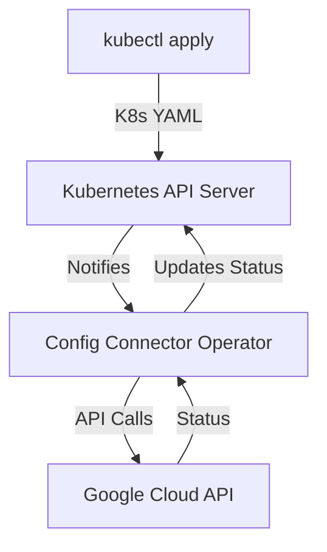

# ☸️ GCP Config Connector

## 📋 Overview
**Config Connector** is an open-source Kubernetes add-on that allows you to manage Google Cloud resources through Kubernetes. It bridges the gap between Kubernetes and GCP, enabling you to manage your infrastructure the same way you manage your applications.

### Why use Config Connector?
- **GitOps Readiness**: Manage your infrastructure with the same tools you use for application deployment (e.g., ArgoCD, Flux).
- **Unified Management**: Use `kubectl` for both apps and infrastructure.
- **Drift Correction**: The Kubernetes controller continuously reconciles the actual state of your cloud resources against the desired state.
- **Resource Composition**: Combine cloud resources and Kubernetes resources in the same manifest.

---

## 🏗️ Architecture

---

## 📂 Module Structure

### 🔰 [Beginner Level](./Beginner/README.md)
- Installation and Modes (Namespaced vs. Cluster-wide)
- Basic resource manifests (StorageBucket, ComputeInstance)
- Understanding the `status` field

### 🚀 [Intermediate Level](./Intermediate/README.md)
- Resource references and dependencies
- Managing IAM with Config Connector
- Annotations and resource lifecycle (Abandon vs. Delete)

### 🏆 [Advanced Level](./Advanced/README.md)
- Multi-project and Multi-org management
- GitOps with Config Sync
- Monitoring and Troubleshooting controllers
- Private service connection and networking

---

## ❓ Interview Questions & Quiz
- [Config Connector Interview Questions & 20+ Quiz Questions](./Interview-Questions/README.md)
