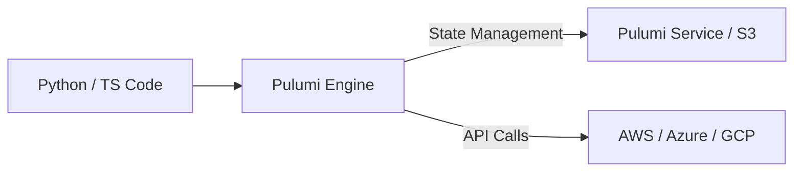

# Pulumi: Infrastructure as Code with Real Code

Pulumi is a modern IaC tool that allows you to use standard programming languages (Python, TypeScript, Go, C#) to provision cloud infrastructure. It bridges the gap between Developers and SREs.

## 📚 Module Structure
- **[Boilerplates](README.md)**: `__main__.py` (S3 provisioning in Python).
- **[CHALLENGES](../../../03-Server-Configuration-and-Ansible/01-Ansible/Learning-Modules/01-Fundamentals/CHALLENGES.md)**: Stacks, classes, and AWSX.

---

## 🏗️ Architecture: The Code Engine

Pulumi takes your code, runs it to build a "Dependency Graph," and then calls the Cloud Providers to make the changes.



---

## 🔑 Key Concepts

| Keyword | Description |
| :--- | :--- |
| **Stack** | An isolated, configurable instance of your Pulumi program (e.g., `dev`, `prod`). |
| **Project** | A folder containing your code and `Pulumi.yaml`. |
| **Component** | A reusable class that groups resources together. |
| **Output** | A special Type (similar to a Promise/Future) that represents values not yet available. |

---

## 🛡️ Robust Pattern: Testing your Infra
Since Pulumi uses real programming languages, you can write standard Unit Tests for your infrastructure using `pytest` or `mocha`. 

```python
def test_bucket_tags(args):
    # Logic to verify bucket has 'Environment' tag
    ...
```

---

## 📖 Real-World Story: The "Refactor" Loop
**Scenario**: A company had 50 different Terraform modules for different microservices.
**Problem**: They needed to update a global security setting across all 50. In Terraform, this required 50 separate PRs and updates.
**Solution**: They migrated to **Pulumi**.
**Result**: They captured the security logic in a single Python package. Now, updating the security setting is as simple as updating the `requirements.txt` version in their apps.

---

## ❓ Interview Questions

1. **How is Pulumi different from Terraform?**
   - *Answer*: Terraform uses a domain-specific language (HCL). Pulumi uses general-purpose programming languages. This gives Pulumi better support for loops, conditionals, and abstraction using Classes.
2. **What does `pulumi up` do?**
   - *Answer*: It previews the changes required to reach the desired state defined in your code and then applies those changes to the cloud provider.
3. **How does Pulumi handle state?**
   - *Answer*: By default, it uses the **Pulumi Service** (SaaS), but it can also use a self-managed backend like an S3 bucket or a local file.

---

[Next: Vendor Tools](../../../../../README.md)
