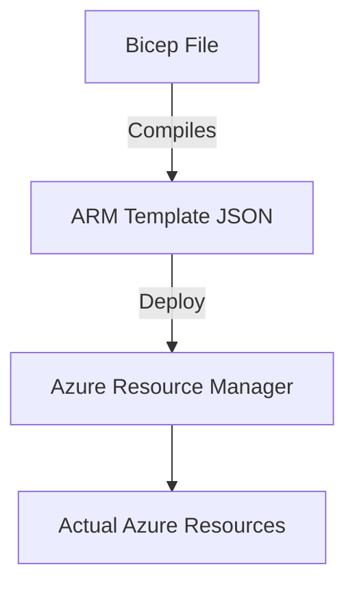

# 🔷 Azure Infrastructure as Code (IaC)

## 📋 Overview
Microsoft Azure provides two native ways to define infrastructure as code: **Azure Resource Manager (ARM) Templates** and **Bicep**.

### 1. ARM Templates (JSON)
The foundational declarative IaC for Azure.
- **Format**: JSON.
- **Characteristics**: Verbose, stable, foundational.
- **Status**: Still supported, used under the hood by Bicep.

### 2. Bicep (DSL)
A modern, domain-specific language (DSL) that provides a better authoring experience than the JSON templates.
- **Format**: `.bicep`.
- **Characteristics**: Clean syntax, modular, compiles to ARM JSON.
- **Status**: Recommended for most new projects.

---

## 🏗️ Architecture

---

## 📂 Module Structure

### 🔷 [Azure ARM Templates](./04-Azure-ARM/README.md)
- [Beginner](./04-Azure-ARM/Beginner/README.md)
- [Intermediate](./04-Azure-ARM/Intermediate/README.md)
- [Advanced](./04-Azure-ARM/Advanced/README.md)
- [Interview & Quiz](./04-Azure-ARM/Interview-Questions/README.md)

### 📐 [Azure Bicep](./05-Azure-Bicep/README.md)
- [Beginner](./05-Azure-Bicep/Beginner/README.md)
- [Intermediate](./05-Azure-Bicep/Intermediate/README.md)
- [Advanced](./05-Azure-Bicep/Advanced/README.md)
- [Interview & Quiz](./05-Azure-Bicep/Interview-Questions/README.md)
