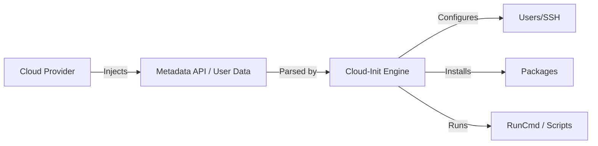

# Cloud-Init: Industry-Standard Initialization

Cloud-init is the standard method for cross-platform cloud instance initialization. It is the "User Data" that runs the first time a server boots, allowing you to turn a generic OS image into a configured server.

## 📚 Module Structure
- **[Boilerplates](README.md)**: `cloud-config.yaml` (Full instance setup).
- **[CHALLENGES](../../../03-Server-Configuration-and-Ansible/01-Ansible/Learning-Modules/01-Fundamentals/CHALLENGES.md)**: Multi-user setups and disk management.

---

## 🏗️ Architecture: The Early Boot Stage

Cloud-init runs inside the VM during the boot process. It fetches metadata from the cloud provider (AWS, Azure, etc.) and applies the YAML configuration.



---

## 🔑 Key Concepts

| Keyword | Description |
| :--- | :--- |
| **`#cloud-config`** | The required first line for any cloud-init YAML file. |
| **User Data** | The field in Cloud consoles where you paste your config. |
| **Stages** | Cloud-init has stages: `init`, `config`, and `final`. |
| **`runcmd`** | A list of shell commands to run at the very end of the process. |
| **`write_files`** | Creating text files on the disk (great for config files). |

---

## 🛡️ Robust Pattern: Validating Config
Always use the `cloud-init analyze` and `cloud-init query` commands on a running system to debug failures. You can validate your YAML locally with:
```bash
cloud-init schema --config cloud-config.yaml
```

---

## 📖 Real-World Story: The "Forgotten Password"
**Scenario**: A company inherited 500 legacy VMs with no recorded SSH keys or passwords.
**Solution**: They attached a Cloud-Init script to the next boot of each instance that injected a new admin user and SSH key.
**Result**: They regained control of all assets in one afternoon without re-imaging the servers.

---

## ❓ Interview Questions

1. **What is the difference between Cloud-Init and Ansible?**
   - *Answer*: Cloud-Init is designed for *Day 0* (initial boot and bootstrapping). Ansible is designed for *Day 1+* (ongoing configuration and orchestration).
2. **What happens if you run Cloud-Init a second time on the same instance?**
   - *Answer*: By default, most modules in Cloud-Init (like user creation or package installation) only run once (per instance ID). If the instance ID changes, it runs again.
3. **Where are the logs for Cloud-Init located?**
   - *Answer*: `/var/log/cloud-init.log` and `/var/log/cloud-init-output.log`.

---

[Next: Kustomize](../../../../../README.md)