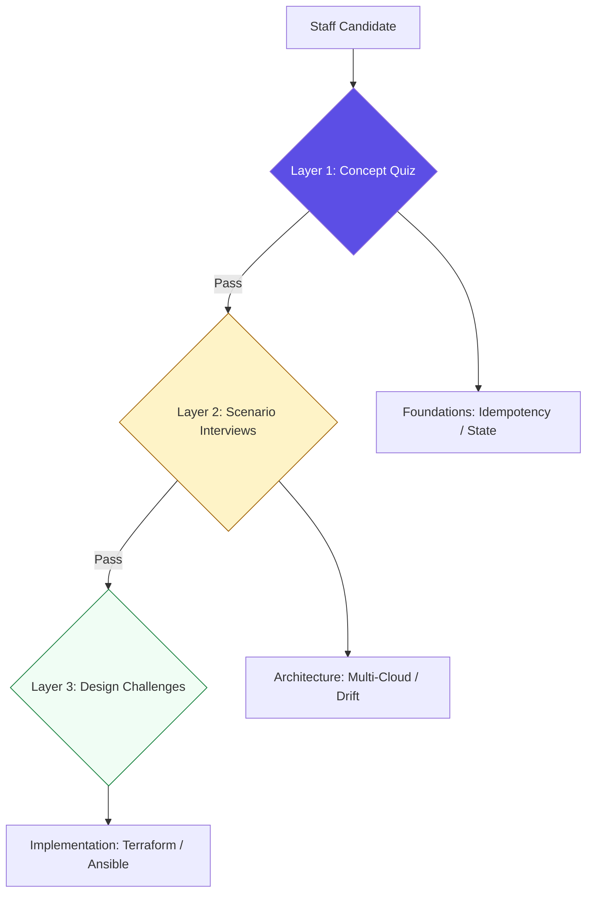

# ?? Mastery Assessments: Config Management & IaC

> **"You haven't mastered a tool until you can explain why it failed, how to fix it under pressure, and when to choose its competitor. Knowledge is the ultimate infrastructure."**

This final module is designed to pressure-test your understanding of the **Infrastructure Architecture** track. You will move beyond simple syntax and into the realm of **Architectural Decision Making**. These assessments prepare you for senior-level interview loops and the daily reality of managing production-grade infrastructure at scale.

---

## ??? Assessment Architecture

The evaluation is split into three technical layers:

---

## ?? Evaluation Components

### 1. [??? Staff Interview Prep](./Interview-Questions.md)
Deep-dives into the "Why" of infrastructure. Focuses on State Management, Immutable Governance, and Fail-safe Orchestration.

### 2. [?? Knowledge Check Quizzes](./Quizzes.md)
Rapid-fire verification of technical keywords, tool-specific behaviors, and lifecycle commands.

### 3. [? Solution Architectural Key](./Solutions/README.md)
Comprehensive explanations and "Professional Standards" for all assessment topics.

---

## ??? Sample Challenge Topic

**Topic: The State Conflict**
*   **The Problem:** You have a Terraform project where the S3 backend is working, but the state is frequently locked by a team member who left the company, and the DynamoDB lock hasn't timed out.
*   **The Question:** How do you safely clear the lock without corrupting the state, and what architectural changes would you implement to prevent this in the future?
*   **Target Answer:** Use `terraform force-unlock`. Prevention involves implementing short TTLs on locks and enforcing CI/CD-only deployments (GitOps) so manual locks are never an issue.

---

[?? Back to Config Management Index](../README.md)
