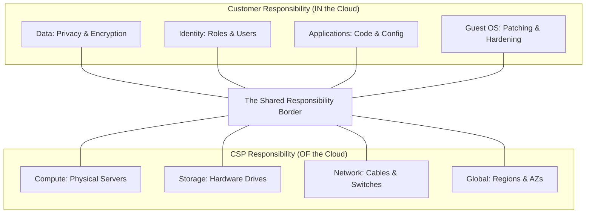

# Shared Responsibility Model: Governance Reference

**Doc Version:** 1.0.0
**Role:** Cloud Compliance Officer
**Scope:** Security Ownership across IaaS, PaaS, and SaaS

---

## 1. The Core Split

Security is a partnership between the Cloud Service Provider (CSP) and the Customer.

- **CSP Responsibility**: Security **OF** the Cloud (Hardware, Data centers, Networking infrastructure).
- **Customer Responsibility**: Security **IN** the Cloud (Data, IAM, OS configuration, Encryption).

---

## 2. Responsibility by Service Type

### IaaS (Infrastructure as a Service)
*Ex: AWS EC2, Azure VMs*
- **CSP**: Physical security, Virtualization layer.
- **Customer**: **Everything else**. Patching the OS, Firewall rules (Security Groups), IAM, Encryption.

### PaaS (Platform as a Service)
*Ex: AWS RDS, Azure SQL, Elastic Beanstalk*
- **CSP**: Operating System, Database engine software, Patching.
- **Customer**: Application code, DB users, Access control list (ACLs), Data encryption.

### SaaS (Software as a Service)
*Ex: GitHub Actions, Salesforce, Microsoft 365*
- **CSP**: The entire application stack and data management.
- **Customer**: User management, Data sensitivity, Configuration settings.

---

## 3. Data Governance & Residency

- **Residency**: Ensuring data stays in a specific country/region (e.g., GDPR requirements).
- **Ownership**: The customer always owns the data. The CSP provides the "Safe" (Encryption at rest).
- **Encryption**:
    - **Transit**: TLS (HTTPS).
    - **Rest**: KMS (Key Management Service) / SSE (Server-Side Encryption).

---

## 4. Visualizing the Responsibility Matrix

---

## 5. Auditing & Compliance (Artifact)

CSPs provide official audit reports to prove they are doing their part.
- **SOC 1/2/3**: Security and availability reports.
- **ISO 27001**: Information security management.
- **PCI-DSS**: Payment card industry standard.
- **FedRAMP**: US Government security standard.

> **Enterprise Pattern**: Use **AWS Artifact** to download these reports during your company's internal security audits to satisfy compliance requirements regarding the CSP's physical security.
