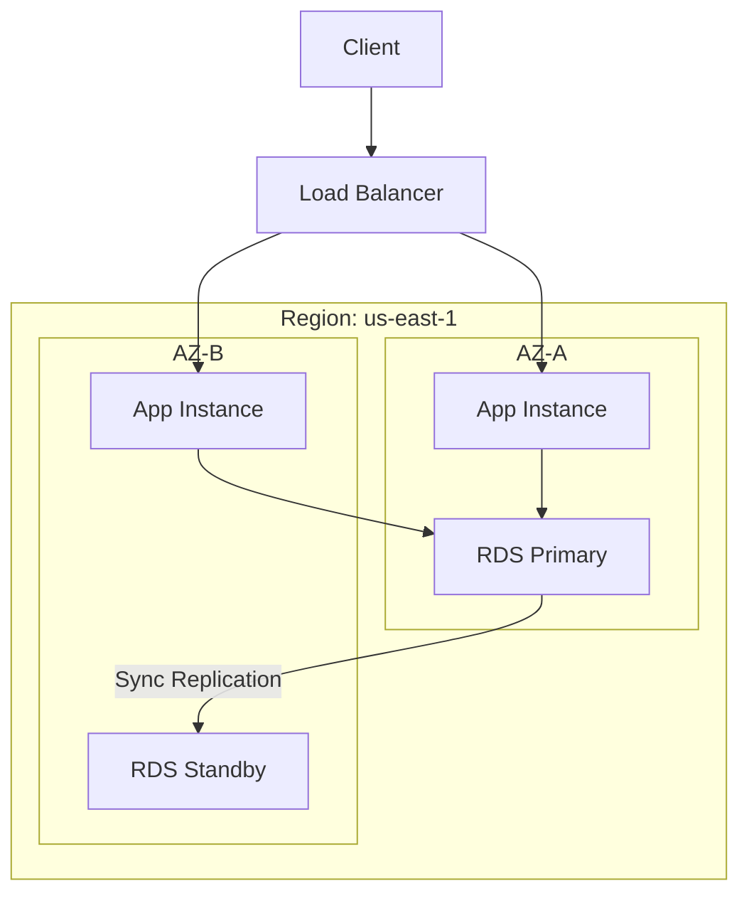

# Cloud Well-Architected Framework: Reference

**Doc Version:** 1.0.0
**Role:** Cloud Solutions Architect
**Scope:** Design Pillars and Operational Best Practices

---

## 1. The Five (or Six) Pillars

Modern cloud architecture is measured against these standard pillars.

### A. Operational Excellence
- **Focus**: Running and monitoring systems, and continually improving processes.
- **Key Pattern**: **Infrastructure as Code (IaC)**. Everything is versioned and automated.
- **Checklist**: Perform operations as code, make frequent/small/reversible changes, refine procedures frequently.

### B. Security
- **Focus**: Protecting data, systems, and assets.
- **Key Pattern**: **Principle of Least Privilege (PoLP)**.
- **Checklist**: Implement a strong identity foundation, maintain traceability, apply security at all layers.

### C. Reliability
- **Focus**: Ability of a system to recover from service/power failures.
- **Key Pattern**: **Multi-AZ Architecture**.
- **Checklist**: Automatically recover from failure, test recovery procedures, scale horizontally to increase availability.

### D. Performance Efficiency
- **Focus**: Using IT and computing resources efficiently.
- **Key Pattern**: **Serverless Architecture**.
- **Checklist**: Democratize advanced technologies, go global in minutes, use serverless architectures.

### E. Cost Optimization
- **Focus**: Avoiding unnecessary costs.
- **Key Pattern**: **Right-Sizing**.
- **Checklist**: Implement cloud financial management, adopt a consumption model, measure overall efficiency.

### F. Sustainability (The 6th Pillar)
- **Focus**: Environmental impact of cloud workloads.
- **Key Pattern**: **Resource Maximization**.

---

## 2. Design for Failure

In the cloud, "Everything fails, all the time." (Werner Vogels, Amazon CTO).

### Fault Tolerance vs. High Availability
- **High Availability (HA)**: System is operational 99.9% of the time (e.g., Load balancer redirects traffic to a healthy instance).
- **Fault Tolerance (FT)**: System maintains performance even during failure (e.g., Raid 10 storage).

### Disaster Recovery (DR) Strategies
1.  **Backup & Restore**: Slow, but cheap.
2.  **Pilot Light**: Core data is synced; apps are scaled to 0 until needed.
3.  **Warm Standby**: A smaller version of the environment is always running.
4.  **Multi-Site (Active-Active)**: Both sites serve traffic simultaneously.

---

## 3. Visualizing Multi-AZ Reliability

---

## 4. Identity & Access Management (IAM) Governance

- **Users**: Humans (Physical identities).
- **Groups**: Collection of users (Perms managed at group level).
- **Roles**: Temporary identities for services (EC2, Lambda) or federated users.
- **Policies**: JSON documents defining permissions.

> **Enterprise Pattern**: Use **IAM Roles for Service Accounts (IRSA)** or **Instance Profiles**. Never store AWS_ACCESS_KEY_ID inside a container or VM.

---

## 5. Security Control Policies (SCP)

At the organization level, SCPs are the ultimate guardrails.
- **Example**: An SCP that denies any user from disabling CloudTrail or deleting the Master Billing account.
- **Example**: An SCP that restricts resource creation to specific regions (e.g., `us-east-1` and `eu-west-1` only).

> **Enterprise Pattern**: Use **AWS Control Tower** to manage landing zones and automatically apply baseline SCPs across all new accounts.
