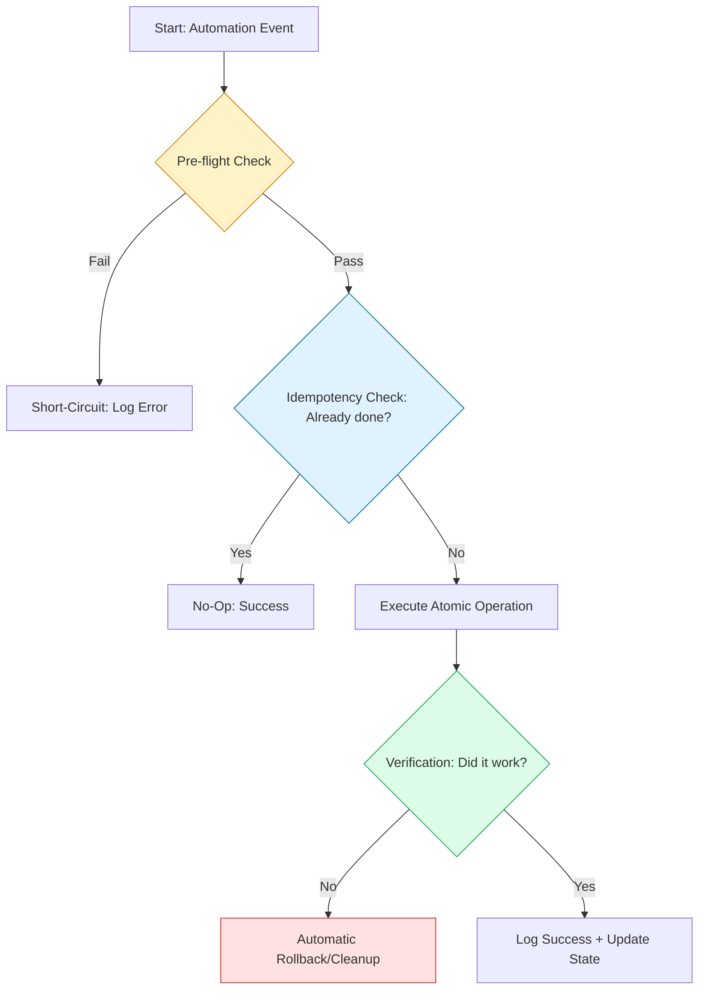

# 🛡️ Automation Best Practices: The Production Standard

> **"If you haven't automated it, you haven't understood it. If you have automated it without error handling, you just haven't broken it yet."**


---

## 🧠 The Mental Model: The Check-Act-Verify

**The Junior Struggle**: "My script works on my machine! I'll just run it in production. If it fails, I'll just run it again!" (Then the second run crashes because the first run left a half-created user or a partially written file).

**The Engineer Solution**: Build for **Resilience**. Every operation must be **Idempotent** (safe to run 1,000 times) and **Atomic** (it either works 100% or fails 100%, never in between).
You follow the **Check-Act-Verify** pattern:
1. **Check**: Is the work already done?
2. **Act**: Perform the work if needed.
3. **Verify**: Did the work actually succeed?

### 🏗️ The Infrastructure Analogy

| Concept | Manufacturing Analogy | Automation Equivalent |
|:--------|:----------------------|:----------------------|
| **Idempotency** | "Don't paint the wall twice" | `if not exists: create` |
| **Atomicity** | "All-or-Nothing assembly" | Transactions / Temp Files |
| **Observability** | "The Assembly Line Camera" | Structured JSON Logging |
| **Fail-Fast** | "Pull the Cord (Andon)" | `set -e` / Exception handling |

---

## 📚 Why This Module Matters for Juniors

**Before this module**, you might think:
- "Error handling is just for beginners"
- "Bash is always the best tool for automation"
- "Logging is only for when things break"

**After this module**, you'll understand:
- **Resilient Logic** is the difference between a 3:00 AM pager alert and a restful sleep.
- **The Python Pivot**: Knowing when to move from Bash to Python for scale.
- **Dry-Runs** allow you to test destructive actions safely.
- **Structured Logging** makes your automation visible to monitoring tools (Datadog/ELK).

**The Difference**: You move from "Writing scripts" to **"Engineering Assets."**

---

---

## 🎯 Junior's Mission: The Atomic Config Deploy
**Scenario**: You have a configuration file that *must* be identical across 100 servers. A partial write during an outage would cause the application to crash.
**Your Goal**: Implement an **Atomic Write Pattern** where the script writes to a temporary file, verifies the content's integrity (e.g., via checksum), and only then "Moves" it to the final production path.

---

## 🏗️ Operational Reality: Production Hazards
"Best Practices" are often written in the blood of previous outages.
1.  **The Half-Baked Deploy**: A script starts updating the code, but the server loses power midway. When the server reboots, the app is in a "Frankenstein" state—part old, part new.
2.  **Silent Failures**: A script that fails to delete an old database snapshot but doesn't report it. Six months later, you discover you've spent $10,000 storing snapshots that should have been gone.
3.  **The "Global" Variable Bug**: Using a global variable in a script that is later converted to run in parallel. Now, ten threads are all fighting to change the same variable, causing random, impossible-to-debug crashes.
4.  **No Dry Run**: Running a "Cleanup" script that identifies 1,000 files to delete. Without a `--dry-run` flag, you have to hit "Enter" and pray you didn't include the project's source code in the regex.

---

## 🛠️ The Reliability Toolbelt
| Tool/Command | Why it matters |
| :--- | :--- |
| `set -euxo pipefail` | The "Strict Mode" for Bash that catches 90% of silent bugs. |
| `python -m unittest` | Testing your automation logic before it ever touches a real server. |
| `sys.exit(1)` | Properly signaling failure to the CI/CD pipeline so the deployment stops. |
| `shasum -a 256 <file>` | Verifying that the file you just downloaded is exactly what the developer intended. |
| `tail -F /var/log/automation.log` | Monitoring your "Invisible Robots" as they work in the background. |

---

## 🎯 Learning Objectives
By the end of this module, you will:

- ✅ **Master Idempotency**: Implementing "Check-Act-Verify" in any language.
- ✅ **Ensure Atomicity**: Using temp-file patterns and transactions.
- ✅ **Implement Dry Runs**: Building safe interfaces for destructive tools.
- ✅ **Standardize Logging**: Switching to JSON-structured observability.
- ✅ **Fail-Fast**: Implementing proper exit codes and error propagation.

---

---

## 🏗️ The Reliability Blueprint



---

## 🚀 The Python Pivot: When to Switch

**The Rule of Thumb**: If it exceeds 100 lines of Bash, has nested logic, or requires complex API interaction—**Pivot to Python.**

### 🛡️ Example: Idempotent S3 Management (Boto3)
```python
import boto3
from botocore.exceptions import ClientError

def ensure_s3_bucket(bucket_name: str) -> bool:
    s3 = boto3.client('s3')
    
    # 🔍 Check: Does it exist?
    try:
        s3.head_bucket(Bucket=bucket_name)
        return True
    except ClientError as e:
        if e.response['Error']['Code'] == '404':
            # 🚀 Act: Create if missing
            s3.create_bucket(Bucket=bucket_name)
            return True
        raise e
```

---

## 🏆 Real-World DevOps Story: The 14-Hour Scraper

**The Incident**: A 1,500-line Bash script was used to scan 50,000 AWS resources for billing tags.
**The Failure**: It used sequential CLI calls, hit rate limits, and took 14 hours. It was impossible to debug when it failed at hour 13.
**The Pivot**: Rewritten in Python using `boto3` paginators and `concurrent.futures`.
**The Win**: Runtime dropped from 14 hours to **12 minutes**. Proper error handling prevented full-script failure if one resource had a bad tag.

---

## ❓ Interview Preparation (Automation Standards)

### 🎯 Core Concepts

1. **Q: How do you make a shell script idempotent?**
    *   *Answer: Use guard-clauses and built-in flags (e.g., `mkdir -p`, `apt install -y`). For custom logic, check if the file or user exists before creating it.*
2. **Q: What is a 'Dry Run'?**
    *   *Answer: A mode where the script performs all checks and logs all intended actions, but does not actually make any changes to the target system.*
3. **Q: Why is 'Atomicity' critical for file writes?**
    *   *Answer: If a script crashes while writing a file, the file will be truncated or corrupted. To be atomic, you write to a `.tmp` file first and then `mv` (rename) it, which is an atomic operation in Linux.*

---

## 📝 Knowledge Check

1. **Which pattern is the gold standard for reliable automation?**
    * [ ] a) Fire and Forget
    * [x] b) Check-Act-Verify
    * [ ] c) Try and Fail
2. **True or False: Structured logs (JSON) are easier for monitoring tools to parse.**
    * [x] a) True
    * [ ] b) False
3. **When should you 'Pivot' from Bash to Python?**
    * [x] a) When the logic requires complex error handling or multi-threaded APIs.
    * [ ] b) Always.
    * [ ] c) Only when your boss asks.

---

[⬅️ Back to Infrastructure Automation Index](../README.md)


---
## 🧭 Additional Modules
- [01 The Automation Maturity Model](01-The-Automation-Maturity-Model/README.md)
- [02 Idempotency Patterns Check Act Verify](02-Idempotency-Patterns-Check-Act-Verify/README.md)
- [03 Parameterization and Secrets Management](03-Parameterization-and-Secrets-Management/README.md)
- [04 Failure Handling and Atomicity](04-Failure-Handling-and-Atomicity/README.md)
- [05 Observability and Logging](05-Observability-and-Logging/README.md)
