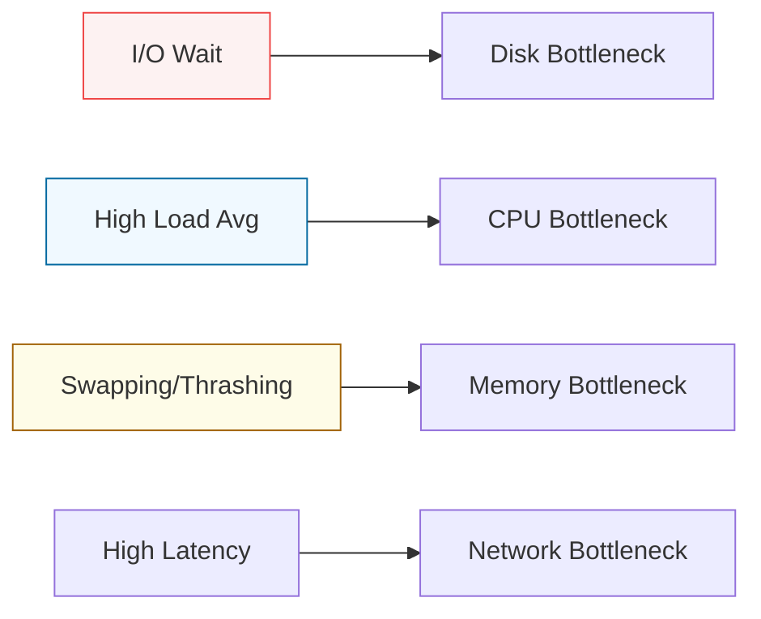

# ⚡ 03: Performance Tuning & Monitoring

> **"If you can't measure it, you can't optimize it."**

---

## 🏛️ The Resource Stack

Performance tuning is about managing the four classic horsemen of resource bottlenecks: **CPU**, **Memory**, **Disk I/O**, and **Network**.

### The Bottleneck Hunt

---

## 🌟 Overview

This module is about **Observability**. You will learn how to look inside the "Black Box" of a running server. We move beyond `top` into advanced telemetry and kernel-level performance parameters (`sysctl`).

### Key Intermediate Metrics:
1.  **Load Average**: Understanding that "High Load" != "High CPU usage" (I/O Wait, Zombie processes).
2.  **Memory Management**: The difference between Free, Cached, and Buffers. Why `0% Free Memory` is actually a good sign in Linux.
3.  **I/O Context**: Using `iostat` and `iotop` to find the specific database query or backup process killing disk performance.
4.  **The Sysctl Interface**: Tuning kernel parameters like `swappiness`, `file-max`, and TCP buffers for high-traffic web servers.

---

## 🚀 The Intermediate Toolbelt

1.  **htop/atop**: Visualizing real-time resource distribution across cores.
2.  **sar (System Activity Reporter)**: Historical analysis. "Why did the server crash at 3 AM yesterday?"
3.  **vmstat**: Reporting virtual memory, process, and CPU statistics in a single line.
4.  **nice/renice**: Controlling process priority to ensure critical tasks aren't starved of CPU.

---

## 🏆 Real-World Scenario: The Mysterious Web Slowness

**The Crisis**: A web server is responding slowly, but `top` shows CPU at only 10%.
**The Solution**: An intermediate investigation using **iostat**.
1.  **Check I/O Wait**: `top` showed 40% CPU time in "wa" (Wait) state.
2.  **Find the Culprit**: `iotop` revealed a legacy logging script writing 100MB/s to a slow HDD.
3.  **The Fix**: Moved the logs to an SSD-backed volume and tuned the kernel `dirty_ratio` to buffer writes more effectively.
**Result**: Response times dropped from 2 seconds to 50ms immediately.

---

## ❓ Interview Preparation (Monitoring)

1.  **Q: What do the three numbers in 'Load Average' represent?**
    *A: They represent the average number of processes in the 'runnable' or 'uninterruptible' state over the last 1, 5, and 15 minutes. A load of 4.0 on a 4-core machine means the CPU is 100% utilized. A load of 8.0 means it is 200% overtaxed.*

2.  **Q: Why does Linux use so much memory for 'Buffers' and 'Cache'?**
    *A: An unused byte of RAM is a wasted byte. The kernel uses spare RAM to store recently accessed data from disk. If an application needs that memory, the kernel releases the cache instantly. This makes the system significantly faster than reading from slow disks.*

---

## 📝 Knowledge Check

1. **Which command provides historical resource usage data?**
- [ ] a) top
- [x] b) sar
- [ ] c) vmstat

2. **True or False: A high 'wa' (Wait) value in top indicates a disk or storage bottleneck.**
- [x] True
- [ ] False

---

## 🔗 Next Steps
Proceed to: **[Log Management & Auditing](../04-Log-Management-and-Auditing/README.md)** →
