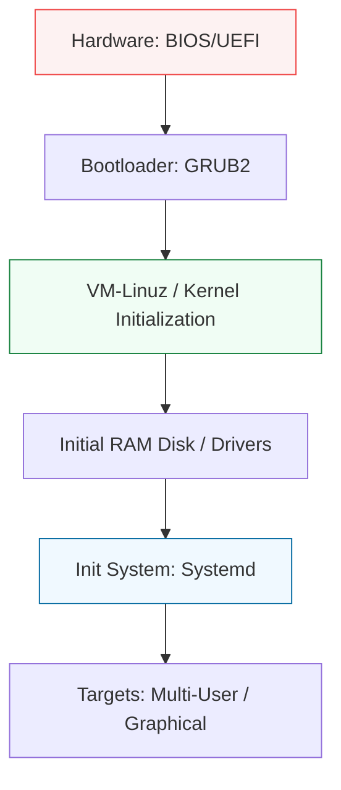

# ⚙️ 05: Kernel & Boot Systems

> **"A server isn't just a running process; it's a lifecycle from Power-On to Shutdown."**

---

## 🏛️ The Boot Architecture

The journey from a "Cold Metal" box to a "Ready-for-Traffc" server is a complex, multi-stage process. Understanding this is vital for disaster recovery and system optimization.

### The Linux Boot Sequence

---

## 🌟 Overview

This module covers the "Vitals" of the operating system. You will learn how the kernel initializes and how to manage the modern `systemd` ecosystem to run your own custom services.

### Key Intermediate Topics:
1.  **Systemd Deep Dive**: Creating custom `.service`, `.timer`, and `.mount` units.
2.  **The Boot Process**: Troubleshooting "Kernel Panics" and "Recovery Mode."
3.  **Kernel Modules**: Using `insmod`, `modprobe`, and `lsmod` to manage hardware support.
4.  **The /proc and /sys Filesystems**: Browsing the "Running State" of the kernel in real-time.

---

## 🏗️ Professional Patterns

### 1. The Custom Service Pattern
Instead of running a python script in a `screen` or `tmux` session, you will learn to write a dedicated systemd unit that handles auto-restart, logging, and dependency management.

### 2. Runlevel (Target) Management
Switching between `multi-user.target` (Servers) and `emergency.target` (Troubleshooting) without rebooting the system.

---

## 🏆 Real-World Scenario: The 3 AM Boot Loop

**The Crisis**: After a scheduled kernel update, a critical database server fails to reboot, displaying a "Kernel Panic" on the console.
**The Solution**: An intermediate recovery workflow.
1.  **GRUB Intervention**: Interrupted the boot process and selected the previous "Known Good" kernel version.
2.  **Single User Mode**: Booted into `emergency.target` to inspect the logs.
3.  **Identify the Driver**: Found that a new kernel module for the storage controller was incompatible with the hardware.
**Result**: Rolled back the driver, updated the kernel configuration, and restored the database in under 15 minutes.

---

## ❓ Interview Preparation (Boot & Init)

1.  **Q: What is the role of 'initramfs' in the boot process?**
    *A: It is a small filesystem loaded into RAM that contains the basic drivers (like storage and network) needed by the kernel to mount the "Real" root filesystem. Without it, the kernel couldn't talk to the disk to find the rest of the OS.*

2.  **Q: How do you create a service that automatically restarts if it crashes?**
    *A: In the systemd `.service` file, add `Restart=on-failure` and `RestartSec=5s` under the `[Service]` section. This makes the system resilient without human intervention.*

---

## 📝 Knowledge Check

1. **Which command is used to reload the systemd configuration after a file change?**
- [ ] a) `systemd reload`
- [x] b) `systemctl daemon-reload`
- [ ] c) `service reload`

2. **True or False: The /proc filesystem contains files that exist on the physical hard drive.**
- [ ] True
- [x] b) False (It is a virtual filesystem generated by the kernel in RAM)

---

## 🔗 Next Steps
Proceed to: **[Advanced Storage (LVM)](../06-Advanced-Storage-LVM/README.md)** →
