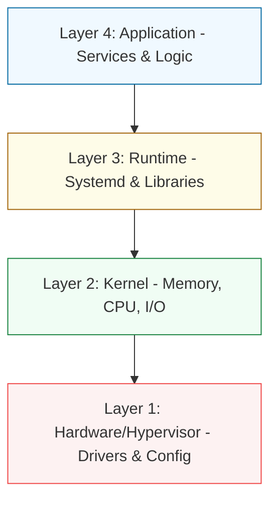

# 🖥️ System Administration (Intermediate)

> **"A junior admin fix issues. An intermediate admin builds systems that don't break. A senior admin builds systems that fix themselves."**

---

## 🏛️ The System Layers

Intermediate system administration focuses on the transition from "Managing a Computer" to "Engineering a Server Platform."

## 📚 Overview

This module covers the deeper internals of Linux and Windows systems. We focus on **Security Hardening**, **Performance Optimization**, and **Lifecycle Management**. You will learn how the kernel manages resources and how to audit every action on a system for compliance and troubleshooting.

## 🎓 Learning Objectives

By the end of this module, you will be able to:
1.  **Harden Systems**: Implement enterprise-grade security using Firewalls (NFTables/Firewalld) and Mandatory Access Control (SELinux/AppArmor).
2.  **Optimize Performance**: Use advanced tools like `sar`, `vmstat`, and `perf` to identify bottlenecks in CPU, Memory, and I/O.
3.  **Manage Logs & Auditing**: Set up centralized logging and system auditing to track "Who did What" and "When."
4.  **Master Storage**: Use LVM (Logical Volume Management) to resize disks without downtime and implement RAID for data redundancy.
5.  **Understand Boot & Init**: Master the `systemd` ecosystem and the Linux boot sequence (BIOS/UEFI → GRUB → Kernel → Init).

---

## 🏗️ Module Roadmap

| Phase | Topic | Focus |
| :--- | :--- | :--- |
| **01** | [**Introduction**](./01-Introduction/README.md) | Platform Engineering vs. Traditional SysAdmin. |
| **02** | [**Server Hardening**](./02-Server-Hardening/README.md) | Firewalls, SSH Security, and MAC (SELinux). |
| **03** | [**Performance Tuning**](./03-Performance-Tuning/README.md) | Resource Monitoring and Kernel Parameters. |
| **04** | [**Log Management & Auditing**](./04-Log-Management-and-Auditing/README.md) | Journald, Auditd, and Log Rotation. |
| **05** | [**Kernel & Boot Systems**](./05-Kernel-and-Boot-Systems/README.md) | Systemd Units and the Boot Lifecycle. |
| **06** | [**Advanced Storage (LVM)**](./06-Advanced-Storage-LVM/README.md) | Dynamic Storage and Redundancy. |
| **07** | [**Assessments**](./07-Assessments/README.md) | Interview Prep, Quizzes, and Solutions. |

---

## 🚀 The Reliability Standard

All administration practices in this module follow the **SRE (Site Reliability Engineering)** mindset:
- **Observability**: If it isn't monitored, it doesn't exist.
- **Security by Design**: Least privilege applied at the kernel level.
- **Immutability**: Prefer reproducible configurations over manual one-off fixes.

---

[⬅️ Back to Infrastructure Automation](../README.md)
