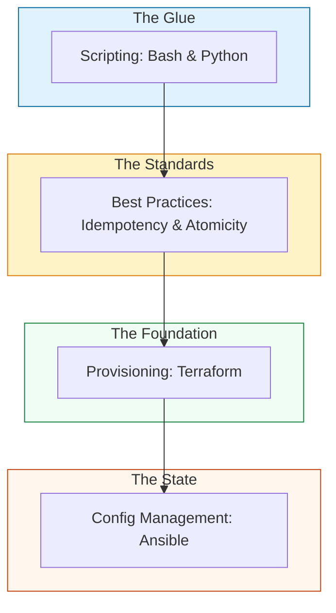

# 🏗️ Infrastructure Automation: The Architect's Portal

> **"Listen up, Junior. A beginner writes scripts to automate tasks. A senior engineer architects systems that automate themselves. In this module, you are moving from 'Handyman' to 'Architect'."**

---

## 🧠 The Mental Model: The Architect's Blueprint

**The Junior Struggle**: "I'll just write a Bash script that loops through a list of servers and runs a command. Isn't that automation?"

**The Senior Solution**: You realize that scripts are **imperative** (Do this, then that). Real automation is **declarative** (This is what the blueprint looks like).
Think of it as a **Lego Instruction Manual**:
- **Imperative (Junior)**: "Pick up a red block. Put it on a blue block. Now find a yellow block." If you lose your place, everything breaks.
- **Declarative (Senior)**: "Build a house with 4 red walls and a yellow roof." The system looks at what you have, sees what's missing, and builds ONLY the missing parts.

---

## 🆚 Junior Way vs. Senior Way

| Feature | The Junior Way (Problematic) | The Senior Way (Architected) |
|:---|:---|:---|
| **Approach** | Imperative ("Run this command") | **Declarative** ("State should be X") |
| **Idempotency** | Running the script twice breaks things | **Idempotent by default** (Safe to re-run) |
| **Errors** | "Hope it works" execution | **Fail-Fast** (Check-Act-Verify) |
| **Logic** | Thousands of lines of nested `if` statements | **Modular Roles** and Task separation |
| **Drift** | Manual changes go unnoticed | **Continuous Reconciliation** (State tracking) |

---

## 🏗️ The Automation Ecosystem

---

## 📂 Core Modules

### 1. [🤖 Scripting Automation](./01-Scripting-Automation/README.md)
*Junior, don't just write scripts; build tools.* 
Master high-performance data parsing (JSON/YAML), Python Boto3 SDKs, and writing CLI tools that other people actually want to use.

### 2. [🛡️ Automation Best Practices](./04-Automation-Best-Practices/README.md)
*Reliability isn't an accident.* 
Deep-dives into **Idempotency**, **Atomicity**, and the **"Guard Clause"** pattern. Learn why `set -euo pipefail` should be in your DNA.

### 3. [⚙️ Config Management](./02-Config-Management/README.md)
*Infrastructure is code.* 
Terraform for the "Walls" (Provisioning) and Ansible for the "Wallpaper" (Configuration). Learn to manage **State** and detect **Drift**.

### 4. [☁️ Cloud Platforms](./03-Cloud-Platforms/README.md)
*The global playground.* 
Platform-specific patterns for AWS, Azure, and Google Cloud. Scaling resources across regions with zero human interaction.

---

## 📖 The Architect's Reference Library

These deep-dive documents serve as the source of truth for "Staff Level" automation patterns.

1.  **[IaC & State Management](./REFERENCE/IaC-State-Management-Ref.md)**: Deep-dive into remote backends, state locking, and refactoring lifecycle.
2.  **[Compliance & Governance](./REFERENCE/Infrastructure-Compliance-Ref.md)**: Policy as Code (OPA/Sentinel), cost analysis, and immutable image lifecycles.
3.  **[Automation Resilience](./REFERENCE/Automation-Resilience-Ref.md)**: Exponential backoff, atomic writes, and the chaos engineering mindset.

---

## 🏆 Real-World DevOps Story: The Infinite Loop

**The Scenario**: A Junior engineer wrote a script to clean up old files but accidentally pointed it at the root directory `/` because a variable was empty.
**The Crisis**: The script deleted the entire system in 30 seconds. There was no **Guard Clause** to check if the path was safe before running `rm -rf`. 
**The Fix**: Implemented **Safe Deletion Patterns** and mandated `set -u` (fail on unset variables) in all production scripts.
**The Lesson**: **Junior, your scripts are powerful. Without guardrails, they are dangerous.**

---

## 🎤 Interview Preparation (Automation)

1. **Q: Junior, what is 'Idempotency' in the context of automation?**
   - *A: It means a script can be run multiple times without changing the result beyond the initial application. For example, 'Create directory /tmp/foo' is idempotent because if it exists, nothing happens.*

2. **Q: Explain 'Imperative' vs. 'Declarative' automation.**
   - *A: Imperative is a series of steps (How). Declarative is a description of the final state (What). Declarative is preferred because the tool handles the complexity of 'How'.*

3. **Q: What does `set -euo pipefail` do in a Bash script?**
   - *A: `-e` exits on error, `-u` exits on unset variables, and `pipefail` ensures that if any part of a pipe fails, the whole command fails.*

4. **Q: Why is 'State' important for tools like Terraform?**
   - *A: State acts as a 'Source of Truth' that allows the tool to map your code to real-world resources. It's how the tool knows what to create, update, or destroy.*

5. **Q: What is 'Configuration Drift'?**
   - *A: It occurs when the actual state of a server changes manually (someone logged in and edited a file), making it different from the code in the automation repo.*

6. **Q: Explain 'Atomicity' in a automation task.**
   - *A: An operation is atomic if it either completes 100% or fails completely with no partial changes. This prevents 'half-broken' systems.*

7. **Q: When should you use Python over Bash?**
   - *A: Use Bash for simple file operations and system commands. Use Python when you need complex data processing (JSON/YAML), API calls (Boto3), or advanced error handling.*

8. **Q: What is a 'Guard Clause'?**
   - *A: A piece of code at the beginning of a function or script that checks for invalid conditions and exits immediately (e.g., 'If variable is empty, exit').*

9. **Q: What is the risk of using 'Latest' tags in automation?**
   - *A: 'Latest' is unpredictable. A script that works today might break tomorrow when a new version is released. Always pin to specific versions.*

10. **Q: How do you perform a 'Dry Run' in Ansible or Terraform?**
    - *A: Ansible: `--check`. Terraform: `terraform plan`. This allows you to see what will happen before making changes.*

---

## 📝 Knowledge Check

1. **Which pattern ensures a script is safe to re-run multiple times?**
   - [x] Idempotency.

2. **Which tool is primarily used for 'Provisioning' (Creating VMs/Networks)?**
   - [x] Terraform.

3. **What happens if you run a non-idempotent script twice?**
   - [x] It might duplicate data or throw errors.

4. **Which Bash flag exits if a variable is not defined?**
   - [x] `-u` (nounset).

5. **What is 'Immutable Infrastructure'?**
   - [x] Infrastructure that is replaced rather than updated (No manual edits).

6. **In Python automation, which library is the standard for AWS?**
   - [x] Boto3.

7. **True/False: It is okay to store database passwords in your scripts as long as they are private.**
   - [x] **False**. (Use Secret Managers).

8. **What does a 'State File' track?**
   - [x] The mapping between your code and the actual infrastructure.

9. **Which pattern checks conditions BEFORE executing dangerous code?**
   - [x] Guard Clause.

10. **Which command helps find 'Configuration Drift'?**
    - [x] `terraform plan` or `ansible --check`.

---

## 🔗 Next Steps
Junior, the portal is open. Let's start with the glue that holds it all together.
1. Proceed to: **[🤖 Scripting Automation](./01-Scripting-Automation/README.md)** →
2. Return to: **[Phase 2 Hub](../README.md)** →

---
## 🧭 Additional Modules
- [05 System Administration](05-System-Administration/README.md)
