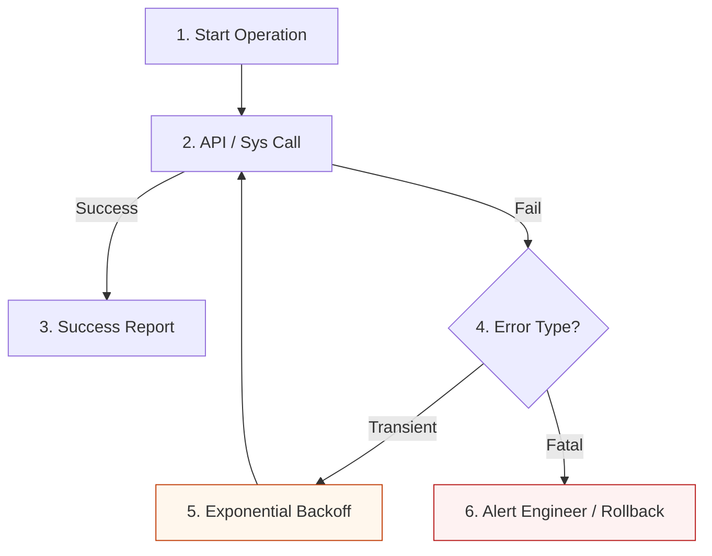

# Automation Resilience & Error Handling Reference

**Doc Version:** 1.0.0
**Role:** Senior SRE / Automation Engineer
**Scope:** Retries, Exception Handling, Atomicity, and Chaos Engineering
**Maturity Level:** Staff Engineering Standard

---

## 1. The Resilience Mindset: "Anticipate Failure"

In infrastructure automation, the network is unreliable, APIs have rate limits, and cloud resources can be in "Transient States." A resilient script assumes every API call will eventually fail.

### The Junior vs. Senior Error Handling
*   **Junior**: `try: ... except Exception: pass` (The "Silent Killer")
*   **Senior**: Specific exception handling (`botocore.exceptions.ClientError`), logging with context, and structured recovery.

---

## 2. Advanced Retry Strategies

Never use a "Fixed Interval" retry (e.g., `sleep(10)`). This can cause "Thundering Herds" that crash your API Gateway.

### 🔄 Exponential Backoff with Jitter
The production standard for retries.
1.  **Exponential**: Increase the wait time after each failure (2s, 4s, 8s, 16s...).
2.  **Jitter**: Add a small random amount of time to the wait (e.g., 2.3s, 4.1s) to desynchronize multiple scripts retrying at once.

> **Staff Pattern**: Use the **Retries as a Configuration** (e.g., Boto3 `adaptive` mode) rather than writing manual loops in your code.

---

## 3. The Atomicity Principle: "All or Nothing"

Automation should never leave a system in a "Partially Modified" state. 

### Implementation Patterns:
*   **Tmp-File-and-Move**: When modifying a config file, write to `config.conf.tmp` first. Validate the content. Only then rename it to `config.conf`. This prevents a crash in the middle of writing from corrupting the system.
*   **Resource Cleanup**: If a script fails while creating 5 resources, it should attempt to delete the "orphans" it already created before exiting.
*   **State-Locking**: Ensure no other process can touch the data while your atomic operation is in progress.

---

## 4. Idempotency & The "Zombie" Problem

An **Idempotent** script is one that can be run 100 times and results in the same outcome as running it once.

### The "Zombie Hunter" Pattern
When auditing for "Zombie" resources (unattached EBS volumes, orphan EIPs):
1.  **Check**: Does the resource match our criteria (e.g., Unattached + No 'Permanent' tag)?
2.  **Act**: Apply a `Termination-Candidate` tag with a date.
3.  **Verify**: Log the change and verify the tag was successfully registered.

**Why Tagging instead of Deleting?**
Infrastructure is risky. "Tag-then-Sweep" is a safer, idempotent governance pattern that allows humans to intercept an accidental deletion.

---

## 5. Visualizing the Resilient Loop

---

## 6. Chaos Engineering for Automation

Don't wait for a real outage to test your resilience.

*   **Failure Injection**: Add a `--chaos` flag to your scripts that introduces a 10% chance of a "simulated error" (throwing a random exception).
*   **Drift Simulation**: Manually change a security group in the console to verify that your "Self-Healing" automation detects and reverts it correctly.
*   **The "Termination" Test**: Kill your automation script in the middle of a run. Does it leave the system corrupted? If yes, it is not atomic enough.

> **Staff Principle**: "If you haven't tested your recovery logic under stress, you don't have recovery logic—you have a wish."
