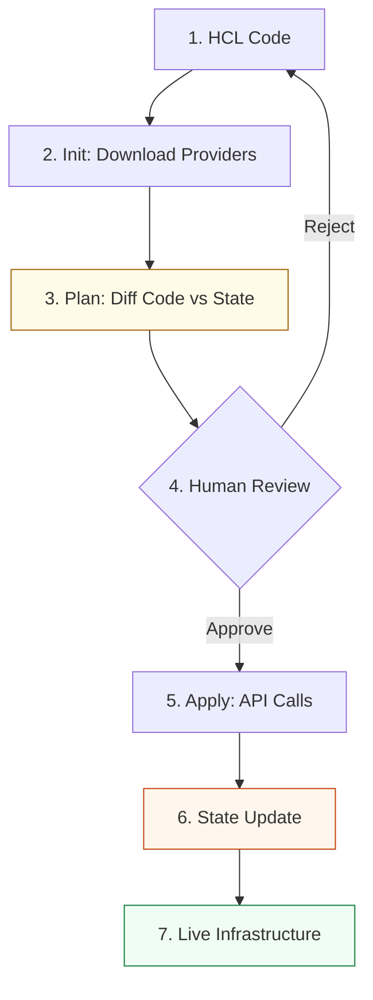

# IaC & State Management Reference

**Doc Version:** 1.1.0
**Role:** Infrastructure Architect
**Scope:** Terraform, State Management, and Resource Lifecycles
**Maturity Level:** Production-Grade / Staff Engineering

---

## 1. The Declarative Philosophy

Infrastructure as Code (IaC) shifts infrastructure management from manual "snowflake" server configuration to a version-controlled, automated process.

### Imperative vs. Declarative
*   **Imperative (Task-based)**: "Step 1: Create a VM. Step 2: Install Nginx. Step 3: Open Port 80." (e.g., Shell scripts, AWS CLI, Ansible tasks). It focuses on the **How**.
*   **Declarative (State-based)**: "I want 3 VMs with Nginx and Port 80." (e.g., Terraform, CloudFormation, Kubernetes YAML). It focuses on the **What**.

**The Benefit**: In a declarative system, the tool calculates the "Plan" (diff) between the live environment and the code, performing only the delta operations.

---

## 2. The Source of Truth: The "State File"

The **State File** (`terraform.tfstate`) is the most critical asset in a provisioning workflow. It maps your high-level code to real-world cloud IDs.

### 🧩 Anatomy of State
*   **Resource Mapping**: Links logical names (e.g., `aws_instance.web`) to physical IDs (e.g., `i-0abcdef12345`).
*   **Metadata Storage**: Tracks dependencies that aren't visible in code (e.g., "Resource B must wait for Resource A's private IP").
*   **Cache**: Prevents querying the cloud API for every single attribute, significantly speeding up large environments.

### 🛡️ State Governance (Staff Standards)
*   **Remote Backends**: **Never** store state locally. Use S3 (AWS), GCS (GCP), or Azure Blob with versioning enabled.
*   **State Locking**: Use a distributed lock (e.g., DynamoDB for AWS) to prevent "Concurrent Write" corruption.
*   **Encryption**: State files contain plain-text secrets (DB passwords, private keys). They must be encrypted at rest and in transit.
*   **Isolation**: Every environment (Dev/Staging/Prod) **must** have its own isolated state file.

---

## 3. Advanced State Operations

Senior Engineers interact with state directly when the real world gets messy.

| Command | Use Case | Rationale |
| :--- | :--- | :--- |
| `terraform import` | Brownfield projects | Bringing existing manual resources under IaC control. |
| `terraform state mv` | Refactoring | Moving resources into modules without destroying/recreating them. |
| `terraform state rm` | Resource Disconnect | Removing a resource from state without deleting it in the cloud. |
| `terraform refresh` | Drift Check | Updating the state file with the latest live values from the cloud. |

> **Staff Pro-Tip**: Before refactoring a large module, run `terraform state list` to map out exactly what will be impacted.

---

## 4. Environment Scaling: Workspaces vs. Directory Isolation

How do you manage Dev, Staging, and Production?

1.  **Workspaces**: Uses a single set of code but stores multiple state files in the backend. 
    *   *Pros*: Fast setup, clean code.
    *   *Cons*: High risk—an accidental `terraform destroy` in the wrong workspace can be fatal.
2.  **Directory Isolation (Recommended)**: Separate folders for each environment, often using a "Global" module.
    *   *Pros*: Strongest isolation, hardest to make global mistakes.
    *   *Cons*: More code boilerplate (managed by tools like Terragrunt).

---

## 5. Resource Lifecycles: Controlling the "Apply"

The `lifecycle` block allows you to override Terraform's default behavior for critical resources.

*   **`prevent_destroy = true`**: Prevents accidental deletion of high-value resources (e.g., Production Databases).
*   **`ignore_changes = [tags]`**: Useful when external tools (like AWS Auto-Tagging) modify resources outside of Terraform.
*   **`create_before_destroy = true`**: Enables "Zero Downtime" updates for resources that cannot be modified in-place (e.g., Launch Templates).

---

## 6. Visualizing the IaC Lifecycle

---

## 7. Operational Reality: Handling Configuration Drift

**Drift** is the silent killer of IaC.
*   **Detection**: Run a scheduled `terraform plan` in your CI/CD pipeline. Any output indicates drift.
*   **Remediation**:
    1.  **The Pure Path**: Run `terraform apply` to overwrite the manual change.
    2.  **The Pragmatic Path**: Update the code to match the manual change, then run `apply` to sync state.

> **Staff Engineer Note**: Manual changes are a symptom of a broken process. If drift is frequent, restrict console access to "Read-Only" for all engineers.
