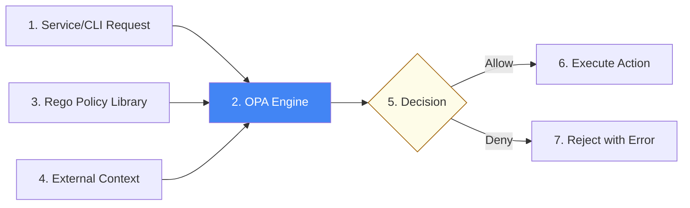

# Policy-as-Code & OPA Architecture Reference

**Doc Version:** 1.0.0
**Role:** DevSecOps Engineer / Compliance Officer
**Scope:** OPA Architecture, Rego Language, and Enforcement Patterns

---

## 1. The Decoupled Authorization Model

Traditionally, authorization logic is embedded inside application code (`if user.isAdmin() then ...`). **Policy-as-Code** via Open Policy Agent (OPA) decouples this logic.

### Benefits of Decoupling
- **Consistency**: The same policy can be applied to APIs, Infrastructure (Terraform), and Kubernetes.
- **Auditability**: Policies are written in a human-readable language (Rego) and stored in Git.
- **Speed**: Security teams can update policies without waiting for developers to recompile applications.
- **Performance**: OPA evaluates policies in-memory with high efficiency.

---

## 2. OPA Primitives: Data, Policy, and Query

OPA makes decisions by combining three inputs:

1.  **Data (JSON)**: The state of the world (e.g., a Kubernetes manifest, a Terraform plan, or a user profile).
2.  **Policy (Rego)**: The rules that define allowed vs. forbidden states.
3.  **Query**: The request for a decision (e.g., "Is this deployment allowed?").

---

## 3. The Rego Language

**Rego** is a declarative logic language tailored for policy enforcement.

### Key Concepts
- **Rules**: If all conditions in a rule are true, the rule is true.
- **Default Values**: Specify a fallback decision (usually `deny`).
- **Iteration**: Easily scan through arrays of resources (e.g., checking all S3 buckets in a Terraform plan).

---

## 4. Enforcement Patterns

### A. Pre-Deployment (Static Analysis)
- **Tool**: Checkov, tfsec, or OPA `conftest`.
- **Location**: CI/CD Pipeline.
- **Mechanism**: Scan the code before resources are created.
- **Pros**: Zero cost to "fix" (it's just a code change).

### B. Admission Control (Runtime Prevention)
- **Tool**: OPA Gatekeeper or Kyverno.
- **Location**: Kubernetes API Server.
- **Mechanism**: The cluster itself rejects requests that violate policy.
- **Pros**: Catch manual "cowboy" changes that bypass Git.

---

## 5. Visualizing the Policy Decision Loop

---

## 6. Enterprise Governance Standards

- **Forbidden Actions**: "Deny all public S3 buckets."
- **Mandatory Metadata**: "Every resource must have an 'Owner' and 'Project' tag."
- **Scaling Limits**: "No CPU requests higher than 4 cores for non-prod namespaces."
- **Network Isolation**: "No Load Balancers allowed in the DB subnet."

> **Enterprise Pattern**: Use **Unit Tests for Rego**. Policies are code; they should have their own tests (using `opa test`) to ensure a logic error in a security policy doesn't accidentally block the entire company's deployments.
