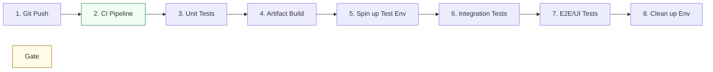

# DevOps Testing Strategy & Architecture Reference

**Doc Version:** 1.0.0
**Role:** QA Automation Engineer / DevOps SRE
**Scope:** Testing Pyramid, Test Data Management, and Environment Parity

---

## 1. The DevOps Testing Pyramid

Modern testing strategy emphasizes a high volume of fast, low-level tests and a small number of slow, high-level tests.

### A. Unit Testing (Foundation)
- **Scope**: Individual functions, classes, or modules.
- **Speed**: Extremely fast (milliseconds).
- **Isolation**: High (use mocks/stubs for external dependencies).
- **Goal**: Logic verification.

### B. Integration Testing (Middle)
- **Scope**: Interaction between two or more components (e.g., Code + Database, Service A + Service B).
- **Speed**: Medium (seconds).
- **Isolation**: Medium (uses real databases or containers via Testcontainers).
- **Goal**: Contract verification.

### C. End-to-End (E2E) Testing (Top)
- **Scope**: Total user journey from UI to Database.
- **Speed**: Slow (minutes).
- **Isolation**: Low (requires a full environment).
- **Goal**: Workflow verification.

---

## 2. Test Data Management (TDM)

One of the biggest bottlenecks in test automation is consistent, high-quality data.

### The "Rules" of Test Data
1.  **Never Use Production Data**: Violates privacy (GDPR/PCI) and security standards.
2.  **Synthetic Data Generation**: Use libraries like **Faker** or **Factory Boy** to generate realistic but fake data.
3.  **Data Masking**: If you must use production data, anonymize sensitive fields (names, emails, credit cards).
4.  **Clean Slate Pattern**: Ensure every test suite starts with a fresh, known database state. Avoid "poisoning" data from previous runs.

---

## 3. Environment Parity

"It works in Dev but fails in QA" is usually an environment parity issue.

### Achieving Parity
- **Infrastrucutre as Code (IaC)**: Use the same Terraform/Ansible code to build Dev, Test, and Prod.
- **Containerization**: Ensure the same Docker image version moves through all stages.
- **Dynamic Environments**: Spin up a temporary "Ephemeral Environment" for every Pull Request and destroy it after testing is complete.

---

## 4. Visualizing the Automated Testing Loop

---

## 5. Performance and Resilience Testing

- **Load Testing**: Can the system handle 100 concurrent users? (k6, JMeter).
- **Stress Testing**: At what point does the system crawl/crash?
- **Chaos Engineering**: Can the system survive the loss of a database or a network zone? (Gremlin, Chaos Mesh).

---

## 6. Enterprise Quality Governance

- **Code Coverage**: Enforcing a mandatory minimum (e.g., 80%) in the CI pipeline.
- **Flaky Test Management**: Identifying and quarantining tests that fail randomly to maintain trust in the pipeline.
- **Testing in Production**: Using Canary Deployments or Feature Flags to safely test code with real users.

> **Enterprise Pattern**: Use **Testcontainers**. Instead of mocking a database, spin up a real Postgres Docker container during the test execution in CI. This provides 100% confidence in your database logic without the overhead of a managed instance.
