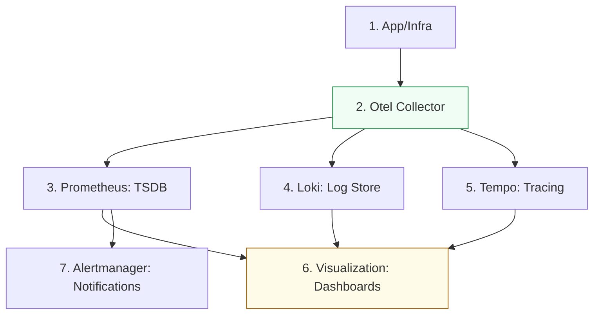

# Observability Architecture & Monitoring Reference

**Doc Version:** 1.0.0
**Role:** Reliability Engineer (SRE) / Observability Lead
**Scope:** Three Pillars (Metrics, Logs, Traces), Alerting, and Dashboards

---

## 1. Monitoring vs. Observability

- **Monitoring**: Focuses on the "Known-Unknowns." Is the CPU > 90%? Is the service up? You know what to look for.
- **Observability**: Focuses on the "Unknown-Unknowns." Why is the lateny high for *only* users in Germany who are using iPhones? It allows you to ask questions of your system that you didn't define in advance.

---

## 2. The Three Pillars (and MELT)

A complete observability strategy requires all three:

### A. Metrics (Aggregated Data)
- **What**: Numeric values over time (CPU, Error Rate, Latency).
- **Format**: Time-series (TSDB).
- **Pros**: Low overhead, easy to chart/alert.
- **Cons**: Lack of context (the "Why").
- **Tools**: Prometheus, VictoriaMetrics, Datadog.

### B. Logs (Individual Events)
- **What**: Textual records of discrete events.
- **Format**: Structured (JSON) or Unstructured.
- **Pros**: High detail/context.
- **Cons**: High storage cost, hard to query at scale if not structured.
- **Tools**: ELK Stack (Elasticsearch, Logstash, Kibana), Loki, Splunk.

### C. Traces (Request Journeys)
- **What**: Data showing the path of a request through microservices.
- **Format**: Spans and Trace IDs.
- **Pros**: Pinpoints precisely where a bottleneck or error occurred in a distributed system.
- **Cons**: High complexity to implement (requires code instrumentation).
- **Tools**: Jaeger, Tempo, Honeycomb.

---

## 3. High-Signal Alerting Strategy

Avoid "Alert Fatigue" by focusing on customer impact.

### Symptom-Based Alerting
- **Check**: "Is the error rate for users > 1%?" (High Signal - Page the SRE).
- **Not**: "Is CPU usage on server A > 90%?" (Low Signal - Service may still be healthy).

### Alert Severities
- **Critical (P0/P1)**: Waking up an engineer (PagerDuty).
- **Warning (P2/P3)**: Notification in Slack for the next business day.
- **Info**: Recorded in logs/dashboards only for debugging.

---

## 4. Visualizing the Observability Pipeline

---

## 5. Enterprise Best Practices

- **The 4 Golden Signals**: Latency, Traffic, Errors, Saturation. Monitor these for *every* service.
- **Standardized Logging**: Enforce a mandatory JSON logging format across all teams (timestamp, service_id, trace_id, level, message).
- **Dashboards as Code**: Maintain Grafana dashboards in Git (using JSON or Grafana-lib) to ensure consistency.
- **Recording Rules**: Pre-calculate expensive Prometheus queries to keep dashboards fast and responsive.

> **Enterprise Pattern**: Implement **OpenTelemetry (OTel)**. By using a vendor-neutral collector, you can send your metrics and logs to Prometheus and Loki today, and switch to a commercial provider like Datadog tomorrow without changing a single line of application code.
