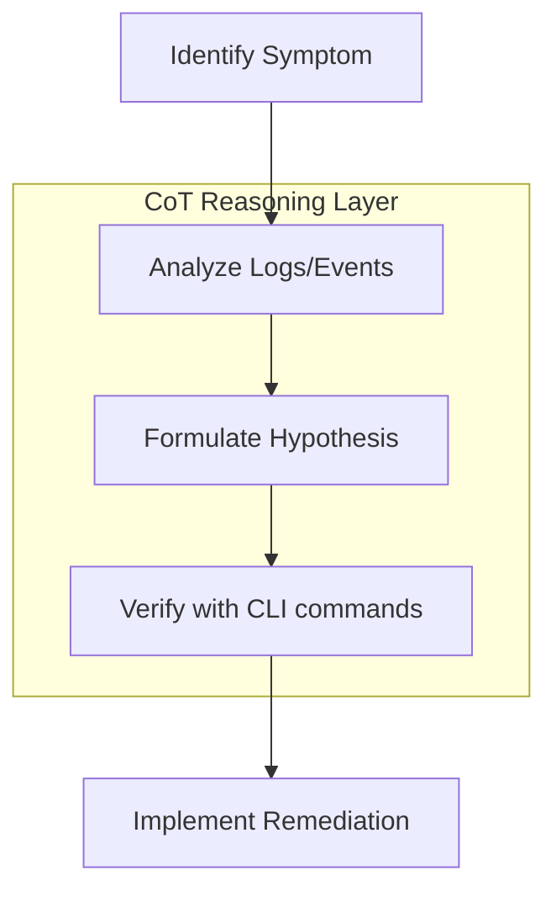

Chain-of-Thought (CoT) is a technique that encourages LLMs to decompose complex problems into a series of logical intermediate steps. For DevOps, this is essential for troubleshooting "black box" infrastructure failures.

## 🧠 Why Use CoT in DevOps?
Infrastructure issues often involve multiple layers (Network, OS, Container, Managed Service). A simple prompt might result in a "guess." CoT forces the model to trace the logic.

### Example: The "Thinking" Prompt
Instead of: *"Give me a script to fix K8s CrashLoopBackOff."*
Use: *"Analyse this event log: [LOGS]. Let's think step-by-step. First, identify the exit code. Second, check the volume mounts. Third, give me the remediation script."*

---

## 🛠️ Practical Implementation

### Troubleshooting Flow

### Prompt Template for Networking issues:
> "I cannot connect to my RDS instance from my EC2 instance. 
> **Goal**: Debug this connection issue.
> **Constraint**: Think through each layer of the OSI model involved (Security Groups, NACLs, Routing Tables, VPC Peering).
> **Output**: A step-by-step reasoning trace followed by the specific AWS CLI commands to verify each layer."
