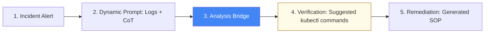

# AI-Operations & Advanced Prompting Reference

**Doc Version:** 1.0.0
**Role:** AI Operations Engineer / Platform Lead
**Scope:** CoT, Parameter Tuning, and Role-Based Guardrails

---

## 1. Chain-of-Thought (CoT) for Systems Debugging

CoT forces the LLM to "think out loud" before providing a final answer. This is critical for DevOps tasks involving complex logic like Networking, IAM, or Kubernetes.

### The Problem
Traditional prompting often leads to "hallucinated" commands or logically unsound fixes.

### The CoT Solution
By instructing the model to "Reason step-by-step," you force it to validate its own logic against the provided context.

**Prompt Snippet**:
```text
Role: Senior SRE
Context: [Copy/Paste Kubernetes Logs]
Task: Identify the root cause.
Constraint: For every hypothesis, provide a 'Verification Command' (e.g., kubectl describe). 
Use Chain-of-Thought reasoning.
```

---

## 2. LLM Parameter Governance

Configuration parameters drastically affect the reliability of code and configuration generation.

| Parameter | Recommended for Code | Effect |
| :--- | :--- | :--- |
| **Temperature** | **0.0 - 0.2** | Lower values make the output more deterministic and focused. Critical for YAML/Code accuracy. |
| **Top-P** | **0.1 - 0.3** | Limits the model to the most likely tokens. Reduces "creative" hallucinations. |
| **Max Tokens** | **Varies** | Ensure this is high enough for the full manifest/function but low enough to prevent runaway loops. |
| **Stop Sequences**| `</yaml>`, `Done` | Prevents the model from rambling after the code is generated. |

---

## 3. Advanced Role-Based Guardrails

Assigning a **Persona** provides the model with the correct "Mental Framework."

- **The Auditor Persona**: "Adopt the perspective of a PCI-DSS compliance auditor. Review the following Terraform plan for public S3 buckets."
- **The SRE Persona**: "You are an SRE at a global bank. Analyze these logs for symptoms of database connection pool exhaustion. Prioritize uptime and data integrity."

---

## 4. Visualizing the AI Incident Workflow



---

## 5. Few-Shot Learning for IaC Consistency

Instead of describing how you want your code to look, provide 2-3 examples (Shots).

**Example Prompt**:
```text
Convert the following ticket into a Terraform module. 
Follow the naming convention in these examples:
Example 1: [VPC Manifest]
Example 2: [S3 Manifest]
Ticket: "Create a private GCS bucket in region europe-west1"
```

---

## 6. Enterprise Safety and Privacy

- **Sanitization**: Automatically strip PII and sensitive internal IPs from logs before sending to public LLMs.
- **Context Injection (RAG)**: Providing the LLM with your internal architecture documentation ensures it doesn't suggest tools or patterns that your company doesn't support.
- **Human-in-the-Loop (HITL)**: Never allow an AI to automatically apply a production change. The AI suggests; the human approves and executes.

> **Enterprise Pattern**: Implement a **Prompt Library**. Store your most effective, tested prompts for generic tasks (Post-mortems, YAML generation, Log analysis) in Git. Treat prompts with the same version control rigor as application code.
