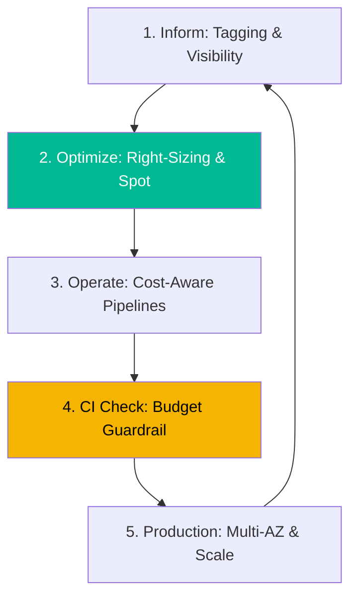

# FinOps & Cloud Cost Optimization Reference

**Doc Version:** 1.0.0
**Role:** FinOps Practitioner / Cloud Architect
**Scope:** Inform-Optimize-Operate lifecycle, Infracost, and Kubecost

---

## 1. The FinOps Lifecycle

FinOps is not a one-time project; it is a continuous loop.

1.  **Inform**: Gaining visibility into spending. Who is spending what? (Tagging, Dashboards).
2.  **Optimize**: Identifying waste and right-sizing resources. Should we use a smaller instance? Can we use Spot?
3.  **Operate**: Automating cost management. Implementing "Cost Gates" in CI/CD pipelines.

---

## 2. Unit Economics in DevOps

Instead of looking at the total cloud bill (e.g., "$10,000/mo"), successful FinOps practitioners look at **Unit Cost**.

- **Formula**: `Total Cloud Spend / Key Business Metric`
- **Example**: `Infrastructure Cost per Transaction`.
- **Goal**: If your cloud bill goes up by 20% but your transactions go up by 50%, your efficiency has improved, and the cost increase is justified.

---

## 3. Cost-Aware CI/CD (Shift-Left Cost)

Just as we shift security left, we must shift cost management left.

### Using Infracost
Infracost analyzes Terraform plans and adds a comment to the Pull Request with the projected cost change.

**Threshold Enforcement**:
- **Policy**: "If a PR increases monthly spend by more than $100, require a FinOps Lead approval."

---

## 4. Kubernetes Cost Visualization (Kubecost)

Kubernetes hides costs behind layers of abstraction (Nodes, Pods, Namespaces).

- **Namespace Allocation**: Mapping dollar amounts to specific teams based on their namespace resource consumption.
- **Efficiency Score**: Calculating the difference between "Allocated" resources (Request/Limit) and "Actual" usage.
- **Recommendations**: Kubecost suggests precision CPU/Memory requests to save money without impacting performance.

---

## 5. Visualizing the FinOps Loop

---

## 6. Enterprise Governance Standards

- **Mandatory Tagging**: Every resource must have a `CostCenter` and `Project` tag. Untagged resources are automatically terminated.
- **Right-Sizing Policies**: Monthly review of all instances with < 10% average CPU usage.
- **Spot First Policy**: Non-production and non-stateful workloads must use Spot instances or preemptible VMs.
- **Reservation Management**: Automating the purchase of Reserved Instances (RI) or Savings Plans based on a 6-month historical average.

> **Enterprise Pattern**: Use **Automated Waste Elimination**. Every Friday at 6 PM, an automated script (Lambda/CloudWatch) should turn off all "Dev" and "Test" environments that aren't tagged as `Always-On`, and turn them back on Monday at 8 AM. This "Weekend Shutdown" can save up to 30% of the non-prod cloud bill.
