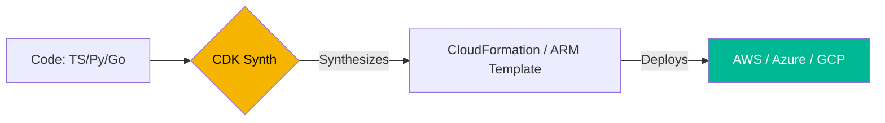

# ☁️ Serverless Infrastructure as Code (Intermediate)

> **"Write code, not configuration. Build infrastructure using the languages you already love."**

## 📚 Overview

Modern IaC follows two paths: **Declarative** (HCL/YAML like Terraform) and **Imperative/Construct-based** (TypeScript/Python like AWS CDK and Pulumi). This module focuses on using real programming languages to define and deploy cloud infrastructure.

## Core Concept: Infrastructure as Software
**[REFERENCE: Serverless IaC Architecture](./REFERENCE/Serverless-IaC-Architecture-Ref.md)**

Using the power of general-purpose languages to manage environments:
- **Synthesis Lifecycle**: Understanding how high-level code is translated into low-level templates (CloudFormation).
- **Construct Libraries**: Building reusable, object-oriented "bricks" for infrastructure.
- **Unit Testing IaC**: Applying software engineering rigor (Pytest/Snapshots) to verify templates before deployment.

## Enterprise Governance: Compliance as Logic
**[REFERENCE: Serverless IaC Architecture](./REFERENCE/Serverless-IaC-Architecture-Ref.md)**

Enforcing standards through code logic instead of manual reviews:
- **CDK Aspects**: Utilizing visitor patterns to automatically apply security tags or encryption to all resources in a stack.
- **Validated Constructs**: Mandating the use of approved, hardened internal libraries across dev teams.
- **Asset Lifecycle**: Automating the bundling, scanning, and deployment of serverless code (Lambda) alongside the infrastructure.
- **State Sequestration**: Ensuring infrastructure state is stored in secure, versioned backends with strict IAM controls.

## 🎯 Learning Objectives

- ✅ Master the **AWS CDK** Construct library.
- ✅ Understand the difference between **Synthesis** and **Deployment**.
- ✅ Deploy resources using **Pulumi** with Python.
- ✅ Implement Serverless patterns (Lambda + S3 + API Gateway) purely in code.

## 🗺️ Module Structure

1. **[🟢 01-AWS-CDK-Python](README.md)**
   - Installing `aws-cdk`.
   - Creating stacks and nested constructs.
2. **[🟢 02-Pulumi-Foundations](README.md)**
   - State management in Pulumi Cloud.
   - Resource mapping and secret encryption.

---

## 🏗️ Visual: The Synthesis Lifecycle



---

## 🛠️ Code: AWS CDK S3 Bucket (Python)

```python
from aws_cdk import (
    aws_s3 as s3,
    core
)

class MyServerlessStack(core.Stack):
    def __init__(self, scope: core.Construct, id: str, **kwargs) -> None:
        super().__init__(scope, id, **kwargs)

        # Create a private S3 bucket
        s3.Bucket(self, "MyFirstBucket",
            versioned=True,
            removal_policy=core.RemovalPolicy.DESTROY,
            auto_delete_objects=True
        )
```

## 📋 Professional Pattern: "Infrastructure as Software"
Treat your IaC like a regular software project. Use unit tests (e.g., `pytest` for CDK) to verify that your synthesized templates contain the expected security groups and tags before they ever reach the cloud.

---
**Next Step**: Start with [AWS CDK with Python](README.md) 🚀
