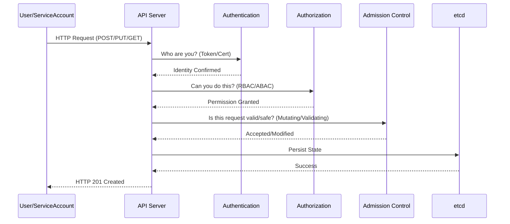
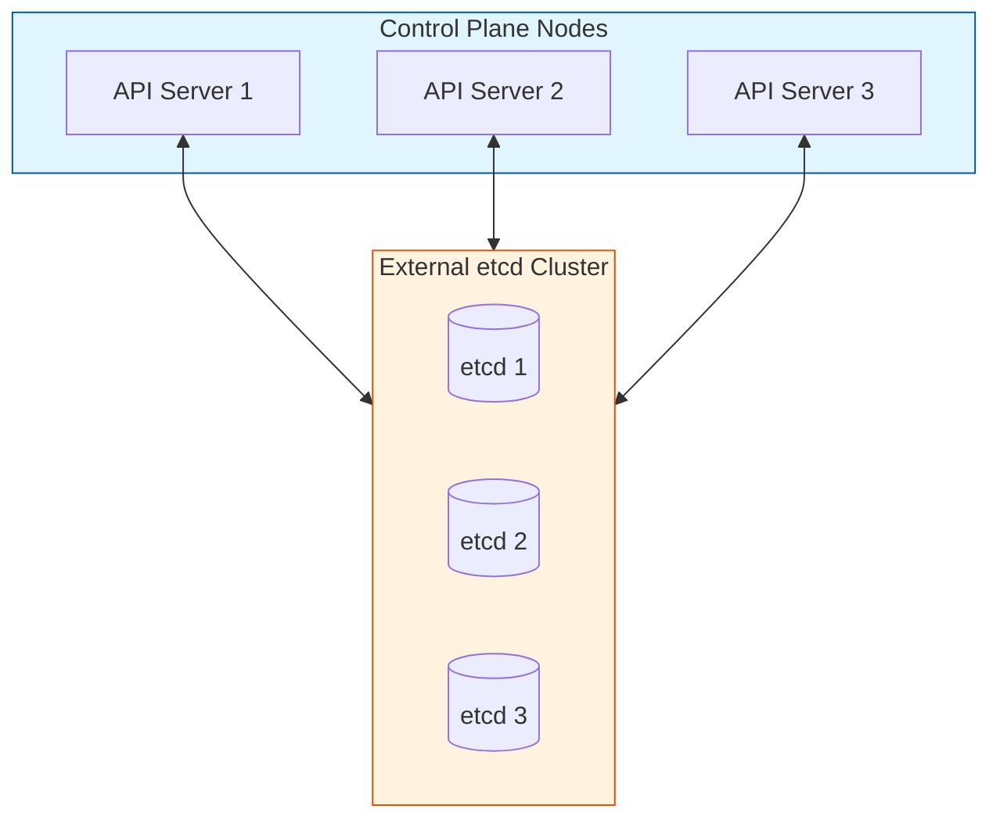

# Missing Sections for Kubernetes Cluster Architecture

This file contains the high-fidelity enhancements for the Cluster Architecture module.

---

## 🏗️ The Kubernetes Nerve Center: Control Plane Deep Dive

### 1. The API Server Request Lifecycle
Every request to Kubernetes goes through a rigorous multi-stage process. Understanding this is key to debugging "Unauthorized" or "Forbidden" errors.



### 2. etcd: The Source of Truth
`etcd` uses the **Raft Consensus Algorithm** to ensure all nodes agree on the cluster state.

**Key Rule:** $(N/2) + 1$ nodes must be healthy to maintain a quorum.
- 3 nodes: Can lose 1
- 5 nodes: Can lose 2

```mermaid
graph TD
    subgraph Quorum ["etcd Cluster (HA)"]
        L((Leader))
        F1((Follower))
        F2((Follower))
        
        L <-->|Heartbeat/Append| F1
        L <-->|Heartbeat/Append| F2
    end
    
    API[API Server] <-->|gRPC| L
    
    style L fill:#f96,stroke:#333,stroke-width:4px
    style Quorum fill:#f5f5f5,stroke:#333,border-dash:[5,5]
```

---

## 🛡️ Professional Pattern: High Availability Topologies

In production, we never run a single master. We use two main patterns:

### 1. Stacked etcd Topology
The `etcd` members run on the same nodes as the control plane components. Simple to manage, but if a node fails, you lose both a control plane member and an etcd member.

### 2. External etcd Topology
The `etcd` cluster is separated from the control plane nodes. This is the **Gold Standard** for enterprise stability.



---

## 🌐 The Data Plane: Under the Hood

### Kubelet: The Node Shepherd
The Kubelet doesn't just "run containers"; it manages the **Pod Life Cycle**.

1. **Watch**: Kubelet watches the API Server (or a local file) for PodSpecs assigned to its node.
2. **Execute**: It interacts with the **CRI (Container Runtime Interface)** to pull images and start containers.
3. **Monitor**: It performs Liveness and Readiness probes.
4. **Report**: It updates the API Server with the Pod's status.

### Kube-Proxy: The Traffic Cop
| Mode | Performance | Mechanism |
| :--- | :--- | :--- |
| **iptables** | Standard | Sequential rule evaluation. Slower at high scale. |
| **IPVS** | High Performance | Hash-table based. Scales to thousands of services. |
| **eBPF (Cilium)** | Ultra Fast | Bypasses kernel networking stack for direct routing. |

---

## 📖 Real-World DevOps Story: "The Day the Quorum Died"

**The Scenario:** A DevOps team was running a 3-node HA control plane. During a routine maintenance window, they took Node 1 down for OS patching. Simultaneously, a network glitch partitioned Node 3 from the rest of the cluster.

**The Result:** The cluster had 3 total etcd nodes. Quorum requires $(3/2)+1 = 2$ nodes. With only Node 2 alive and reachable, the API Server stopped accepting *any* write requests. 

**The Lesson:** 
- In 3-node clusters, you have **ZERO** fault tolerance during maintenance.
- **Enterprise Rule:** Always use 5 nodes for etcd if you want to perform maintenance safely.

---

## 👨‍💻 Interview Preparation (Senior Level)

1. **Q: What happens if etcd is lost and you have no backup?**
   *   *A: The control plane stops functioning. Existing pods continue to run, but no new pods can be scheduled, and no updates (scaling, rolling updates) can occur. You are essentially in a "frozen" state.*

2. **Q: Why is etcd always an odd number of members?**
   *   *A: To avoid "split-brain" scenarios. An odd number ensures that in any network partition, only one side can have a majority (quorum).*

3. **Q: Explain the difference between `kube-scheduler` Filtering and Scoring.**
   *   *A: Filtering removes nodes that don't meet requirements (e.g., lack of CPU, wrong taints). Scoring ranks the remaining nodes to find the "best" fit (e.g., node with the most free resources).*

4. **Q: Can a worker node run without a Kubelet?**
   *   *A: No. The Kubelet is the PRIMARY agent. Without it, the control plane has no way to communicate with the node or manage containers on it.*

---

## 🧠 Knowledge Check

1. Which component is the only one authorized to talk to `etcd`?
2. What is the default networking mode for `kube-proxy`?
3. If a Pod is stuck in `Pending` state, which component is likely having issues?
