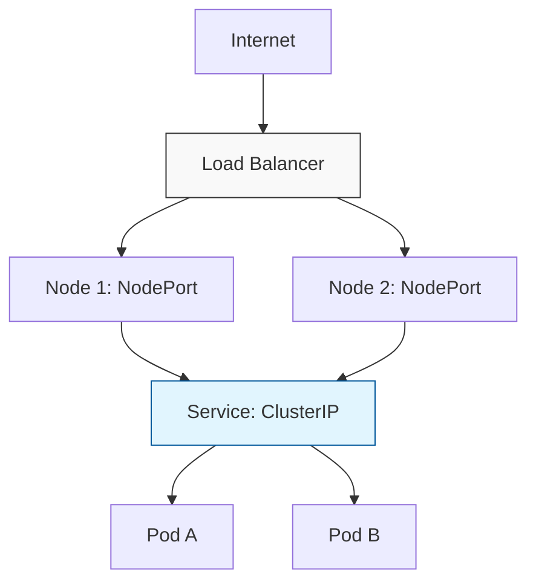

# 🌐 Services and Networking: Connecting the Cluster


## 📋 Overview

In Kubernetes, Pods are ephemeral. If a Pod crashes and is replaced, its IP address changes. **Services** provide a stable network endpoint (IP and DNS name) that stays constant even as Pods come and go.

### 🎯 Learning Objectives

By the end of this module, you will:
- Master the three primary **Service Types**: ClusterIP, NodePort, and LoadBalancer.
- Understand how **Selectors** link Services to Pods via Endpoints.
- Configure and troubleshoot **CoreDNS** for service discovery.
- Learn the difference between `port`, `targetPort`, and `nodePort`.
- Design internal microservice communication using **FQDNs**.

---

## 🔌 Service Types: The Connectivity Matrix

### 1. ClusterIP (Internal - Default)
Provides a stable IP address reachable only from within the cluster. This is the "standard" for inter-service communication.

### 2. NodePort (External via Node)
Exposes the service on each Node's IP at a static port (between 30000-32767).
```bash
# Example nodePort access
http://<Any-Node-IP>:30080
```

### 3. LoadBalancer (Cloud Standard)
Exposes the Service externally using a cloud provider's load balancer. This handles the high-level routing from the public internet into your cluster.



---

## 🏷️ The Selector Mechanics

A Service identifies its target Pods using **Label Selectors**.

```yaml
apiVersion: v1
kind: Service
metadata:
  name: backend-service
spec:
  type: ClusterIP
  selector:
    app: backend-api  # Must match the labels in your Pod/Deployment
  ports:
    - protocol: TCP
      port: 80        # Port the service listens on
      targetPort: 8080 # Port the application listens on inside the pod
```

---

## 📖 Service Discovery: Kubernetes DNS

Kubernetes runs a built-in DNS service (**CoreDNS**) that automatically creates DNS records for every Service.

### The Full Qualified Domain Name (FQDN)
You can reach any service using this standard format:
`<service-name>.<namespace>.svc.cluster.local`

**Example:**
`auth-api.production.svc.cluster.local`

### CoreDNS Workflow
1.  A Pod requests `nslookup database-svc`.
2.  The request is sent to the **CoreDNS** service IP.
3.  CoreDNS looks up the mapping and returns the stable **ClusterIP** of the service.

---

## 📖 Real-World DevOps Story: "The Infinite Loop of Redirection"

**The Scenario:** A team noticed extreme latency between their Frontend and Backend microservices. Investigation revealed they were calling each other via their **external** LoadBalancer URLs (e.g., `https://api.myapp.com`) instead of internal names.

**The Result:** Every internal request was traveling out to the internet, through the cloud firewall, hitting the LoadBalancer, and coming back in.

**The Lesson:** Always use internal Service names (`http://backend-service`) for service-to-service calls. It is faster, cheaper, and keeps traffic inside your private network.

---

## 👨‍💻 Interview Preparation

1. **Q: What is the "Endpoints" object?**
   *   *A: It is a resource created automatically by a Service that contains the list of actual IP addresses of the pods matching the selector.*

2. **Q: Explain the difference between `port`, `targetPort`, and `nodePort`.**
   *   *A: `port` is the service's port; `targetPort` is the pod's port; `nodePort` is the physical node's port.*

3. **Q: How can you access a service if CoreDNS is down?**
   *   *A: You can still use the **ClusterIP** directly, but service discovery (name resolution) will fail.*

---

## 🧠 Knowledge Check

1. Which Service type is used for inter-service communication only? (ClusterIP)
2. What is the standard DNS name for a service named `db` in namespace `dev`? (`db.dev.svc.cluster.local`)
3. Which component on the node routes traffic to the pods? (Kube-Proxy)

---

## 🔗 Internal Navigation
- [Next: Ingress Controllers](../06-Ingress-Controllers/README.md)
- [Back: Deployments and Scaling](README.md)