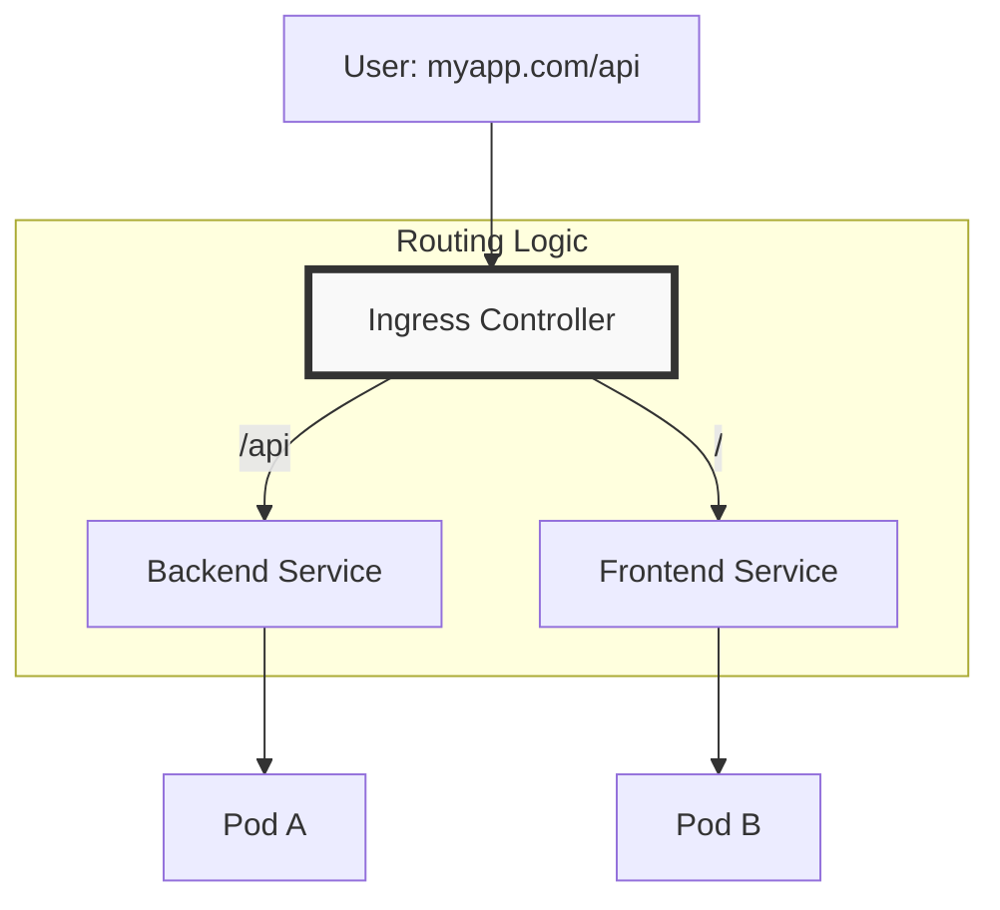

# 🚦 Ingress Controllers: Layer 7 Traffic Management

## 📋 Overview

While **Services** handle basic Load Balancing (Layer 4), **Ingress** provides advanced routing (Layer 7). It acts as the smart gateway for your cluster, handling SSL termination, path-based routing, and name-based virtual hosting.

### 🎯 Learning Objectives

By the end of this module, you will:
- Understand the difference between an **Ingress Resource** and an **Ingress Controller**.
- Implement **Path-based** and **Host-based** routing.
- Configure **SSL/TLS Termination** using Kubernetes Secrets.
- Use **Annotations** to control Ingress behavior (e.g., URL rewriting).
- Troubleshoot common Ingress errors (`502`, `404`).

---

## 🏗️ How Ingress Works

An Ingress Controller (like Nginx, Traefik, or Istio) is typically a Pod that acts as a Reverse Proxy. It watches the API Server for new Ingress resources and automatically updates its configuration.



---

## 🔌 Scaling External Access

### 1. Host-Based Routing
Manage multiple domains with a single IP address.
- `api.example.com` -> API Service
- `info.example.com` -> Docs Service

### 2. Path-Based Routing
Split traffic within the same domain.
- `example.com/payment` -> Payment Microservice
- `example.com/shipping` -> Shipping Microservice

---

## 🔒 SSL Termination (HTTPS)

One of the most powerful features of Ingress is centralized SSL management. You only need to manage certificates in one place, rather than in every single Pod.

```yaml
spec:
  tls:
  - hosts:
      - myapp.example.com
    secretName: myapp-tls-secret # Secret containing the certificate
  rules:
  - host: myapp.example.com
    http:
      paths:
      - path: /
        pathType: Prefix
        backend:
          service:
            name: web-service
            port:
              number: 80
```

---

## 🛠️ Essential Annotations

Annotations allow you to pass specific instructions to your Ingress Controller.

| Annotation | Purpose |
| :--- | :--- |
| `nginx.ingress.kubernetes.io/rewrite-target` | Strips or modifies the path before sending it to the backend. |
| `nginx.ingress.kubernetes.io/ssl-redirect` | Automatically forces HTTP traffic to HTTPS. |
| `nginx.ingress.kubernetes.io/limit-rps` | Implements basic rate limiting at the entry point. |

---

## 📖 Real-World DevOps Story: "The 502 Bad Gateway Phantom"

**The Scenario:** A team deployed a new Ingress for a Java Microservice. The Pod was running, and the Service was active, but they kept getting `502 Bad Gateway`.

**The Cause:** The microservice was taking 30 seconds to start up. The **Readiness Probe** was failing, so the Service had no "Endpoints". Since there were no active endpoints, the Ingress Controller had nowhere to send the traffic.

**The Lesson:** Check `kubectl get endpoints` before debugging the Ingress. If the endpoints list is empty, the issue is with your Pod's health or Service selector, not the Ingress.

---

## 👨‍💻 Interview Preparation

1. **Q: Can you have multiple Ingress Controllers in a single cluster?**
   *   *A: Yes. You use the `ingressClassName` field to specify which controller (e.g., `nginx-internal` vs `nginx-external`) should handle the resource.*

2. **Q: How does Ingress handle traffic to a Service that has multiple Pods?**
   *   *A: The Ingress Controller typically uses the Service's ClusterIP or selects Pod IPs directly from the Endpoints list and performs its own load balancing (usually Round Robin).*

3. **Q: What is the benefit of SSL Termination at the Ingress?**
   *   *A: It reduces CPU load on individual application pods (no encryption overhead) and simplifies certificate management (one place to renew).*

---

## 🧠 Knowledge Check

1. What is the difference between an Ingress Resource and an Ingress Controller? (Resource = Config, Controller = The Proxy Pod)
2. What HTTP error code usually indicates the Ingress can't find a matching rule? (`404 Not Found`)
3. Which field in the yaml allows you to define a secret for HTTPS? (`spec.tls`)

---

## 🔗 Internal Navigation
- [Next: ConfigMaps and Secrets](../07-ConfigMaps-and-Secrets/README.md)
- [Back: Services and Networking](../05-Services-and-Networking/README.md)