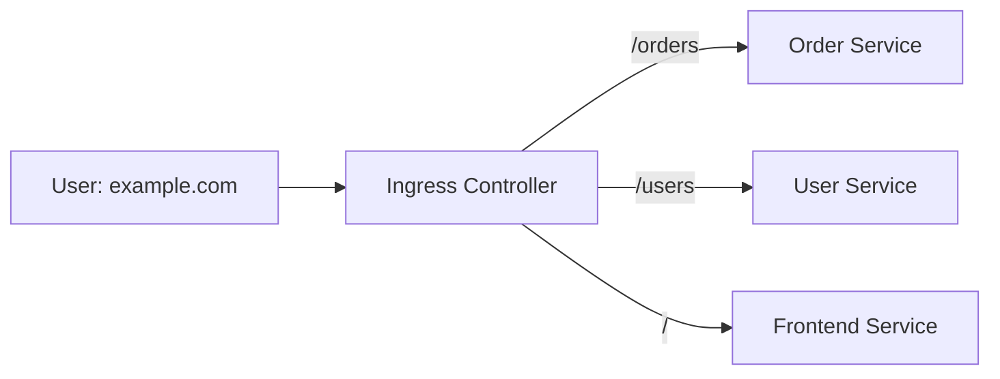
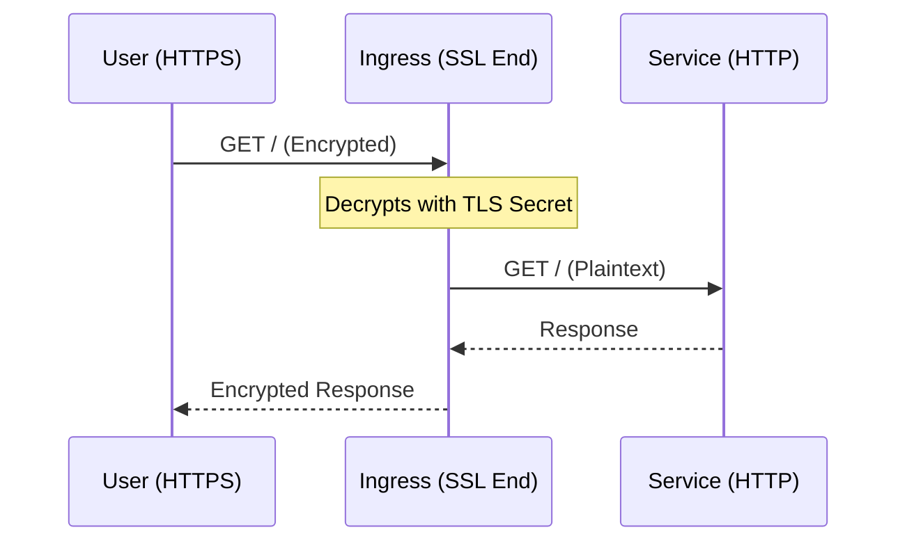

# Missing Sections for Ingress Controllers

This file contains the high-fidelity enhancements for the Ingress module.

---

## 🚦 Ingress vs. LoadBalancer Service

Why use Ingress if we have `type: LoadBalancer`?

| Feature | Service (LoadBalancer) | Ingress |
| :--- | :--- | :--- |
| **Layer** | Layer 4 (TCP/UDP) | Layer 7 (HTTP/HTTPS) |
| **Cost** | 1 LB per Service (Expensive) | 1 LB for Many Services (Cheap) |
| **Routing** | IP/Port only | Path-based (/app), Host-based (api.com) |
| **Features**| Basic | SSL Termination, URL Rewriting, Auth |

---

## 🏗️ Path-Based Routing

Ingress allows you to route traffic to different backend services based on the URL path.

### Path Types
- **Prefix**: `/store` matches `/store`, `/store/products`, etc.
- **Exact**: `/store` matches *only* exactly `/store`.

---

## 🔒 SSL Termination

Ingress is the specialized place to handle SSL/TLS certificates. You store the cert in a **Kubernetes Secret**, and the Ingress Controller decrypts the traffic before sending it to the pods.

---

## 📖 Real-World DevOps Story: "The 502 Bad Gateway Phantom"

**The Scenario:** A team deployed a new Ingress rule. Everything looked correct, but every request resulted in a `502 Bad Gateway`. 

**The Cause:** The application was listening on port `8080`, but the Ingress was trying to send traffic to the Service on port `80`. The Service existed, but it wasn't forwarding correctly to the `targetPort`. Another common cause: the Pod was failing its **Readiness Probe**, so the Ingress Controller removed it from the backend pool.

**The Lesson:** 
- A `502` usually means the Ingress Controller can't talk to the backend.
- Always check the **Service port** vs **Pod targetPort**.
- Check `kubectl describe ingress` to see if the "Backends" are listed as `Healthy`.

---

## 👨‍💻 Interview Preparation (L7 Traffic Manager)

1. **Q: What is the relation between an Ingress Resource and an Ingress Controller?**
   *   *A: The Ingress Resource is a **set of rules** (the configuration). The Ingress Controller is the **actual pod** (like Nginx or Traefik) that reads those rules and performs the routing.*

2. **Q: How do you handle "Sticky Sessions" in Ingress?**
   *   *A: Usually via **Annotations**. For Nginx, you would use `nginx.ingress.kubernetes.io/affinity: "cookie"`.*

3. **Q: What is the Ingress Class?**
   *   *A: It allows you to have multiple different Ingress Controllers in the same cluster (e.g., an internal one and an external one) and specify which one should handle a particular Ingress resource.*

---

## 🧠 Knowledge Check

1. At which OSI layer does Ingress operate? (Layer 7)
2. Where are SSL certificates stored for use by Ingress? (In a Kubernetes Secret)
3. What is the annotation used to rewrite paths in Nginx Ingress? (`nginx.ingress.kubernetes.io/rewrite-target`)
