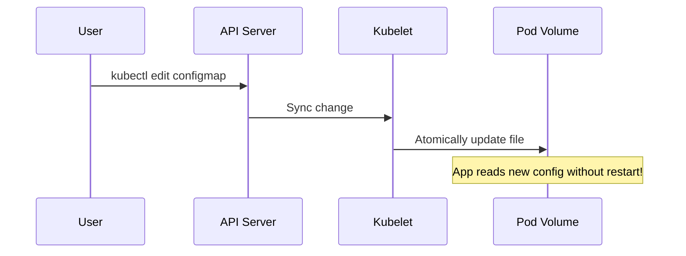

# Missing Sections for ConfigMaps and Secrets

This file contains the high-fidelity enhancements for the ConfigMaps and Secrets module.

---

## 🎭 The Dynamic Duo: ConfigMaps vs. Secrets

When do you use which?

| Feature | ConfigMap | Secret |
| :--- | :--- | :--- |
| **Use Case** | Non-sensitive app config (URLs, feature flags). | Sensitive data (Passwords, Keys, Tokens). |
| **Storage** | Plain text in etcd. | Base64 encoded in etcd (Optional encryption at rest). |
| **Max Size** | 1 MiB | 1 MiB |

---

## 🛠️ Decoding Secrets: It's Not Encryption!

**Security Warning:** Base64 is an encoding, not encryption. Anyone with access to the YAML can decode it instantly.

```bash
# How to decode a secret in the terminal
echo "YWRtaW4=" | base64 --decode
# Output: admin
```

### Pro-Tip: "Secret-Safe" Workflow
1.  Store secret templates in Git (e.g., `secret.yaml.example`).
2.  Use a **Vault** (like HashiCorp Vault or AWS Secrets Manager) for the real values.
3.  Inject secrets into K8s at runtime using the **External Secrets Operator**.

---

## 🔄 Dynamic Updates without Restarts

If you mount a ConfigMap or Secret as a **Volume**, Kubernetes will automatically update the file inside the pod when you update the resource in the API.


*Note: This does NOT apply to Environment Variables. Env vars are only set when the container starts.*

---

## 📖 Real-World DevOps Story: "The Git-Leaked Password"

**The Scenario:** A developer accidentally committed a `secret.yaml` file containing the production database password to a public GitHub repository. 

**The Result:** Within 5 minutes, automated bots had scanned the repo and tried to access the database. They had to rotate all credentials, update the Secret, and perform a rolling update of 50 microservices.

**The Lesson:** 
- **Never** commit Secret manifests with real data to Git.
- Use `.gitignore` for any file containing sensitive data.
- Use `SealedSecrets` or `Sops` if you need to store secrets in Git.

---

## 👨‍💻 Interview Preparation (Security Specialist)

1. **Q: How can you increase the security of Secrets in etcd?**
   *   *A: Enable **Encryption at Rest**. This ensures that if the etcd backup is stolen, the secrets are unreadable without the encryption key.*

2. **Q: What happens if you try to mount a ConfigMap that doesn't exist?**
   *   *A: The Pod will stay in the `ContainerCreating` or `CreateContainerConfigError` state until the ConfigMap is created.*

3. **Q: Explain the `stringData` field in a Secret manifest.**
   *   *A: `stringData` allows you to write secrets in plain text in the YAML; Kubernetes will automatically convert them to base64 for you when you apply the file. It's much easier for human operators!*

---

## 🧠 Knowledge Check

1. What command encodes "password123" into base64? (`echo -n "password123" | base64`)
2. Can a ConfigMap be used to store a Docker Registry key? (Possible, but **Secret** is required for `imagePullSecrets`)
3. Does updating an environment variable in a ConfigMap automatically update the pod? (No, requires restart)
