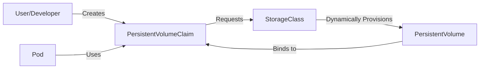

# Missing Sections for Persistence and Storage

This file contains the high-fidelity enhancements for the Storage module.

---

## 📦 The Storage Lifecycle: Order, Delivery, and Ownership

Think of Kubernetes storage like a **Restaurant Service**:

1.  **StorageClass (The Menu)**: Defines what types of storage are available (e.g., "Silver" = HDD, "Gold" = SSD).
2.  **PersistentVolumeClaim (The Order)**: The user makes a request (e.g., "I want 50GB of Gold storage").
3.  **PersistentVolume (The Meal)**: The actual piece of storage created or assigned to fulfill the order.

---

## 🛠️ Access Modes: How many can listen?

Not all storage is created equal. Some can only be used by one node at a time.

| Mode | Short | Meaning | Common Provider |
| :--- | :--- | :--- | :--- |
| **ReadWriteOnce** | RWO | One node can read/write. | AWS EBS, Google PD |
| **ReadOnlyMany** | ROX | Many nodes can read only. | NFS, Google PD |
| **ReadWriteMany** | RWX | Many nodes can read/write. | NFS, Azure Files, EFS |

---

## 🛡️ The Reclaim Policy: What happens when you leave?

When a `PersistentVolumeClaim` is deleted, what happens to the physical data on the `PersistentVolume`?

- **Retain (Default for Manual)**: The PV stays. Data is safe but "Released" (cannot be reused until manual cleanup).
- **Delete (Default for Dynamic)**: The physical disk in AWS/GCP is deleted immediately. Data is **gone**.

---

## 🔄 Dynamic Provisioning vs. Static Provisioning

- **Static**: The Admin creates a 100GB PV manually. The User creates a 100GB PVC. They "find" each other. (Maintenance heavy).
- **Dynamic**: The User creates a PVC. Kubernetes talks to the Cloud Provider, creates a disk on the fly, and generates the PV automatically. (Professional Standard).

---

## 📖 Real-World DevOps Story: "The Database that lost its home"

**The Scenario:** A team was running a MongoDB pod in a multi-zone AWS cluster (`us-east-1a`, `1b`, `1c`). The pod started in `1a` and created a 100GB EBS volume. One day, Node 1 in `1a` failed. 

**The Result:** The Scheduler tried to start the MongoDB pod in `1b` because it had more free resources. However, the pod stuck in `ContainerCreating`. Describing the pod showed: `"Volume is in zone us-east-1a and cannot be attached to node in us-east-1b"`.

**The Lesson:** 
- EBS volumes are **Zonal**.
- Use `volumeBindingMode: WaitForFirstConsumer` in your StorageClass. This ensures the volume is created in the *same* zone where the pod is actually scheduled.

---

## 👨+‍💻 Interview Preparation (Storage Architect)

1. **Q: What is a CSI (Container Storage Interface) Driver?**
   *   *A: It is a standard that allows storage providers (NetApp, AWS, Portworx) to write a single plugin that works across all orchestrators like K8s, Nomad, and Mesos.*

2. **Q: Can you expand a volume while it is in use?**
   *   *A: Yes, if the StorageClass has `allowVolumeExpansion: true`. You simply edit the PVC's storage request to a larger value.*

3. **Q: What is the difference between an `EmptyDir` and a `PersistentVolume`?**
   *   *A: `EmptyDir` is temporary; data is deleted when the pod is removed. `PersistentVolume` is durable; data survives pod deletion.*

---

## 🧠 Knowledge Check

1. Which resource is used to request storage from the cluster? (PersistentVolumeClaim)
2. What happens to a PV with a `Retain` policy when its PVC is deleted? (It enters 'Released' state and keeps the data)
3. Which Access Mode is required for a website pod that horizontally scales across many nodes and shares a common image folder? (ReadWriteMany - RWX)
