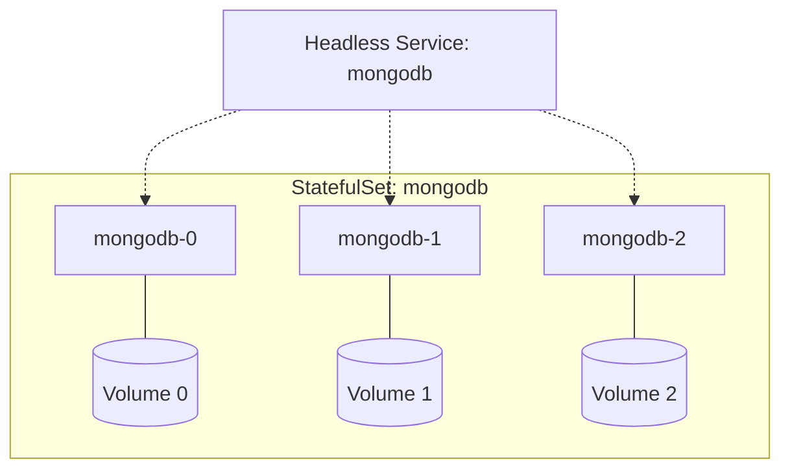

# Missing Sections for StatefulSets, Jobs, and CronJobs

This file contains the high-fidelity enhancements for the Stateful module.

---

## 🏗️ StatefulSets: The Stable Foundation

Unlike Deployments, where pods are anonymous and replaceable, **StatefulSets** are used for applications that need:
1.  **Stable, Unique Network Identifiers**: Pods are named `db-0`, `db-1`, etc.
2.  **Stable, Persistent Storage**: `db-0` always gets the *same* volume back, even after a restart.
3.  **Ordered Deployment and Scaling**: Pods are created one by one (0, 1, 2) and deleted in reverse order.

### The Headless Service (DNS)
StatefulSets require a **Headless Service** (ClusterIP: None) to handle DNS. Each pod gets its own DNS record:
`pod-name.service-name.namespace.svc.cluster.local`

---

## 🕒 Jobs vs. CronJobs: Tasks and Schedules

- **Job**: A one-time task (e.g., "Run a DB migration right now").
- **CronJob**: A recurring task (e.g., "Take a DB backup every night at 2 AM").

### Job Control
- **completions**: Total number of successful runs needed.
- **parallelism**: How many to run at the same time.

---

## 📖 Real-World DevOps Story: "The Persistent Duplicate"

**The Scenario:** A team migrated their MySQL database from a Deployment to a StatefulSet. They were relieved to see the stable identities. However, during an upgrade, they noticed that `mysql-1` was failing to start because the underlying volume was still "attached" to a ghost instance of the old pod on another node.

**The Result:** The StatefulSet waited indefinitely. It didn't try to create `mysql-2` because `mysql-1` wasn't healthy.

**The Lesson:** 
- StatefulSets enforce **Sequential Rollouts**. If Pod 1 fails, the rollout stops.
- Always check **VolumeAttachments** when pods are stuck in `ContainerCreating` during stateful updates.

---

## 👨‍💻 Interview Preparation (Stateful Specialist)

1. **Q: Why don't we use a Service IP for a StatefulSet?**
   *   *A: Because we usually want to talk to a **specific** member of the set (like the Read-Write Master or a specific Shard), not a random load-balanced instance.*

2. **Q: What is a `volumeClaimTemplate`?**
   *   *A: It's a "blueprint" inside the StatefulSet. Each time a pod is created, Kubernetes uses this template to create a unique PVC just for that pod.*

3. **Q: What happens if a CronJob takes longer than its scheduled interval?**
   *   *A: This depends on the `concurrencyPolicy`. `Allow` (default) starts a new job anyway. `Forbid` skips the new job. `Replace` kills the old one and starts the new one.*

---

## 🧠 Knowledge Check

1. In a StatefulSet named `db`, what is the name of the third pod? (`db-2`)
2. Which object is responsible for running a pod to successful completion? (Job)
3. What is the cron schedule for "Every 15 minutes"? (`*/15 * * * *`)
