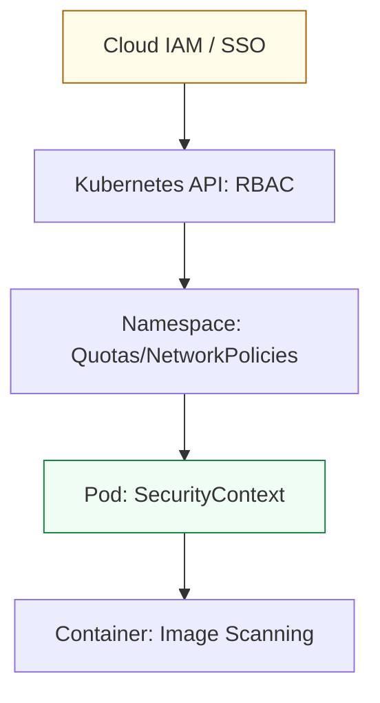

# Kubernetes Security & Governance Reference

**Doc Version:** 1.0.0
**Role:** DevSecOps Engineer / Security Lead
**Scope:** RBAC, Network Isolation, and Workload Hardening

---

## 1. Multi-Tenancy & Isolation (Namespaces)

**Namespaces** are the primary mechanism for isolating groups of resources within a single cluster.

- **Logical Isolation**: Divide a cluster into "Dev," "Staging," and "Production."
- **Resource Quotas**: Limit the total CPU, Memory, and Storage a namespace can consume to prevent one team from starving others.
- **LimitRanges**: Enforce default resource requests/limits for any pod created in the namespace.

---

## 2. Authentication & Authorization (RBAC)

**Role-Based Access Control (RBAC)** regulates access to the Kubernetes API.

### The RBAC Model:
1.  **Subject**: Who is asking? (User, Group, or ServiceAccount).
2.  **Verb**: What are they doing? (get, list, create, update, delete).
3.  **Resource**: On what? (pods, services, secrets, nodes).
4.  **Role/ClusterRole**: A set of permissions.
5.  **RoleBinding/ClusterRoleBinding**: The bridge that connects the Subject to the Role.

**Rule of Thumb**: Always follow the **Principle of Least Privilege**. Never grant `cluster-admin` to a ServiceAccount or a developer unless strictly necessary.

---

## 3. Network Security (NetworkPolicy)

By default, every pod in a Kubernetes cluster can talk to every other pod. In production, this "Flat Network" is a massive security risk.

### NetworkPolicy logic:
- **Default Deny**: Start by blocking all traffic into and out of a namespace.
- **Explicit Allow**: Create rules to allow only necessary traffic (e.g., "Allow Frontend Pods to talk to Backend Pods on Port 8080").
- **Cilium / Calico**: These CNI plugins enforce NetworkPolicies using eBPF or iptables.

---

## 4. Hardening Workloads (Pod Security)

Securing the container itself is as important as securing the cluster.

### Pod Security Standards (PSS):
- **Privileged**: Open and unrestricted (Avoid in production).
- **Baseline**: Minimal restrictions, prevents known privilege escapes.
- **Restricted**: Highly restricted, follows hardening best practices (e.g., no root, no hostNetwork, read-only root filesystem).

### Configuration Check:
```yaml
securityContext:
  runAsNonRoot: true
  runAsUser: 1000
  allowPrivilegeEscalation: false
  readOnlyRootFilesystem: true
  capabilities:
    drop: ["ALL"]
```

---

## 5. Secrets Management

Kubernetes Secrets are, by default, stored in etcd as **Base64 encoded strings**, not encrypted.

### Enterprise Hardening:
1.  **Encryption at Rest**: Enable etcd encryption in your cloud provider or via the API server.
2.  **External Secrets (ESO)**: Sync secrets from AWS Secrets Manager, HashiCorp Vault, or Azure Key Vault into Kubernetes automatically.
3.  **RBAC for Secrets**: Strictly limit who can `get` or `list` secrets in any namespace.

---

## 6. Visualizing the Security Layers



---

## 7. Compliance and Auditing

- **Audit Logs**: Record every request made to the API server. This is critical for post-incident analysis and compliance (PCI-DSS, HIPAA).
- **Admission Controllers**: Use **OPA Gatekeeper** or **Kyverno** to block non-compliant manifests before they are admitted to the cluster (e.g., "Reject any pod without an 'app' label").
- **Continuous Scanning**: Re-scan containers running in the cluster daily to find newly discovered CVEs.

> **Enterprise Pattern**: Use **Runtime Security** tools like **Falco**. While NetworkPolicies prevent attacks from moving across the network, Falco detects attacks happening *inside* the container (e.g., a shell being opened in a web server or a sensitive file like `/etc/shadow` being read).
