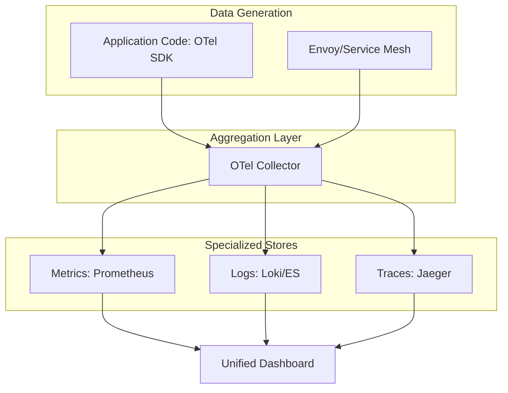

# Advanced Observability & MTTR Architecture Reference

**Doc Version:** 1.0.0
**Role:** Reliability Architect / Observability Lead
**Scope:** MTTR optimization, Cardinality, and Unified Visibility

---

## 1. The MTTR Mindset (Mean Time To Repair)

In complex distributed systems, it is impossible to prevent all failures. The goal of advanced observability is to minimize the time between an incident occurring and its resolution.

### The Breakdown of MTTR
- **MTTD (Detection)**: Time until an alert fires. (Goal: < 2 mins).
- **MTTI (Identification)**: Time to find the root cause. (Goal: Tracing/Aggregation).
- **MTTR (Resolution)**: Time to apply the fix (Rollback/Patch).

---

## 2. Managing High Cardinality

**Cardinality** refers to the number of unique time-series in your metrics system.

- **Low Cardinality**: `http_requests_total{status="200"}`. Only a few possible values for 'status'.
- **High Cardinality**: `http_requests_total{user_id="12345"}`. Millions of unique user_ids create millions of metrics.

### The Problem
High cardinality results in:
1.  Slow queries in Grafana.
2.  Exploding storage costs in Prometheus/Datadog.
3.  Memory issues in the monitoring server.

### The Solution: Aggregation
- Store high-cardinality data in **Logs** (where it lives as text).
- Store low-cardinality data in **Metrics** (where it lives as a count).

---

## 3. Distributed Tracing: The Correlation ID

To follow a user request through 10 microservices, you must use a **Correlation ID** (or Trace ID).

### Context Propagation
The Trace ID is injected into the HTTP Header (`X-Trace-Id`) by the first service and passed to every subsequent service. This allows your observability platform to "stitch" together a single timeline of the request journey.

---

## 4. Visualizing the Unified Observability Stack

---

## 5. Security and PII in Observability

- **Data Masking at Source**: Ensuring that email addresses, passwords, or credit card numbers are never logged or stored in tags.
- **Log Retention Policies**: Automatically deleting logs after 14-30 days to comply with GDPR "Right to be Forgotten."
- **RBAC for Dashboards**: Restricting who can see production logs that might contain sensitive business metadata.

---

## 6. Enterprise Governance: The Service Level standard

- **SLI (Indicator)**: The raw metric (e.g., 99th percentile latency).
- **SLO (Objective)**: The target for that metric (e.g., Latency < 500ms for 99.9% of requests).
- **SLA (Agreement)**: The legal contract with the customer (e.g., "If latency > 1s, we refund your money").

> **Enterprise Pattern**: Implement **Error Budgets**. If your SLO says 99.9% uptime, you have an "Error Budget" of 0.1% downtime per month. If you burn through the budget, all new feature releases are halted, and the team must focus 100% on reliability until the budget recovers.
