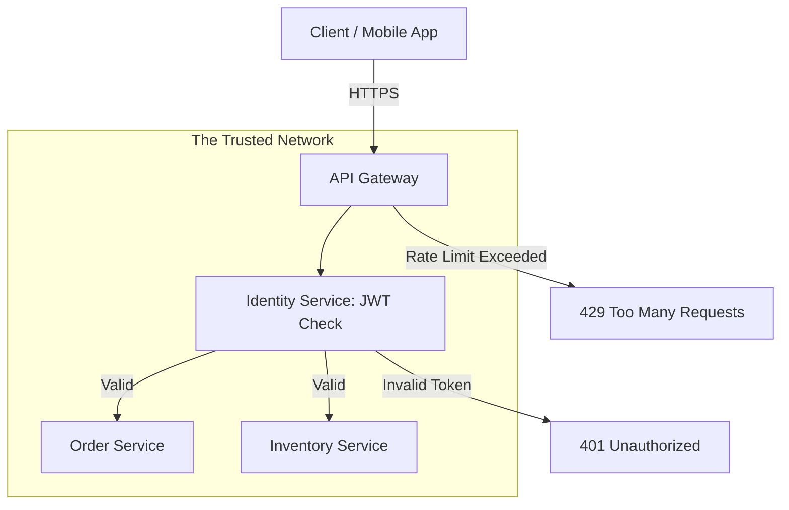

# API Gateway & Security Architecture Reference

**Doc Version:** 1.0.0
**Role:** API Security Architect / Platform Lead
**Scope:** Gateway patterns, Authentication (JWT/OAuth2), and Traffic Control

---

## 1. The Gateway as a Security Boundary

In a microservices architecture, the Gateway is the only service exposed to the public internet. All other services reside in a private network and trust the Gateway's decisions.

### Key Responsibilities
- **Request Routing**: Mapping external public URLs to internal private microservices.
- **Authentication/Authorization**: Verifying *who* is making the request and *what* they are allowed to do.
- **TLS Termination**: Managing SSL/TLS certificates in one centralized place.
- **Internal Masking**: Hiding internal implementation details (e.g., ports, service names, IP addresses) from the public.

---

## 2. Authentication: JWT & OAuth2 Deep Dive

### JSON Web Token (JWT)
A JWT is a self-contained, digitally signed token used to pass information between parties.

- **Header**: Algorithm and token type.
- **Payload**: Claims (User ID, Roles, Expiration).
- **Signature**: Verifies the token hasn't been tampered with using a secret or public/private key.

### OAuth2 / OIDC
- **OAuth2**: Framework for **Authorization** (What you can do).
- **OIDC (OpenID Connect)**: Extension of OAuth2 for **Authentication** (Who you are).

---

## 3. Traffic Management: Protecting Stability

Beyond security, the Gateway protects the backend from being overwhelmed.

### A. Rate Limiting (Throttling)
- **Objective**: Prevent a single user/bot from consuming all resources.
- **Strategy**: 100 requests / minute per API Key.

### B. Circuit Breaking
- **Objective**: If Service A is failing or slow, the Gateway "trips the circuit" and returns an immediate error (or cached response) instead of waiting for a timeout.
- **Benefit**: Prevents **Cascading Failures** where one slow service blocks all threads in the entire system.

---

## 4. Visualizing the Gateway Flow

---

## 5. Backend-for-Frontend (BFF) Pattern

Instead of one generic API for everyone, use the Gateway to provide tailored endpoints:
- **Mobile BFF**: Returns a minimized JSON for slow mobile data connections.
- **Desktop BFF**: Returns detailed data for complex web dashboards.

---

## 6. Enterprise Governance Standards

- **Zero Trust Internally**: Even internal service-to-service communication should be authenticated (MTLS).
- **OWASP Top 10 for APIs**: Guarding against common risks like Broken Object Level Authorization (BOLA).
- **API Versioning**: Enforcing a strict `/v1/`, `/v2/` lifecycle to avoid breaking existing clients.
- **Contract-First Development**: Using OpenAPI/Swagger definitions as the "Law" that both Frontend and Backend must follow.

> **Enterprise Pattern**: Use **JWT Validation at the Edge**. Configure your Gateway (e.g., Kong, AWS API Gateway) to verify the digital signature of the JWT *before* forwarding the request to any backend service. This saves CPU and prevents "Unauthorized" requests from ever touching your database.
