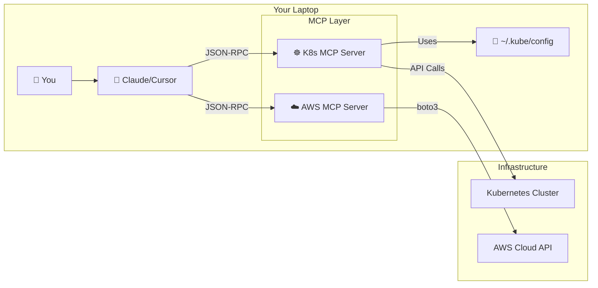

# 03: MCP for Kubernetes and Cloud

**[⬅️ Back to MCP Module Index](../README.md)** | **[Next: Security and Auth ➡️](../04-Security-and-Auth/README.md)**

---

# ☸️ MCP for Kubernetes & Cloud Infrastructure

The promise of "Agentic DevOps" is realized when we connect our AI models to our heavy infrastructure. This module explores how to safely bridge the gap between an LLM and your Kubernetes clusters or Cloud accounts.

## 🏗️ Architecture: The Local Gateway Pattern

For 99% of DevOps use cases, the **Local Gateway** pattern is the correct architectural choice. instead of giving the AI a persistent service account in your cluster (which is risky), you run the MCP Server **locally on your laptop**.

### Why?
1.  **Auth Inheritance**: The MCP server uses *your* local credentials (`~/.kube/config`, `~/.aws/credentials`).
2.  **Zero-Trust**: The AI only has access when *you* are using it.
3.  **Network**: It can access private clusters via your VPN/Teleport session without needing public ingress.



---

## ☸️ Orchestrating Kubernetes

A Kubernetes MCP server acts as a translator between natural language and the Kubernetes API.

### Essential Tools to Expose
If you were building a K8s MCP server, these are the "High Leverage" tools you should implement:

| Tool Name | Arguments | Description |
| :--- | :--- | :--- |
| `get_resource_logs` | `namespace`, `name`, `container` | Fetches logs. Crucial for debugging. |
| `describe_resource` | `kind`, `namespace`, `name` | Returns the `kubectl describe` output. |
| `list_events` | `namespace` | Fetches recent events (often explains loop crash-loops). |
| `get_resource_yaml` | `kind`, `namespace`, `name` | Reads the current configuration. |

### Example Workflow: "The CrashLoop Investigation"
1.  **User**: "Why is the `payments` pod crashing?"
2.  **AI (via MCP)**: Calls `list_pods(namespace="default")` -> sees `payments-78d` is `CrashLoopBackOff`.
3.  **AI (via MCP)**: Calls `get_resource_logs(name="payments-78d")` -> sees "Connection Refused to DB".
4.  **AI (via MCP)**: Calls `describe_resource(name="payments-78d")` -> checks env vars.
5.  **AI**: "It seems the DB host env var is pointing to an old endpoint. Here is the log trace..."

---

## ☁️ Integrating with Cloud Providers (AWS/Azure)

Cloud APIs are vast. An MCP server for AWS shouldn't try to wrap *everything*. Focus on **Read-Only Observability** first.

### The "Boto3 Bridge"
Using Python's `boto3` library is the standard way to build AWS MCP servers.

```python
import boto3
from mcp.server.fastmcp import FastMCP

mcp = FastMCP("AWS-Observer")
ec2 = boto3.client('ec2')

@mcp.tool()
def list_instances(region: str = "us-east-1"):
    """Lists basic info about EC2 instances in a region."""
    resp = ec2.describe_instances()
    # ... logic to simplify response ...
    return simplified_json
```

### Strategic Use Cases
1.  **Cost Auditing**: *"Find me all idle RDS instances."*
2.  **Security Review**: *"Check which Security Groups allow 0.0.0.0/0 on port 22."*
3.  **Log Analysis**: *"Fetch the last 50 error logs from CloudWatch Log Group '/aws/lambda/listener'."*

---

## ⚠️ The Danger Zone: Write Access

Giving an AI "Write" access (e.g., `delete_pod`, `terminate_instance`) is powerful but dangerous.

**Best Practices:**
1.  **Human Verification**: The Host (e.g., Claude Desktop) typically asks for user confirmation before executing any tool. **NEVER disable this for Write operations.**
2.  **Dry Runs**: For infrastructure changes (Terraform/Helm), create a tool like `plan_deployment` that returns the `diff`, rather than `apply_deployment`.
3.  **Scoped Roles**: If running in a shared environment, ensure the MCP server's IAM role has `ReadOnlyAccess` initially.

---

## 🧪 Knowledge Check

**1. Why is the "Local Gateway" pattern preferred over running MCP servers inside the cluster?**
*   [ ] It's faster.
*   [ ] It removes the need for managing complex service production credentials and uses the user's existing context.
*   [ ] AI models run better locally.

**2. Which usage pattern is safest for Cloud MCP servers?**
*   [ ] Full Admin Access.
*   [ ] Read-Only Observability + Human Verification for Writes.
*   [ ] Unsupervised Auto-Scaling.

