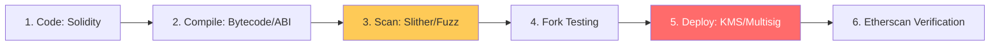

# Blockchain DevOps & Smart Contract Architecture Reference

**Doc Version:** 1.0.0
**Role:** Web3 DevOps Engineer / Smart Contract Architect
**Scope:** Smart Contract Lifecycle, CI/CD, and Security Tooling

---

## 1. The Smart Contract Build Lifecycle

Smart contracts (written in Solidity, Vyper, or Rust) are not executed directly. They follow a specific compilation and deployment path.

1.  **Source Code**: High-level code (e.g., `.sol`).
2.  **Compilation**: The compiler (solc) generates two critical artifacts:
    - **Bytecode**: The low-level code executed on the EVM (Ethereum Virtual Machine).
    - **ABI (Application Binary Interface)**: A JSON file that tells the frontend and other services how to interact with the contract's functions.
3.  **Deployment**: Sending a transaction containing the Bytecode to the blockchain.
4.  **Verification**: Uploading the source code to an explorer (like Etherscan) to prove it matches the deployed Bytecode.

---

## 2. Web3 CI/CD: The "Shift-Left" Security Standard

In blockchain, code is law. Once a contract is deployed, it is (often) immutable. This makes "Shift-Left" security mandatory.

### The Security Pipeline Chain:
- **Static Analysis (SAST)**: Tools like **Slither** and **Mythril** scan the source code for common vulnerabilities (Reentrancy, Integer Overflow).
- **Fuzz Testing (Invariants)**: Tools like **Foundry** or **Echidna** attempt to break the contract's fundamental rules (invariants) by providing millions of random inputs.
- **Unit & Integration Tests**: Running a local mock blockchain (Anvil/Hardhat Network) to verify function logic without spending real gas.
- **Fork Testing**: Running tests against a local copy of the *actual* mainnet state to ensure compatibility with existing protocols.

---

## 3. High-Security Key Management

The most sensitive part of Web3 DevOps is the **Deployment Key**.

- **Environment Isolation**: Never use the same private key for Testnet and Mainnet.
- **Secret Management**: Keys must never be in code. Use GitHub Secrets, AWS Secrets Manager, or a specialized KMS.
- **Hardware Security Modules (HSM)**: For production deployments, use MPC (Multi-Party Computation) or Multisig wallets (Gnosis Safe) rather than a single EOA (Externally Owned Account) key.

---

## 4. Visualizing the Smart Contract Pipeline

---

## 5. Gas Optimization Governance

Deploying and interacting with contracts costs "Gas" (real money).

- **Gas Profiling**: Every automated test run should generate a "Gas Report" to identify inefficient functions.
- **CI Guardrails**: Automatically fail a Pull Request if a code change increases deployment gas cost beyond a certain threshold.

---

## 6. Enterprise Governance Standards

- **Internal Standard Libraries**: Mandating the use of battle-tested libraries like **OpenZeppelin** for ERC20/ERC721 implementations.
- **Upgradeability Governance**: If using Proxy patterns (e.g., UUPS or Transparent Proxy), an "Upgrade Strategy" and "Emergency Pause" plan must be documented and tested.
- **Oracle Reliability**: Ensuring any external data (Chainlink) used in the contract has a fallback mechanism in case of provider failure.

> **Enterprise Pattern**: Implement **Automated Source Verification**. Your CI pipeline should automatically verify the source code on Etherscan (or the relevant block explorer) as the final step of deployment. This ensures transparency and builds trust with the audit community immediately.
