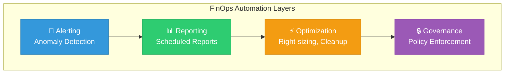
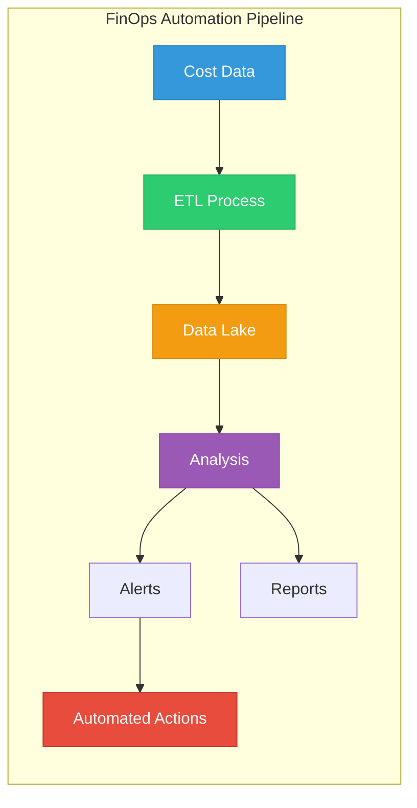

# Lesson 05: Automation & Tooling

## Learning Objectives

By the end of this lesson, you will:
- Automate cost optimization actions
- Implement scheduled resource management
- Set up automated alerting and response
- Build custom FinOps tooling

---

## Automation Opportunities



---

## 1. Scheduled Resource Management

### Dev/Test Shutdown Automation

Stop non-production resources outside business hours.

#### AWS Lambda Example

```python
import boto3
from datetime import datetime

def lambda_handler(event, context):
    ec2 = boto3.client('ec2')
    action = event.get('action', 'stop')
    
    # Find instances tagged for scheduling
    filters = [
        {'Name': 'tag:Environment', 'Values': ['development', 'staging']},
        {'Name': 'tag:AutoShutdown', 'Values': ['true']}
    ]
    
    if action == 'stop':
        filters.append({'Name': 'instance-state-name', 'Values': ['running']})
    else:
        filters.append({'Name': 'instance-state-name', 'Values': ['stopped']})
    
    instances = ec2.describe_instances(Filters=filters)
    
    instance_ids = []
    for reservation in instances['Reservations']:
        for instance in reservation['Instances']:
            instance_ids.append(instance['InstanceId'])
    
    if instance_ids:
        if action == 'stop':
            ec2.stop_instances(InstanceIds=instance_ids)
            print(f"Stopped {len(instance_ids)} instances")
        else:
            ec2.start_instances(InstanceIds=instance_ids)
            print(f"Started {len(instance_ids)} instances")
    
    return {'instances_affected': len(instance_ids)}
```

#### EventBridge Schedule

```json
{
  "Name": "StopDevInstances",
  "ScheduleExpression": "cron(0 20 ? * MON-FRI *)",
  "Target": {
    "Arn": "arn:aws:lambda:us-east-1:123456789012:function:ScheduleInstances",
    "Input": "{\"action\": \"stop\"}"
  }
}
```

### Terraform for Scheduling

```hcl
resource "aws_cloudwatch_event_rule" "stop_dev" {
  name                = "stop-dev-instances"
  description         = "Stop dev instances at 8 PM"
  schedule_expression = "cron(0 20 ? * MON-FRI *)"
}

resource "aws_cloudwatch_event_rule" "start_dev" {
  name                = "start-dev-instances"
  description         = "Start dev instances at 8 AM"
  schedule_expression = "cron(0 8 ? * MON-FRI *)"
}

resource "aws_cloudwatch_event_target" "stop_lambda" {
  rule      = aws_cloudwatch_event_rule.stop_dev.name
  target_id = "StopDevInstances"
  arn       = aws_lambda_function.scheduler.arn
  input     = jsonencode({"action" = "stop"})
}
```

---

## 2. Automated Cleanup

### Orphaned Resource Cleanup

```python
import boto3
from datetime import datetime, timedelta

def cleanup_unused_volumes():
    ec2 = boto3.client('ec2')
    
    # Find available (unattached) volumes older than 7 days
    volumes = ec2.describe_volumes(
        Filters=[{'Name': 'status', 'Values': ['available']}]
    )
    
    deleted = []
    threshold = datetime.now() - timedelta(days=7)
    
    for volume in volumes['Volumes']:
        create_time = volume['CreateTime'].replace(tzinfo=None)
        if create_time < threshold:
            # Check for protection tag
            tags = {t['Key']: t['Value'] for t in volume.get('Tags', [])}
            if tags.get('DoNotDelete') != 'true':
                ec2.delete_volume(VolumeId=volume['VolumeId'])
                deleted.append(volume['VolumeId'])
    
    return deleted

def cleanup_old_snapshots():
    ec2 = boto3.client('ec2')
    
    # Find snapshots older than 90 days
    snapshots = ec2.describe_snapshots(OwnerIds=['self'])
    
    deleted = []
    threshold = datetime.now() - timedelta(days=90)
    
    for snapshot in snapshots['Snapshots']:
        start_time = snapshot['StartTime'].replace(tzinfo=None)
        if start_time < threshold:
            # Check for retention tag
            tags = {t['Key']: t['Value'] for t in snapshot.get('Tags', [])}
            if tags.get('Retention') != 'long-term':
                ec2.delete_snapshot(SnapshotId=snapshot['SnapshotId'])
                deleted.append(snapshot['SnapshotId'])
    
    return deleted
```

### Cleanup Schedule

| Resource Type | Check Frequency | Age Threshold |
|---------------|-----------------|---------------|
| Unattached EBS | Daily | 7 days |
| Old Snapshots | Weekly | 90 days |
| Unused Elastic IPs | Daily | 1 day |
| Old AMIs | Monthly | 365 days |
| Unused Load Balancers | Weekly | 30 days |

---

## 3. Automated Alerting

### Cost Anomaly Automation

```python
import boto3
import json

def handle_anomaly(event, context):
    """
    Triggered by SNS from Cost Anomaly Detection
    """
    sns_message = json.loads(event['Records'][0]['Sns']['Message'])
    
    anomaly = sns_message['anomaly']
    impact = anomaly['impact']['totalImpact']
    root_causes = anomaly['rootCauses']
    
    # Determine severity
    if impact > 1000:
        severity = 'critical'
        notify_channels = ['slack-finops', 'pagerduty']
    elif impact > 100:
        severity = 'warning'
        notify_channels = ['slack-finops']
    else:
        severity = 'info'
        notify_channels = ['email']
    
    # Build notification
    message = {
        'severity': severity,
        'impact': f"${impact:.2f}",
        'services': [rc['service'] for rc in root_causes],
        'accounts': [rc.get('linkedAccount', 'N/A') for rc in root_causes]
    }
    
    # Send to appropriate channels
    for channel in notify_channels:
        send_notification(channel, message)
    
    return {'status': 'notified', 'severity': severity}
```

### Slack Integration

```python
import requests
import json

def send_slack_alert(webhook_url, anomaly_data):
    blocks = [
        {
            "type": "header",
            "text": {
                "type": "plain_text",
                "text": f"🚨 Cost Anomaly Detected"
            }
        },
        {
            "type": "section",
            "fields": [
                {
                    "type": "mrkdwn",
                    "text": f"*Impact:*\n${anomaly_data['impact']}"
                },
                {
                    "type": "mrkdwn",
                    "text": f"*Severity:*\n{anomaly_data['severity'].upper()}"
                },
                {
                    "type": "mrkdwn",
                    "text": f"*Services:*\n{', '.join(anomaly_data['services'])}"
                },
                {
                    "type": "mrkdwn",
                    "text": f"*Duration:*\n{anomaly_data['duration']}"
                }
            ]
        },
        {
            "type": "actions",
            "elements": [
                {
                    "type": "button",
                    "text": {"type": "plain_text", "text": "View in Console"},
                    "url": anomaly_data['console_url']
                }
            ]
        }
    ]
    
    requests.post(webhook_url, json={"blocks": blocks})
```

---

## 4. Right-Sizing Automation

### Automated Right-Sizing Recommendations

```python
import boto3

def get_rightsizing_recommendations():
    ce = boto3.client('ce')
    
    response = ce.get_rightsizing_recommendation(
        Service='AmazonEC2',
        Configuration={
            'RecommendationTarget': 'SAME_INSTANCE_FAMILY',
            'BenefitsConsidered': True
        }
    )
    
    recommendations = []
    for rec in response['RightsizingRecommendations']:
        if rec['RightsizingType'] == 'Modify':
            target = rec['ModifyRecommendationDetail']['TargetInstances'][0]
            recommendations.append({
                'instance_id': rec['CurrentInstance']['ResourceId'],
                'current_type': rec['CurrentInstance']['InstanceType'],
                'recommended_type': target['ResourceDetails']['EC2ResourceDetails']['InstanceType'],
                'monthly_savings': float(rec['ModifyRecommendationDetail']['TargetInstances'][0]['EstimatedMonthlySavings']['Value']),
                'savings_percentage': rec['ModifyRecommendationDetail']['TargetInstances'][0]['EstimatedMonthlySavings']['Value']
            })
    
    return recommendations

def apply_rightsizing(instance_id, new_type, dry_run=True):
    ec2 = boto3.client('ec2')
    
    if dry_run:
        print(f"Would resize {instance_id} to {new_type}")
        return
    
    # Stop instance
    ec2.stop_instances(InstanceIds=[instance_id])
    waiter = ec2.get_waiter('instance_stopped')
    waiter.wait(InstanceIds=[instance_id])
    
    # Modify instance type
    ec2.modify_instance_attribute(
        InstanceId=instance_id,
        InstanceType={'Value': new_type}
    )
    
    # Start instance
    ec2.start_instances(InstanceIds=[instance_id])
    
    return {'status': 'resized', 'new_type': new_type}
```

---

## 5. Policy Enforcement

### Tag Compliance Checker

```python
import boto3

def check_tag_compliance():
    ec2 = boto3.resource('ec2')
    required_tags = ['Environment', 'Owner', 'CostCenter', 'Application']
    
    non_compliant = []
    
    for instance in ec2.instances.all():
        instance_tags = {tag['Key']: tag['Value'] for tag in instance.tags or []}
        missing_tags = [tag for tag in required_tags if tag not in instance_tags]
        
        if missing_tags:
            non_compliant.append({
                'instance_id': instance.id,
                'missing_tags': missing_tags,
                'existing_tags': instance_tags
            })
    
    return non_compliant

def send_compliance_report(non_compliant):
    # Group by owner/team if possible
    by_owner = {}
    for item in non_compliant:
        owner = item['existing_tags'].get('Owner', 'unknown')
        if owner not in by_owner:
            by_owner[owner] = []
        by_owner[owner].append(item)
    
    # Send notifications
    for owner, items in by_owner.items():
        send_notification(owner, items)
```

---

## FinOps Tooling Landscape

### Native Cloud Tools

| Tool | Provider | Use Case |
|------|----------|----------|
| Cost Explorer | AWS | Cost analysis, recommendations |
| Budgets | AWS | Budget alerts |
| Compute Optimizer | AWS | Right-sizing |
| Cost Management | Azure | Cost analysis, budgets |
| Billing Reports | GCP | Cost visibility |

### Third-Party Tools

| Tool | Category | Key Features |
|------|----------|--------------|
| **CloudHealth** | Platform | Multi-cloud, governance |
| **Spot.io** | Optimization | Spot management, right-sizing |
| **Kubecost** | Kubernetes | K8s cost allocation |
| **Infracost** | IaC | Pre-deployment cost estimation |
| **Vantage** | Analytics | Cost reporting, integrations |
| **Densify** | Right-sizing | ML-based recommendations |

### Open Source Tools

| Tool | Purpose | Link |
|------|---------|------|
| **Cloud Custodian** | Policy as code | github.com/cloud-custodian/cloud-custodian |
| **Komiser** | Multi-cloud visibility | github.com/tailwarden/komiser |
| **InfraCost** | Terraform cost estimation | github.com/infracost/infracost |
| **Kubecost** | K8s cost monitoring | github.com/kubecost/cost-model |

---

## Building a FinOps Automation Pipeline



---

## Key Takeaways

- ✅ Automate scheduled resource start/stop for non-production
- ✅ Implement regular cleanup of orphaned resources
- ✅ Set up anomaly detection with automated notifications
- ✅ Use policy-as-code for governance
- ✅ Combine native and third-party tools

---

## What's Next?

Congratulations! You've completed the **Intermediate FinOps** level! 🎉

Continue to **[Advanced FinOps](../../../../README.md)** to learn:
- Enterprise FinOps frameworks
- Multi-cloud cost management
- Unit economics and cost per customer
- Building a FinOps culture
